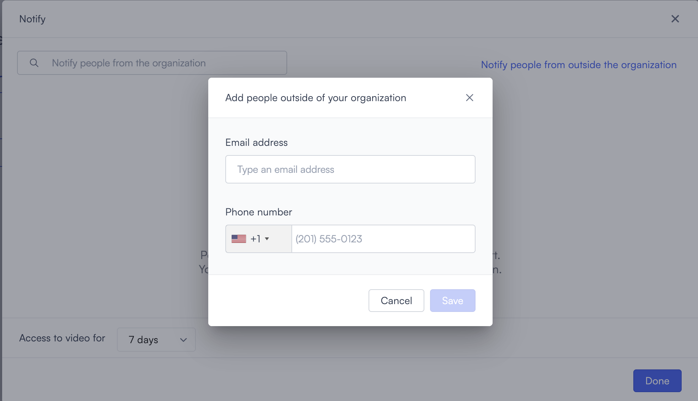

# Alert actions

When an alert fires, Lumana can do more than just log the event. Actions let you define what happens next, whether that's notifying a person, triggering a device, or sending data to an external system. You set the action in the **Then** section when creating or editing an alert.

Each alert supports one action. The action runs every time the alert's conditions are met, subject to any blocking period you've configured.

## Add an action

When creating or editing an alert, scroll down to the **Then** section and select it to open the action list.

Select the action you want to use. The section expands to show the configuration fields for that action. Fill in the required fields, then continue to save the alert.

## Available actions

Select the action that fits how your team needs to respond when this alert triggers.

### Notify

Sends a notification to selected users when the alert triggers. Use this to alert your team about events that need immediate attention.

To configure it:

1. In the **Notify people from the organization** field, search for a user and select their name to add them.
2. For each user you add, select their delivery channels: **SMS**, **Email**, or **Mobile app**. You can select more than one channel per user.
3. To add a custom message, enter it in the **Type your message** field.
4. To attach a snapshot to email notifications, select the **Include alert image in email** checkbox.
5. In the **Access to video for** dropdown, select how long the video link in the notification stays active. Each alert generates a new link that expires after the selected duration. The options are **1 hour**, **8 hours**, **1 day**, **7 days**, **1 month**, and **4 months**.

To notify someone outside your organization, select **Notify people from outside the organization**. A panel opens.

1. Enter the recipient's email address in the **Email address** field.
2. Enter their phone number in the **Phone number** field.
3. Select **Done**.

### Toggle GPIO

Activates a GPIO output on a connected Core device when the alert triggers. Use this to control physical devices such as a door relay, a siren, or a warning light.


Your GPIO device must be physically connected to the Core before you can use this action. See [GPIO devices](../set-up-cameras-and-devices/other-devices/gpio-devices.md) for setup instructions.


1. Select the GPIO number from the **GPIO** dropdown. The available options are **17**, **18**, **19**, and **20**.
2. Select the toggle direction: **High** or **Low**.
3. Enter the duration in milliseconds. Use the **+** and **-** buttons to adjust the value.

### Send syslog record

Sends a syslog entry to an external logging or SIEM system when the alert triggers. Use this to integrate Lumana alerts into your existing security event pipeline.

1. Select the transport method from the **method** dropdown. The options are **UDP** and **TCP**.
2. Enter the server address in the **address** field. Include the port in the address, for example `http://example.com:8080`.

### Play sound

Plays a sound pattern on a connected speaker when the alert triggers. Use this as an on-site deterrent or audible notification.


Your speaker must be added to Lumana before you can use this action. See [Smart speakers](../set-up-cameras-and-devices/other-devices/smart-speakers.md) for setup instructions.


1. Select a pattern from the **pattern** dropdown. Patterns are defined on the speaker device itself.
2. Select the speaker from the **speaker** field. A **Select speakers** panel opens. Search for the speaker by name, then select it and select **Select**.

### Change alert group state

Arms or disarms an alert group when this alert triggers. Use this when you want one alert to automatically change the active state of a related group of alerts.

1. Select the alert group from the **alert group** field.
2. Select the target state: **Armed**, **Disarmed**, or **Schedule**. Selecting **Schedule** returns the group to its configured arm schedule.

### Change alert status

Changes the status of a selected alert when this alert triggers. Use this to automatically enable or disable another alert based on a detection event.

1. Select the alert from the **alert** field.
2. Select the new status from the **status change to** field.

### Trigger Remote IO

Triggers a channel on a connected remote IO device when the alert triggers. Use this to activate external hardware such as gate controllers, sirens, or strobe lights.


Your remote IO device must be added to Lumana before you can use this action. To add one, go to the location, select **Edit location**, select **Remote IOs**, then select **Add Remote IO**.


1. Enter the name of your remote IO device in the **remote IO** field.
2. Select the trigger type: **set** or **pulse**.
   - **Set**: Holds the channel at the selected state until changed.
   - **Pulse**: Briefly triggers the channel for the defined duration, then returns it to its original state.
3. Select the channel number. The available options are **1**, **2**, **3**, **4**, and **5**.
4. If you selected **set**, then select the state: **on** or **off**.
   If you selected **pulse**, then enter the duration in milliseconds using the **+** and **-** buttons.

### Notify Team3

Sends a notification through the Team3 integration when the alert triggers. Use this if your organization uses Team3 for incident communication.

No additional configuration is required. Select this action to enable it.

### Use HTTP request

Sends a pre-configured HTTP request to an external endpoint when the alert triggers. Use this to trigger webhooks, push data to third-party platforms, or integrate with custom applications.

Select an existing HTTP request from the **HTTP request** dropdown, or select **+ Create HTTP request** to configure a new one. To edit or remove saved requests, select **Manage HTTP request**.

### Send Microsoft Teams message

Posts a message to a Microsoft Teams channel when the alert triggers. Use this to surface Lumana alerts directly in your team's communication workspace.

Select a channel from the **Select channel** field, or select **Create channel** to add a new one.

### Change variable value

Updates the value of a configured variable when the alert triggers. Use this in combination with variable-based alert rules to create conditional or stateful alert logic.


Variables are created and managed in **Organization database > Variables**. Each variable has a name, a type (**Int**, **String**, **Json**, or **Float**), and a value.


1. Select the variable from the **select variable** field.
2. Enter the new value in the **value change to** field. The format must match the variable's type.
