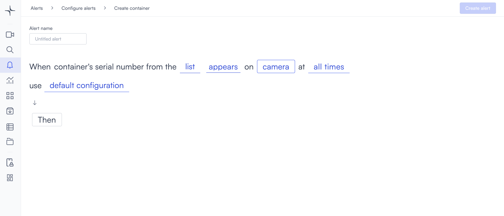
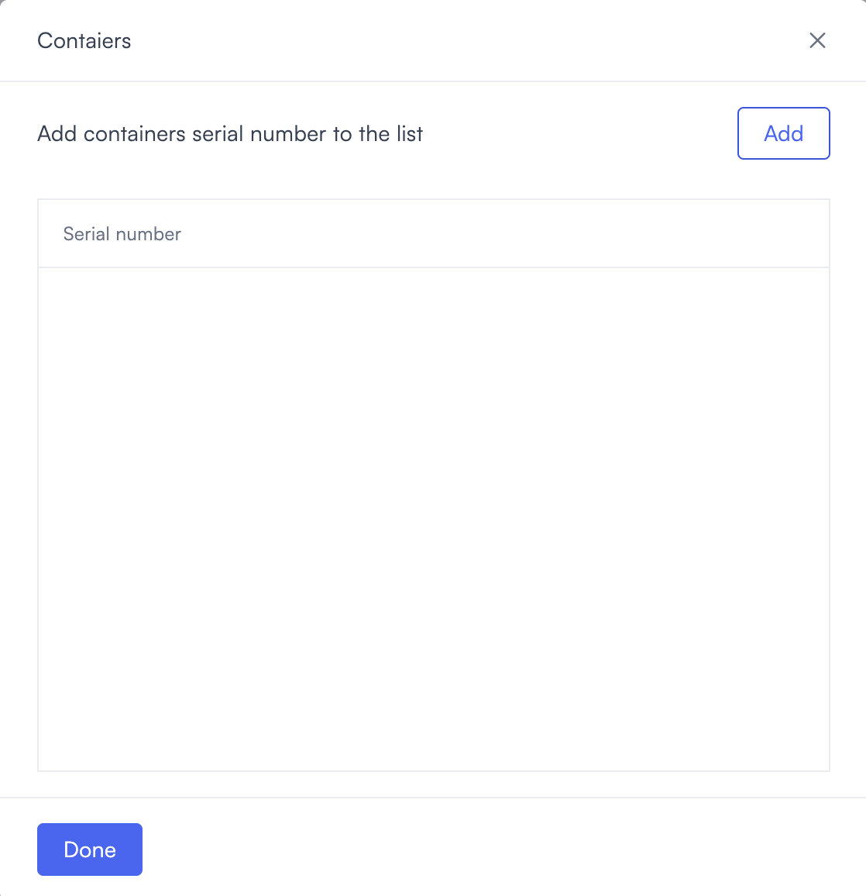

# Container detection

Container detection alerts you when a container's serial number matches a list you configure. Use it to track specific containers, monitor arrivals and departures, or detect containers not on an approved list.

## How it works

Lumana reads container serial numbers from the camera feed and compares them against your configured list. When the detection meets the condition you set, the alert triggers. You configure the trigger condition to match your use case.

## Configure the alert

1. Select the **bell icon** in the navigation bar. The Alerts monitoring view opens.

2. Select **Add alert** in the top right corner. The Configure alerts page opens.

3. Under **Identification**, select **Use template** on the **Container detection** card. The Create container detection page opens.

4. Enter a name in the **Alert name** field, for example "Loading dock container" or "Restricted area container."
5. Select the **appears** field in the alert rule sentence. A dropdown opens with the trigger conditions.

   * **appears**: Triggers when a detected serial number matches a serial number on the list.
   * **does not appear**: Triggers when a detected serial number does not match any serial number on the list.
   * **is not identified or appears**: Triggers when the serial number cannot be read, or when the serial number is on the list.
   * **is not identified or does not appear**: Triggers when the serial number cannot be read, or when the serial number is not on the list.
6. Select the **list** field to open the Containers modal.

   Select **Add** to create a new entry. An editable row appears with a **Serial number** field.

   Enter the serial number, then select the save icon to save the entry. To remove an entry, select the delete icon next to it.

   Select **Done** to confirm the list and close the modal.

7. Select the **camera** field to open the Choose cameras modal. Select the cameras you want to monitor, then select **Select** to confirm.

8. Select the **time** field to set when the alert is active. [Configure alerts](../../configure-alerts.md#schedule) covers the schedule options.
9. Optionally, select **default configuration** to adjust display settings, confidence level, priority, blocking period, and alert message. [Configure alerts](../../configure-alerts.md#default-configuration) covers these settings.
10. Select **Then**  to choose the action Lumana takes when the alert triggers. The available actions are covered in [Alert actions](../../alert-actions.md).
11. Select **Create alert** in the top right corner. The alert is saved and becomes active immediately.
