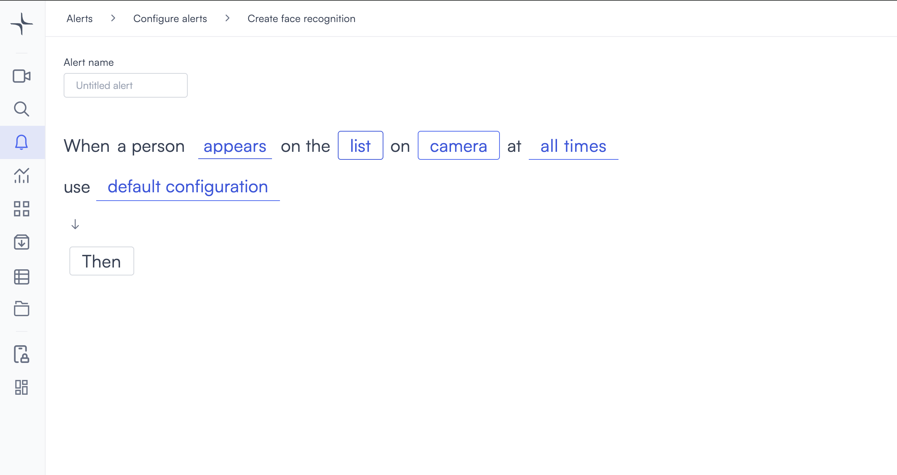

# Face recognition

Face recognition triggers when Lumana detects a face that matches or does not match a list of people you define. Use it to flag known individuals, control access by face, or detect faces the system cannot identify in restricted areas.

## How it works

Lumana matches detected faces in the camera feed against a people list you build from your organization database. When the detection meets the condition you set, the alert triggers. You configure the trigger condition to match your use case.

## Configure the alert

1. Select the **bell icon** in the navigation bar. The Alerts monitoring view opens.

2. Select **Add alert** in the top right corner. The Configure alerts page opens.

3. Under **Identification**, select **Use template** on the **Face recognition** card. The Create face recognition page opens.

4. Enter a name in the **Alert name** field, for example "Persons of interest" or "Restricted access watchlist."
5. Select the **appears** field in the alert rule sentence. A dropdown opens with the trigger conditions.

   * **appears**: Triggers when Lumana identifies a face and the person is on the list.
   * **does not appear**: Triggers when Lumana identifies a face and the person is not on the list.
   * **is not identified or appears**: Triggers when Lumana cannot identify the face, or when the person is on the list.
   * **is not identified or does not appear**: Triggers when Lumana cannot identify the face, or when the person is not on the list.

6. Select the **list** field to open the People's list modal.

   Use the **Search people** field to find people from your organization database. Select a person to add them to the list. Each person you add appears under **Person name** with a remove button next to their name.

   * To remove a person, select the **×** button next to their name.
   * To remove everyone, select **Clear list**.

   Select **Done** to confirm the list and close the modal.

7. Select the **camera** field to open the Choose cameras modal. Select the cameras you want to monitor, then select **Select** to confirm.

8. Select the **time** field to set when the alert is active. [Configure alerts](../../configure-alerts.md#schedule) covers the schedule options.
9. Optionally, select **default configuration** to adjust display settings, confidence level, priority, blocking period, and alert message. [Configure alerts](../../configure-alerts.md#default-configuration) covers these settings.
10. Select **Then**  to choose the action Lumana takes when the alert triggers. The available actions are covered in [Alert actions](../../alert-actions.md).
11. Select **Create alert** in the top right corner. The alert is saved and becomes active immediately.
