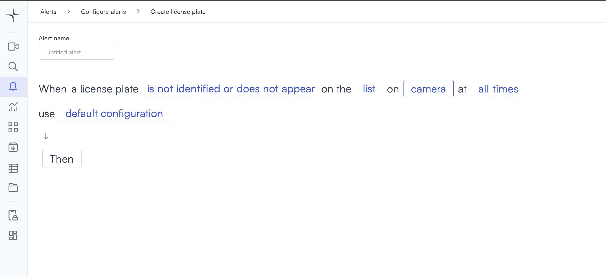
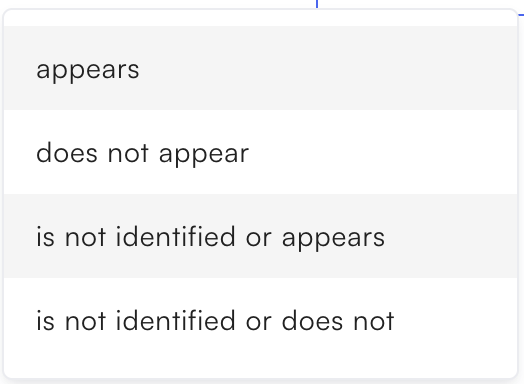
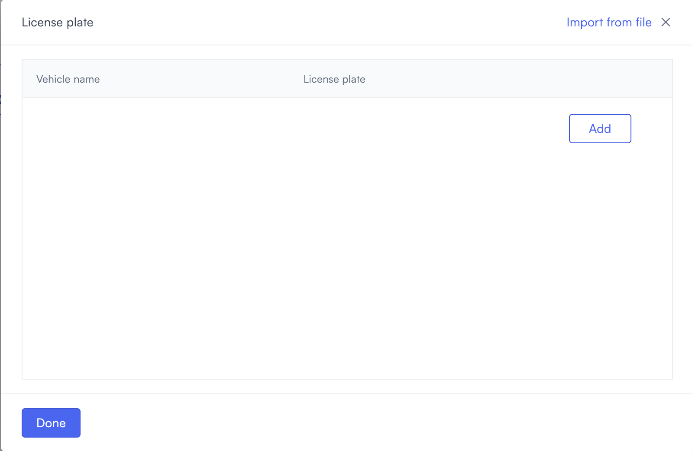
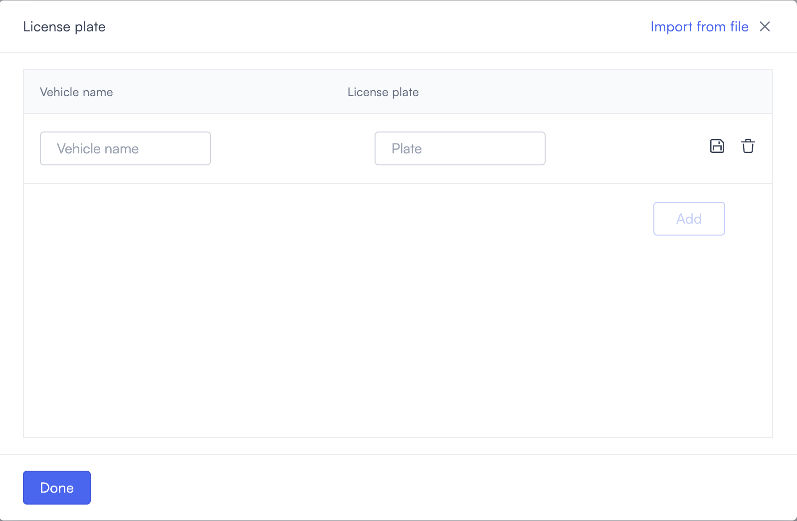

# License plate recognition

License plate recognition alerts you when a detected plate matches or doesn't match a list you configure. Use it to control vehicle access, track specific vehicles, or detect unreadable plates.

## How it works

Lumana reads license plates from the camera feed and compares them against your configured list. When the detection meets the condition you set, the alert triggers. You configure the trigger condition to match your use case. Choose to alert on matching plates, non-matching plates, or vehicles whose plate can't be read.

## Configure the alert

1. Select the **bell icon** in the navigation bar. The Alerts monitoring view opens.

2. Select **Add alert** in the top right corner. The Configure alerts page opens.

3. Under **Identification**, select **Use template** on the **License plate** card. The Create license plate page opens.

4. Enter a name in the **Alert name** field, for example "Gated entry unauthorized plate" or "Known vehicle arrival."
5. Select the **appears** field in the alert rule sentence. A dropdown opens with the trigger conditions.

   * **appears**: Triggers when a detected plate matches a plate on the list.
   * **does not appear**: Triggers when a detected plate does not match any plate on the list.
   * **is not identified or appears**: Triggers when the plate cannot be read, or when the plate is on the list.
   * **is not identified or does not appear**: Triggers when the plate cannot be read, or when the plate is not on the list.

6. Select the **list** field to open the License plate modal.

   Select **Add**  to create a new entry. An editable row appears with a **Vehicle name** field and a **Plate** field.

   Enter the vehicle name and plate number, then select the save icon to save the entry. To remove an entry, select the delete icon next to it. To import multiple plates at once, select **Import from file**.

   Select **Done** to confirm the list and close the modal.
7. Select the **camera** field to open the Choose cameras modal. Select the cameras you want to monitor, then select **Select** to confirm.

8. Select the **time** field to set when the alert is active. [Configure alerts](../../configure-alerts.md#schedule) covers the schedule options.
9. Optionally, select **default configuration** to adjust display settings, confidence level, priority, blocking period, and alert message. [Configure alerts](../../configure-alerts.md#default-configuration) covers these settings.
10. Select **Then**  to choose the action Lumana takes when the alert triggers. The available actions are covered in [Alert actions](../../alert-actions.md).
11. Select **Create alert** in the top right corner. The alert is saved and becomes active immediately.
