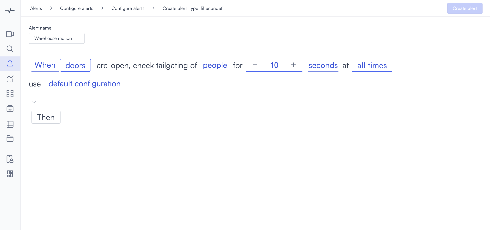
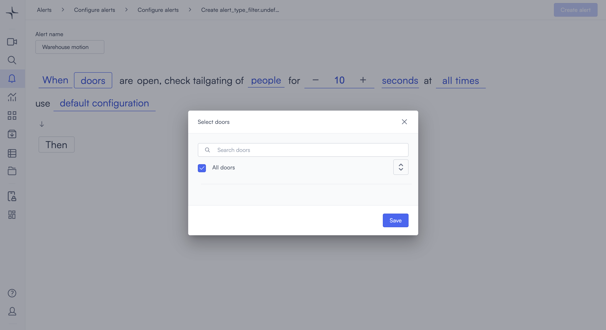
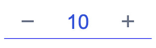

# Door tailgating

The door tailgating alert detects when multiple people pass through a door during a single access event. Use it when you want to catch unauthorized entry that happens while a door is legitimately open.

## How it works

When a door in your connected access control system opens, Lumana monitors it for the duration you set. If additional people pass through beyond the authorized entry, the alert triggers. The alert works with the doors registered in your access control integration.

## Configure the alert

1. Select the **bell icon** in the navigation bar. The Alerts monitoring view opens.

2. Select **Add alert** in the top right corner. The Configure alerts page opens.

3. Select **Integrations** in the left sidebar, then select **Use template** on the **Door tailgating** card. The Create door tailgating page opens.

4. Enter a name in the **Alert name** field, for example "Main entrance tailgating" or "Server room door."
5. Select the **doors** field in the alert rule sentence. The Select doors panel opens.

Use the **Search doors** field to find a specific door, or select **All doors** to monitor every door in your integration. Select **Save** to confirm.

6. Select the **people** field to choose the object type to monitor.
7. Set the duration in the seconds field. Select **−** or **+** to adjust the value, or enter a value directly. Lumana monitors the door for this long after it opens.

8. The **at all times** field controls when the alert is active. To restrict it to specific hours or days, select **at all times** to open the scheduling options. For all scheduling options, see [Configure alerts](../../create-and-manage-alerts.md#schedule).
9. Optionally, select **default configuration** to adjust display settings, confidence level, priority, blocking period, and alert message. [Configure alerts](../../create-and-manage-alerts.md#default-configuration) covers these settings.
10. Select **Then**  to choose the action Lumana takes when the alert triggers. [Alert actions](../../alert-actions.md) covers the available actions.
11. Select **Create alert** in the top right corner. The alert is saved and becomes active immediately.
