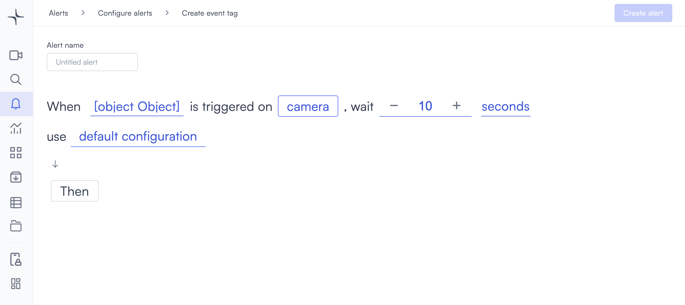
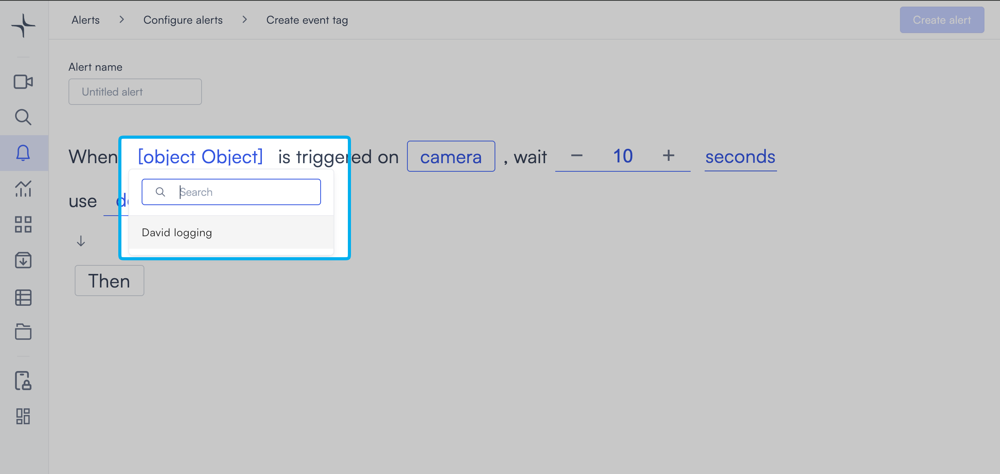

# Event tag

Event tag triggers when Lumana receives an event from the event tag you select on a camera you monitor. Use it to trigger an alert when an external system, such as a point-of-sale, warehouse management, or access control platform, sends an event to Lumana.

## How it works

Your external system posts events to Lumana via the API. When Lumana receives an event matching the event tag you select, it waits for the delay you set, then triggers the alert. Lumana indexes the camera footage at that timestamp and links it to the event.

To create event tags and configure the API integration before using this alert, see [Enhance your video data with Lumana Event Tags](../../../databases-analytics-and-search/enhance-your-video-data-with-lumana-event-tags.md).

## Configure the alert

1. Select the **bell icon** in the navigation bar. The Alerts monitoring view opens.

2. Select **Add alert** in the top right corner. The Configure alerts page opens.

3. Select **Integrations** in the left sidebar to go to that section, then select **Use template** on the **Event tag** card. The Create event tag page opens.

4. Enter a name in the **Alert name** field, for example "High-value transaction" or "Pallet scan received."
5. Select the **event tag** field in the alert rule sentence. A dropdown opens listing all event tags created in your organization.

6. Select the event tag you want to monitor.
7. Select the **camera** field to open the Choose cameras modal. Select the cameras you want to monitor, then select **Select** to confirm.

8. Set the delay in the **wait** field. The default is 10. Select **−** or **+** to adjust the value, or enter a value directly. Lumana waits this long after receiving the event before triggering the alert.

9. Select the **seconds** field and choose **seconds**, **minutes**, or **hours**.

10. Optionally, select **default configuration** to adjust display settings, confidence level, priority, blocking period, and alert message. [Configure alerts](../../configure-alerts.md#default-configuration) covers these settings.
11. Select **Then**  to choose the action Lumana takes when the alert triggers. [Alert actions](../../alert-actions.md) covers the available actions.
12. Select **Create alert** in the top right corner. The alert is saved and becomes active immediately.
