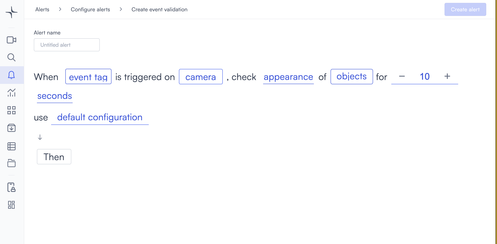
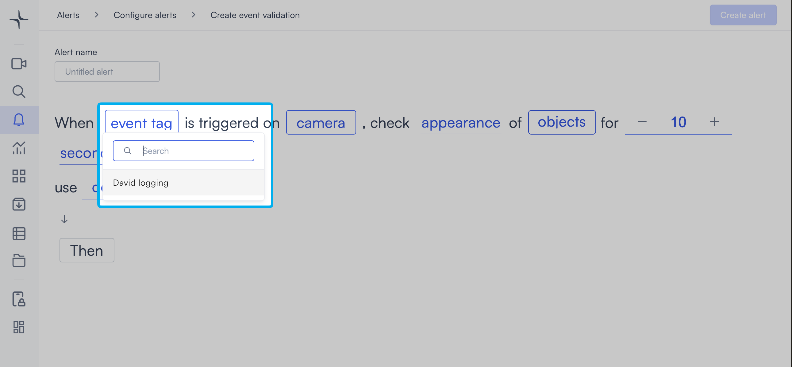
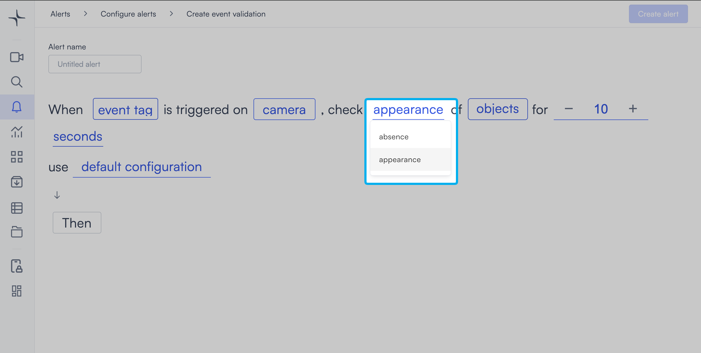

# Event validation

Event validation triggers when an event tag arrives on a camera and your configured objects appear or are absent as expected. Use it to verify that physical activity on camera matches what an external system recorded.

## How it works

When Lumana receives the event tag, it monitors the camera you selected. It checks whether the configured objects appear or are absent for the duration you set. When the objects match the condition, the alert triggers.

To create event tags and configure the API integration before using this alert, see [Enhance your video data with Lumana Event Tags](../../../databases-analytics-and-search/enhance-your-video-data-with-lumana-event-tags.md).

## Configure the alert

1. Select the **bell icon** in the navigation bar. The Alerts monitoring view opens.

2. Select **Add alert** in the top right corner. The Configure alerts page opens.

3. Select **Integrations** in the left sidebar to go to that section, then select **Use template** on the **Event validation** card. The Create event validation page opens.

4. Enter a name in the **Alert name** field, for example "No customer at register" or "Unattended POS transaction."
5. Select the **event tag** field in the alert rule sentence. A dropdown opens listing all event tags created in your organization.

6. Select the event tag you want to monitor.
7. Select the **camera** field to open the Choose cameras modal. Select the cameras you want to monitor, then select **Select** to confirm.

8. Select the **appearance** field in the alert rule sentence. A dropdown opens with the detection conditions.

   * **appearance**: Triggers when the configured objects are detected on camera for the set duration.
   * **absence**: Triggers when the configured objects are not detected on camera for the set duration.

9. Select the **objects** field in the alert rule sentence. A dropdown opens with the available object types.

   Select one or more object types to monitor:

   * **people**: Detects people.
   * **vehicles**: Detects vehicles.
   * **animals**: Detects animals.

   Any custom objects you've already created appear below the built-in types, tagged as **Custom**. You can select multiple types. If you need to detect a specific object that isn't in the list, then select **+ New custom object** and follow the steps in [Create a custom object](../security/proximity.md#create-a-custom-object).

10. Set the duration in the **for** field. The default is 10. Select **−** or **+** to adjust the value, or enter a value directly.

11. Select the **seconds** field and choose **seconds**, **minutes**, or **hours**.

12. Optionally, select **default configuration** to adjust display settings, confidence level, priority, blocking period, and alert message. [Configure alerts](../../configure-alerts.md#default-configuration) covers these settings.
13. Select **Then**  to choose the action Lumana takes when the alert triggers. [Alert actions](../../alert-actions.md) covers the available actions.
14. Select **Create alert** in the top right corner. The alert is saved and becomes active immediately.
