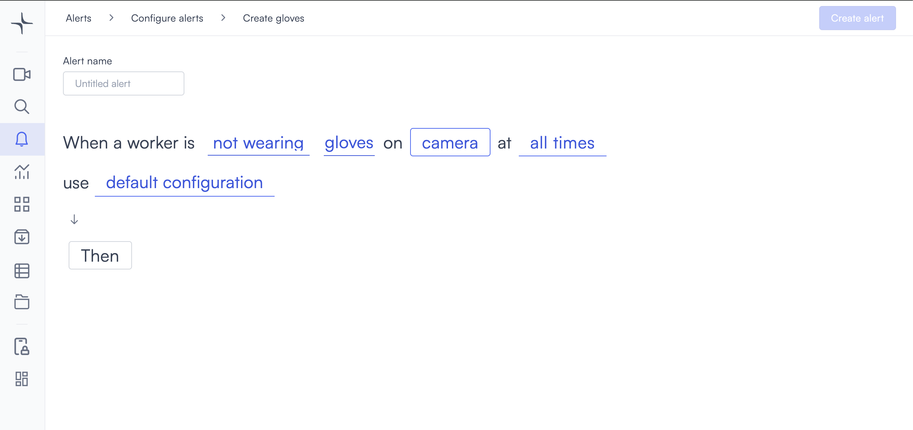
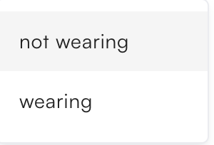
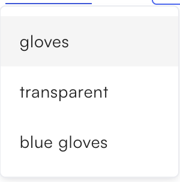

# Gloves

Gloves detection triggers when a worker is detected not wearing gloves on a camera you select.

## How it works

Lumana monitors the camera feed and checks whether the worker matches the wearing condition you select. When the condition is met, the alert triggers.

## Configure the alert


Gloves detection is currently in beta. Detection accuracy might vary depending on camera angle, image quality, and lighting conditions. Test the alert in your environment before relying on it for critical safety decisions.


1. Select the **bell icon** in the navigation bar. The Alerts monitoring view opens.

2. Select **Add alert** in the top right corner. The Configure alerts page opens.

3. Select **Safety and compliance** in the left sidebar to go to that section, then select **Use template** on the **Gloves** card. The Create gloves page opens.

4. Enter a name in the **Alert name** field, for example "Gloves violation" or "Hand protection compliance."
5. Select the **not wearing** field in the alert rule sentence. A dropdown opens with the wearing conditions.

   * **not wearing**: Triggers when the worker is not wearing the configured glove type.
   * **wearing**: Triggers when the worker is wearing the configured glove type.

6. Select the **gloves** field in the alert rule sentence. A dropdown opens with the glove types.

   * **gloves**: Detects whether the worker is wearing gloves.
   * **transparent**: Detects whether the worker is wearing transparent gloves.
   * **blue gloves**: Detects whether the worker is wearing blue gloves.

7. Select the **camera** field to open the Choose cameras modal. Select the cameras you want to monitor, then select **Select** to confirm.

8. Select the **time** field to set when the alert is active. [Configure alerts](../../configure-alerts.md#schedule) covers the schedule options.
9. Optionally, select **default configuration** to adjust display settings, confidence level, priority, blocking period, and alert message. [Configure alerts](../../configure-alerts.md#default-configuration) covers these settings.
10. Select **Then**  to choose the action Lumana takes when the alert triggers. [Alert actions](../../alert-actions.md) covers the available actions.
11. Select **Create alert** in the top right corner. The alert is saved and becomes active immediately.
