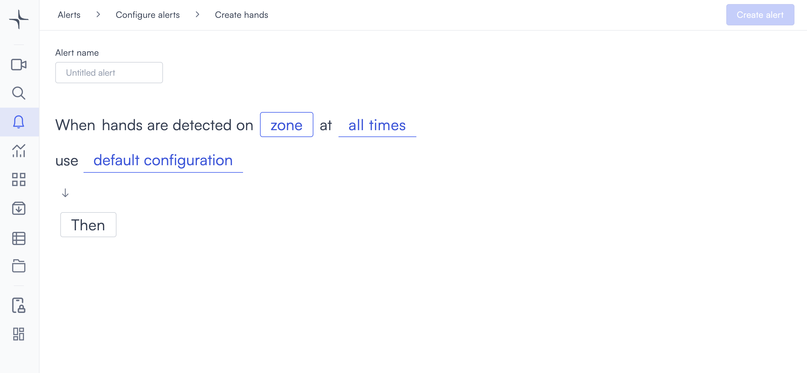

# Hands detected

Hands detected triggers when hands are detected in a zone you draw on the camera view.

## How it works

Lumana monitors the zone you define within the camera frame. When hands are detected inside that zone, the alert triggers.

## Configure the alert


Hands detection is currently in beta. Detection accuracy might vary depending on camera angle, image quality, and lighting conditions. Test the alert in your environment before relying on it for critical safety decisions.


1. Select the **bell icon** in the navigation bar. The Alerts monitoring view opens.

2. Select **Add alert** in the top right corner. The Configure alerts page opens.

3. Under **Safety and compliance**, select **Use template** on the **Hands detected** card. The Create hands page opens.

4. Enter a name in the **Alert name** field, for example "Hands in restricted area" or "Hands detected alert."
5. Select the **zone** field to open the Choose cameras modal. Select the camera you want to monitor, then select **Select** to confirm.

   After selecting a camera, draw a detection zone to define the area within the frame. Select the **edit icon** next to the camera name to open the Select region of interest dialog.

   Select points on the camera feed to define the zone boundary. Each point connects to the next with a green line. When the polygon is closed, the enclosed area fills with a green overlay indicating the active detection zone.

   * **Exclude**: Toggle on to invert the zone. Hands detected outside the drawn area trigger the alert instead.
   * **Reset**: Clears all points and lets you start over.
   * **Select**: Confirms the zone and closes the dialog.

6. Select the **time** field to set when the alert is active. [Configure alerts](../../configure-alerts.md#schedule) covers the schedule options.
7. Optionally, select **default configuration** to adjust display settings, confidence level, priority, blocking period, and alert message. [Configure alerts](../../configure-alerts.md#default-configuration) covers these settings.
8. Select **Then**  to choose the action Lumana takes when the alert triggers. [Alert actions](../../alert-actions.md) covers the available actions.
9. Select **Create alert** in the top right corner. The alert is saved and becomes active immediately.
