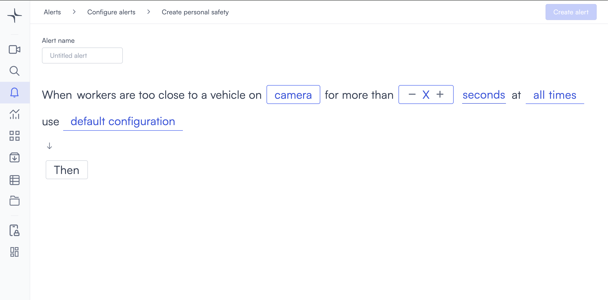

# Personal safety

Personal safety detection triggers when workers are too close to a vehicle on a camera for longer than a duration you set.

## How it works

Lumana monitors the camera feed for workers in close proximity to vehicles. When that proximity persists for longer than a duration you set, the alert triggers.

## Configure the alert

1. Select the **bell icon** in the navigation bar. The Alerts monitoring view opens.

2. Select **Add alert** in the top right corner. The Configure alerts page opens.

3. Under **Safety and compliance**, select **Use template** on the **Personal safety** card. The Create personal safety page opens.

4. Enter a name in the **Alert name** field, for example "Forklift proximity alert" or "Vehicle pedestrian warning."
5. Select the **camera** field to open the Choose cameras modal. Select the cameras you want to monitor, then select **Select** to confirm.

6. Set the duration in the **for more than** field. Select **−** or **+** to adjust the value, or enter a value directly.

7. Select the **seconds** field and choose **seconds**, **minutes**, or **hours**.

8. Select the **time** field to set when the alert is active. [Configure alerts](../../configure-alerts.md#schedule) covers the schedule options.
9. Optionally, select **default configuration** to adjust display settings, confidence level, priority, blocking period, and alert message. [Configure alerts](../../configure-alerts.md#default-configuration) covers these settings.
10. Select **Then**  to choose the action Lumana takes when the alert triggers. [Alert actions](../../alert-actions.md) covers the available actions.
11. Select **Create alert** in the top right corner. The alert is saved and becomes active immediately.
