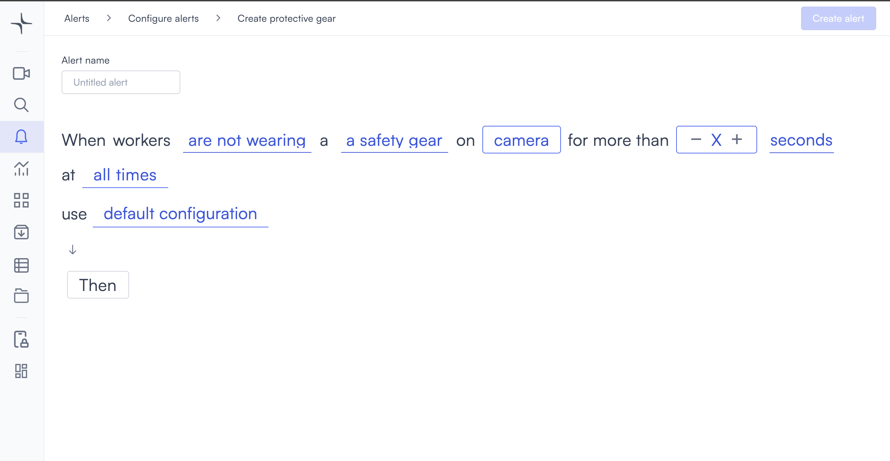
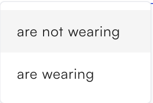
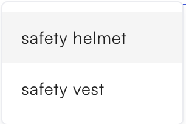

# Protective gear

Protective gear detection triggers when workers are detected wearing or not wearing configured safety equipment for longer than a duration you set.

## How it works

Select a wearing condition and a gear type. Lumana monitors the camera feed and triggers the alert when workers match the condition for longer than the configured duration.

## Configure the alert

1. Select the **bell icon** in the navigation bar. The Alerts monitoring view opens.

2. Select **Add alert** in the top right corner. The Configure alerts page opens.

3. Select **Safety and compliance** in the left sidebar to go to that section, then select **Use template** on the **Protective gear** card. The Create protective gear page opens.

4. Enter a name in the **Alert name** field, for example "Hard hat violation" or "Safety vest compliance."
5. Select the **are not wearing** field in the alert rule sentence. A dropdown opens with the wearing conditions.

   * **are not wearing**: Triggers when workers are not wearing the configured gear type.
   * **are wearing**: Triggers when workers are wearing the configured gear type.

6. Select the **a safety gear** field in the alert rule sentence. A dropdown opens with the gear types.

   * **safety helmet**: Detects whether workers are wearing a safety helmet.
   * **safety vest**: Detects whether workers are wearing a safety vest.

7. Select the **camera** field to open the Choose cameras modal. Select the cameras you want to monitor, then select **Select** to confirm.

8. Set the duration in the **for more than** field. Select **−** or **+** to adjust the value, or enter a value directly.

9. Select the **seconds** field and choose **seconds**, **minutes**, or **hours**.

10. Select the **time** field to set when the alert is active. [Configure alerts](../../configure-alerts.md#schedule) covers the schedule options.
11. Optionally, select **default configuration** to adjust display settings, confidence level, priority, blocking period, and alert message. [Configure alerts](../../configure-alerts.md#default-configuration) covers these settings.
12. Select **Then**  to choose the action Lumana takes when the alert triggers. [Alert actions](../../alert-actions.md) covers the available actions.
13. Select **Create alert** in the top right corner. The alert is saved and becomes active immediately.
