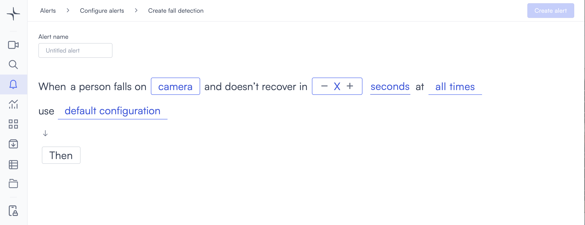

# Fall detection

The fall detection alert triggers when a person falls in the camera view and doesn't recover within a time threshold you set. It's used in healthcare facilities, care homes, workplaces, and any environment where a fall is a safety event that needs an immediate response.

## How it works

Lumana uses AI to analyze body posture and movement in the video feed. The model distinguishes between normal movements, such as walking, sitting, or bending, and an actual fall. When a fall is detected, Lumana starts a timer. If the person doesn't recover within the configured threshold, the alert triggers. Falls where the person recovers quickly don't trigger the alert.

## Camera placement

Camera placement directly affects detection accuracy. For reliable fall detection:

* Position cameras at a corner or overhead angle that captures the person's full body.
* Ensure there are no obstructions between the person and the camera. Furniture, walls, or other people blocking the view can trigger false alerts.
* Maintain adequate lighting to ensure clear visibility.
* Keep individuals within a reasonable distance from the camera. Subjects too far from the lens might not be detected reliably.

Not every environment is suitable for this alert type. Review the limitations below before deploying.

## Limitations

Fall detection works best in controlled, low-traffic environments. It might not perform reliably in the following conditions:

* **Object size**: The detected person must cover at least 5% of the camera frame and be positioned within the central 80% of the frame.
* **Analysis limit**: Only three individuals are analyzed per frame. If more than three people are present, the three largest are prioritized.
* **Crowded areas**: High-traffic locations such as malls or busy streets can produce false detections.
* **Dynamic environments**: Gyms, sports facilities, or workplaces with frequent rapid movement can confuse the AI model.
* **Distance**: Subjects far from the camera significantly reduce detection accuracy.

Environments that are low-traffic, well-lit, and have cameras positioned to capture full-body movement are the best fit for this alert.

## Configure the alert


Fall detection is currently in beta. Detection accuracy might vary depending on camera placement, lighting, and the conditions described in the limitations above. Test the alert in your environment before relying on it for critical safety decisions.


1. Select the **bell icon** in the navigation bar. The Alerts monitoring view opens.

2. Select **Add alert** in the top right corner. The Configure alerts page opens.

3. Under **Security**, select **Use template** on the **Fall detection** card. The Create fall detection page opens.

4. Enter a name in the **Alert name** field, for example "Care home fall detection" or "Warehouse floor fall alert."
5. Select the **camera** field to open the Choose cameras modal. Select the cameras you want to monitor, then select **Select** to confirm.

6. Set the recovery time threshold. Select **+** to increase the value or **-** to decrease it. Then select the unit dropdown and choose **seconds**, **minutes**, or **hours**. The alert only triggers when a person falls and doesn't recover within this time.
7. Select the **time** field to set when the alert is active. [Configure alerts](../../configure-alerts.md#schedule) covers the schedule options.
8. Optionally, select **default configuration** to adjust display settings, confidence level, priority, blocking period, and alert message. [Configure alerts](../../configure-alerts.md#default-configuration) covers these settings.
9. Select **Then**  to choose the action Lumana takes when the alert triggers. The available actions are covered in [Alert actions](../../alert-actions.md).
10. Select **Create alert** in the top right corner. The alert is saved and becomes active immediately.
