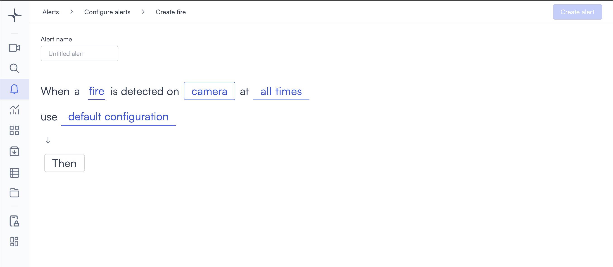
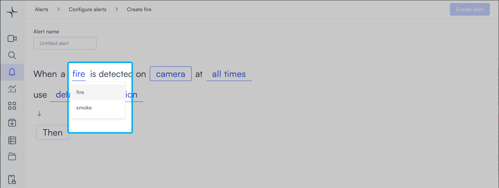

# Fire

The fire alert triggers when flames or smoke are visible in the camera feed. It works as a visual detection layer alongside your existing alarm systems, covering areas that physical sensors might not reach.

## How it works

Lumana's AI model analyzes the video feed for the visual signatures of fire or smoke. When the configured condition is detected, the alert triggers immediately. Because detection is camera-based, it can cover outdoor areas, large open spaces, and locations where smoke detectors aren't practical.

## Configure the alert

1. Select the **bell icon** in the navigation bar. The Alerts monitoring view opens.

2. Select **Add alert** in the top right corner. The Configure alerts page opens.

3. Select **Security** in the left sidebar to go to that section, then select **Use template** on the **Fire** card. The Create fire page opens.

4. Enter a name in the **Alert name** field, for example "Warehouse fire detection" or "Loading dock smoke alert."
5. Select the **fire** field in the alert rule sentence. A dropdown opens with the available detection types.

Select the condition you want to detect:

* **fire**: Detects visible flames in the camera feed.
* **smoke**: Detects visible smoke in the camera feed.

6. Select the **camera** field to open the Choose cameras modal. Select the cameras you want to monitor, then select **Select** to confirm.

7. Select the **time** field to set when the alert is active. [Configure alerts](../../configure-alerts.md#schedule) covers the schedule options.
8. Optionally, select **default configuration** to adjust display settings, confidence level, priority, blocking period, and alert message. [Configure alerts](../../configure-alerts.md#default-configuration) covers these settings.
9. Select **Then**  to choose the action Lumana takes when the alert triggers. The available actions are covered in [Alert actions](../../alert-actions.md).
10. Select **Create alert** in the top right corner. The alert is saved and becomes active immediately.
