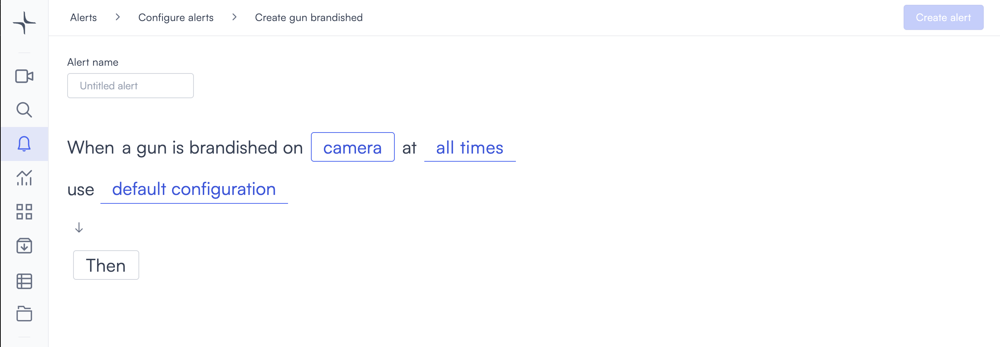

# Gun brandished

The gun brandished alert triggers when a gun is actively brandished on camera. It works with Lumana's professional monitoring service for immediate dispatch when needed.

## How it works

Lumana's AI model analyzes the video feed for a gun being brandished. When it detects one, the alert triggers immediately.


This alert type is supported by Lumana's professional monitoring service. Trained agents can verify the alert and dispatch first responders when needed.


## Configure the alert


Gun brandished detection is currently in beta. Detection accuracy might vary depending on camera angle, image quality, and lighting conditions. Test the alert in your environment before relying on it for critical security decisions.


1. Select the **bell icon** in the navigation bar. The Alerts monitoring view opens.

2. Select **Add alert** in the top right corner. The Configure alerts page opens.

3. Under **Security**, select **Use template** on the **Gun brandished** card. The Create gun brandished page opens.

4. Enter a name in the **Alert name** field, for example "Lobby gun brandished" or "Main entrance weapon alert."
5. Select the **camera** field to open the Choose cameras modal. Select the cameras you want to monitor, then select **Select** to confirm.

6. Select the **time** field to set when the alert is active. [Configure alerts](../../configure-alerts.md#schedule) covers the schedule options.
7. Optionally, select **default configuration** to adjust display settings, confidence level, priority, blocking period, and alert message. [Configure alerts](../../configure-alerts.md#default-configuration) covers these settings.
8. Select **Then**  to choose the action Lumana takes when the alert triggers. The available actions are covered in [Alert actions](../../alert-actions.md).
9. Select **Create alert** in the top right corner. The alert is saved and becomes active immediately.
