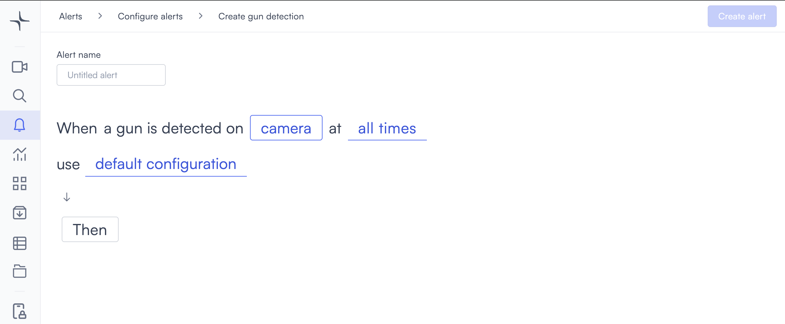
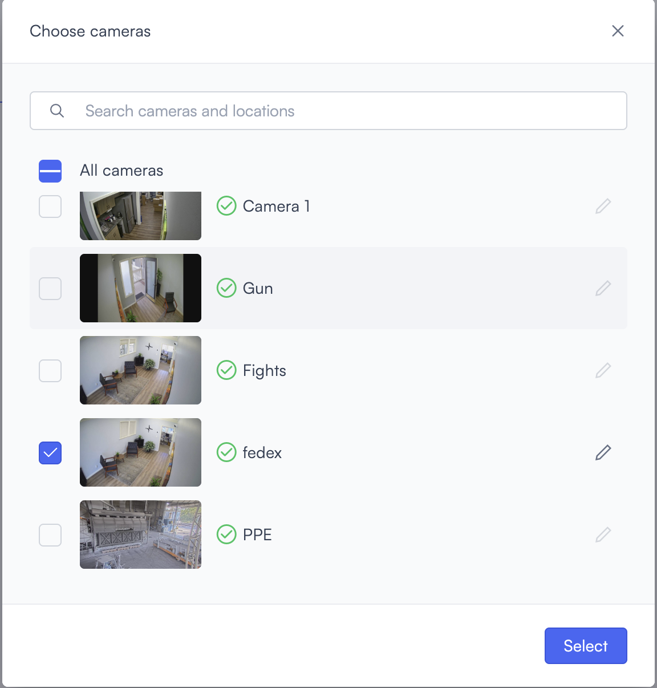

# Gun detection

Gun detection alerts you when a firearm is visible in the camera view, regardless of whether it's being actively held or brandished. It's distinct from the [gun drawn alert](gun-drawn.md), which looks specifically for a weapon raised in a threatening posture.

## How it works

Lumana's AI model scans the video feed for firearms within the frame. When one is identified, the alert triggers and footage of the event is saved for review.

## When to use it

This alert is suited for locations where unauthorized weapons are a defined security risk.

* Monitoring access points, lobbies, or public spaces for unauthorized weapons.
* Providing an early warning layer alongside the gun drawn alert for higher-risk environments.
* Supporting compliance in locations where weapons are prohibited.

## Configure the alert


Gun detection is currently in beta. Detection accuracy might vary depending on camera angle, image quality, and lighting conditions. Test the alert in your environment before relying on it for critical security decisions.


The general alert configuration flow, including advanced configuration and alert actions, is covered in [Configure alerts](../../configure-alerts.md). This section covers the fields specific to gun detection.

1. Select the **bell icon** in the navigation bar, then select **Add alert**.
2. Under **Security**, select **Use template** on the **Gun detection** card. The Create gun detection page opens.

3. Enter a name in the **Alert name** field, for example "Lobby gun detection" or "Main entrance weapon alert."
4. Select the **camera** field to open the Choose cameras modal. Select the cameras you want to monitor, then select **Select** to confirm.

5. Select the **time** field to set when the alert is active. The schedule options are covered in [Configure alerts](../../configure-alerts.md#create-an-alert).
6. Optionally, select **default configuration** to adjust display settings, confidence level, priority, blocking period, and alert message. These settings are covered in [Configure alerts](../../configure-alerts.md#create-an-alert).
7. Select **Then** to choose the action Lumana takes when the alert triggers. The available actions are covered in [Alert actions](../../alert-actions.md).
8. Select **Create alert** in the top right corner. The alert is saved and becomes active immediately.
