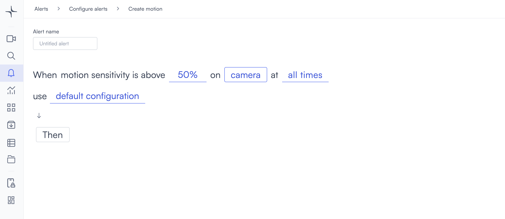
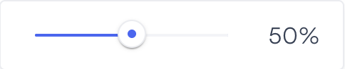

# Motion

The Motion alert triggers when Lumana detects movement within a camera's view. Use it as a baseline alert for spaces where any activity is significant, such as after-hours offices, restricted storage areas, or perimeter zones that should remain clear outside authorised hours.

## How it works

Lumana analyses the video feed continuously and triggers the alert when movement exceeds the sensitivity threshold you set. You can restrict detection to a specific zone within the frame or apply it to the entire camera view. If no zone is drawn, any movement across the full frame triggers the alert.

Drawing a detection zone reduces false positives in busy environments where only a portion of the frame needs monitoring.

## When to use it

- Monitoring after-hours offices or facilities where any movement signals a potential security concern.
- Detecting activity in restricted storage areas where access is limited to authorised personnel.
- Flagging movement in perimeter zones that should remain clear outside scheduled operating hours.

## Configure the alert

The general alert configuration flow, including advanced configuration and alert actions, is covered in [Configure alerts](../../configure-alerts.md). This section covers the fields specific to Motion.

1. Select the **bell icon** in the navigation bar, then select **Add alert**.
2. Under **Security**, select **Use template** on the **Motion** card. The Create motion page opens.

3. Enter a name in the **Alert name** field, for example "After-hours motion" or "Warehouse perimeter."

4. Select the sensitivity value in the alert rule sentence. A slider opens.

   Drag the slider to set the motion sensitivity threshold. The range is 0 to 100 and the default is 50. A higher value requires more significant movement before the alert triggers, which reduces false positives. A lower value makes the alert more sensitive to subtle movement.

5. Select the **camera** field to open the Choose cameras modal. Select the cameras you want to monitor and select **Select** to confirm.

  

   After selecting a camera, you can optionally draw a detection zone to limit motion detection to a specific area of the frame. Select the **edit icon** next to the camera name to open the Select region of interest dialog.

   Click on the camera feed to place points. Each click adds a point connected by a green line. When you close the polygon, the selected area fills with a green overlay showing the active detection zone.

   

   - **Exclude**: Toggle on to invert the zone. Motion outside the drawn area triggers the alert instead of motion inside it.

 

   - **Reset**: Clears all points and lets you start over.
   - **Select**: Confirms the zone and closes the dialog.

   If you do not draw a zone, motion anywhere in the full camera frame triggers the alert.

6. Select the **time** field to set when the alert is active. The schedule options are covered in [Configure alerts](../../configure-alerts.md#create-an-alert).

7. Optionally, select **default configuration** to adjust display settings, confidence level, priority, blocking period, and alert message. These settings are covered in [Configure alerts](../../configure-alerts.md#create-an-alert).

8. Select **Then** to choose the action Lumana takes when the alert triggers. The available actions are covered in [Alert actions](../../alert-actions.md).

9. Select **Create alert** in the top right corner. The alert is saved and becomes active immediately.