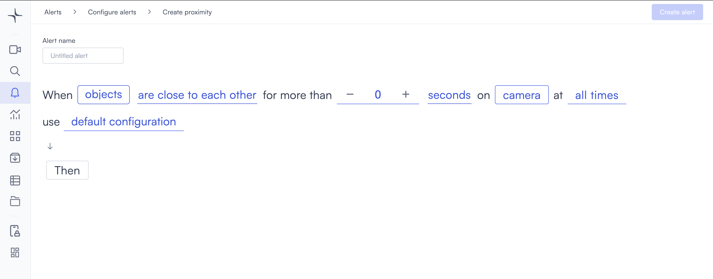
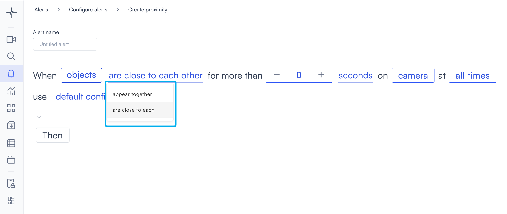
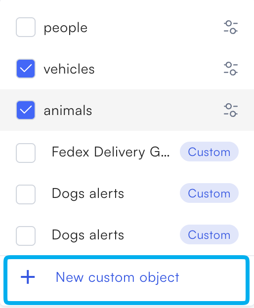
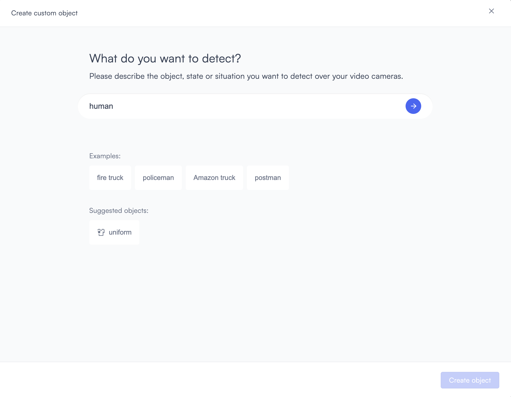
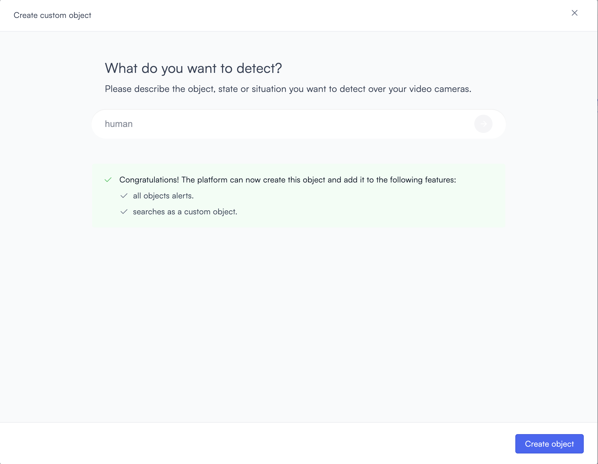
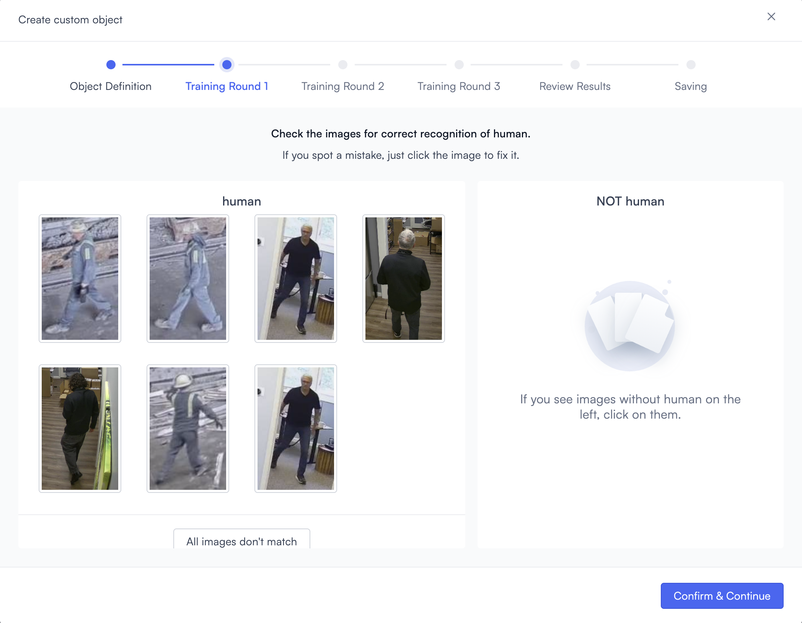
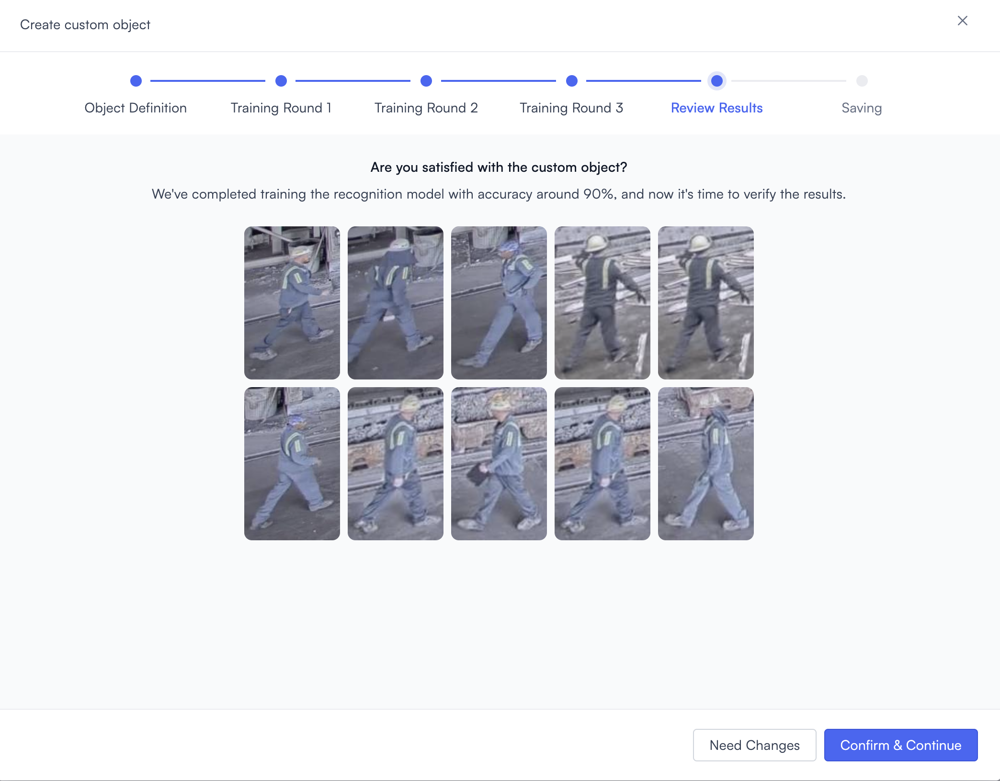
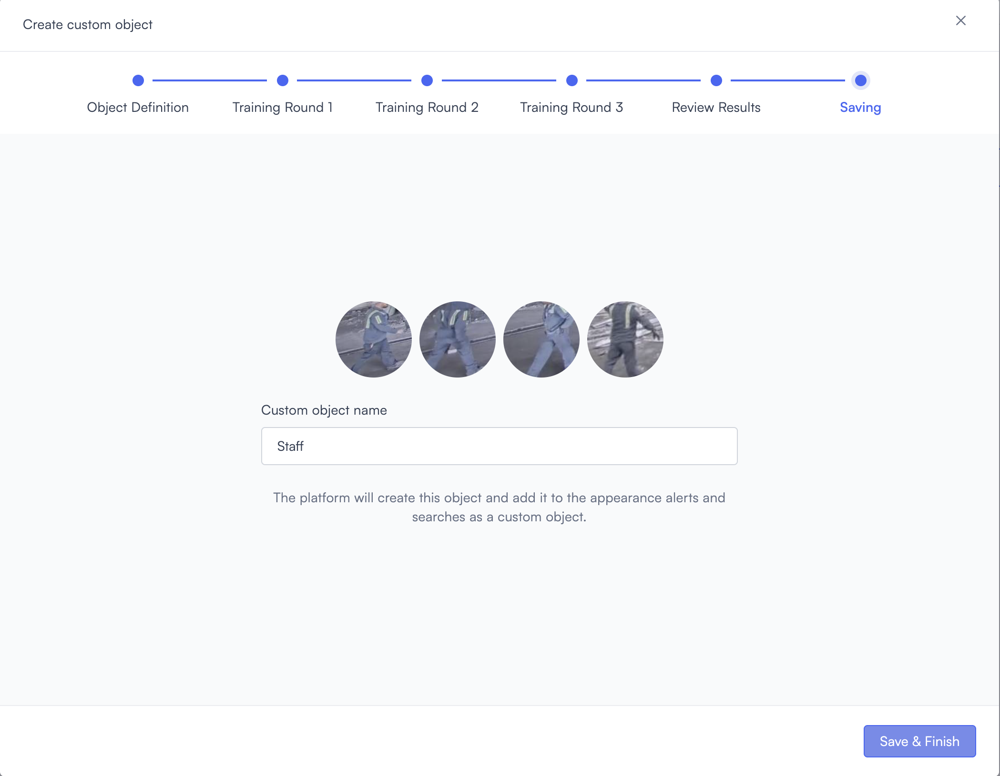
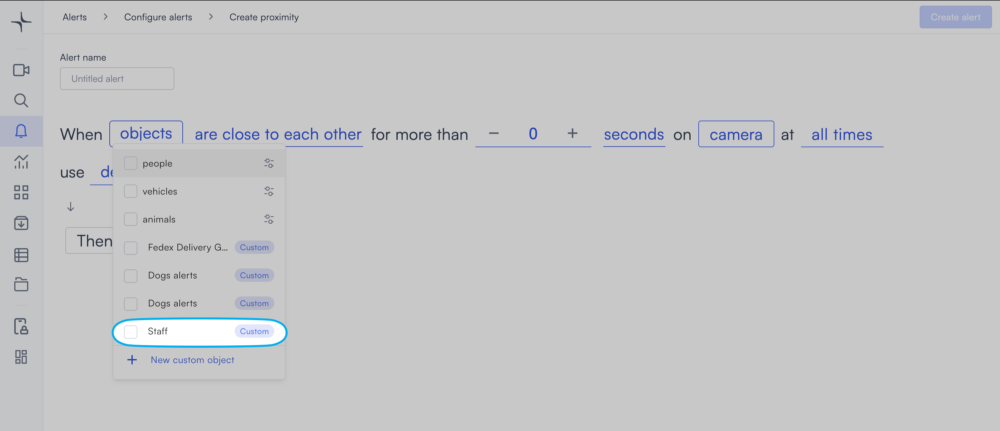

# Proximity

The Proximity alert triggers when two objects remain within a close distance of each other for longer than a set duration. Use it when brief contact between objects is normal, but sustained closeness signals a security concern.

## How it works

Lumana monitors the positions of detected objects in the camera view. When two objects stay within the proximity threshold for longer than the duration you set, the alert triggers and Lumana saves a video clip to the alert feed. You can choose from built-in object types or train Lumana to recognize a custom object specific to your environment.

## When to use it

Proximity detection works well in environments where you need to distinguish incidental contact from sustained closeness.

* Detecting a person loitering near a parked vehicle, which may indicate an attempted theft.
* Monitoring restricted areas where people should not approach certain equipment or assets.
* Identifying sustained contact between individuals in sensitive or secure environments.

## Configure the alert

The general alert configuration flow, including advanced configuration and alert actions, is covered in [Configure alerts](../../configure-alerts.md). This section covers the fields specific to Proximity.

1. Select the **bell icon** in the navigation bar, then select **Add alert**.
2. Under **Security**, select **Use template** on the **Proximity** card. The Create proximity page opens.

3. Enter a name in the **Alert name** field, for example "Vehicle perimeter" or "Restricted area proximity."
4. Select the **objects** field in the alert rule sentence. A dropdown opens with the available object types.

Select one or more object types to monitor:

* **people**: Detects people.
* **vehicles**: Detects vehicles.
* **animals**: Detects animals.

Any custom objects you've already created appear below the built-in types, tagged as **Custom**. You can select multiple types. The alert rule sentence updates to reflect your selection, for example "vehicles and animals."

If you need to detect a specific object that isn't in the list, then select **+ New custom object**. The Create custom object dialog opens. The full process is covered in [Create a custom object](proximity.md#create-a-custom-object) below.

5. Select the **proximity behavior** field and choose how the objects relate:

* **are close to each other**: Triggers when both objects are within a close physical distance.
* **appear together**: Triggers when both objects appear in the same camera frame at the same time.

6. Select the duration counter and use the **−** and **+** controls to set how long the objects must remain in proximity before the alert triggers. The default is 0.

7. Select the time unit field and choose **seconds**, **minutes**, or **hours**.

8. Select the **camera** field to open the Choose cameras modal. Select the cameras you want to monitor, then select **Select** to confirm.

9. Select the **time** field to set when the alert is active. The schedule options are covered in [Configure alerts](../../configure-alerts.md#create-an-alert).
10. Optionally, select **default configuration** to adjust display settings, confidence level, priority, blocking period, and alert message. These settings are covered in [Configure alerts](../../configure-alerts.md#create-an-alert).
11. Select **Then** to choose the action Lumana takes when the alert triggers. The available actions are covered in [Alert actions](../../alert-actions.md).
12. Select **Create alert** in the top right corner. The alert is saved and becomes active immediately.

## Create a custom object

If the built-in object types don't cover what you need to detect, then you can train Lumana to recognize a custom object. The process uses footage from your cameras to build a recognition model, and it takes a few minutes to complete.

1. In the objects dropdown, select **+ New custom object**.

The Create custom object dialog opens.

2. Enter a description of what you want to detect in the text field, for example "policeman" or "Amazon truck." Select the **arrow** button to submit.

Lumana classifies the object and searches your camera footage for matching examples. This takes a moment.

3. When classification is complete, a confirmation message shows that the object can be used in alerts and searches. Select **Create object** to continue.

4. In **Training Round 1**, Lumana presents images from your footage sorted into two columns: images it believes match your object, and images it believes do not match. Select any image that is incorrectly placed to move it to the correct column. Select **Confirm & Continue** when the images look right.

5. Repeat the review process for **Training Round 2** and **Training Round 3**. Each round refines the model based on your corrections.
6. In the **Review Results** step, Lumana displays sample detections at approximately 90% accuracy. If the results look correct, then select **Confirm & Continue**. If you need adjustments, then select **Need Changes** to go back.

7. In the **Saving** step, enter a name in the **Custom object name** field, then select **Save & Finish**.

The custom object is saved and appears in the objects dropdown tagged as **Custom**. You can now select it in the alert rule.

