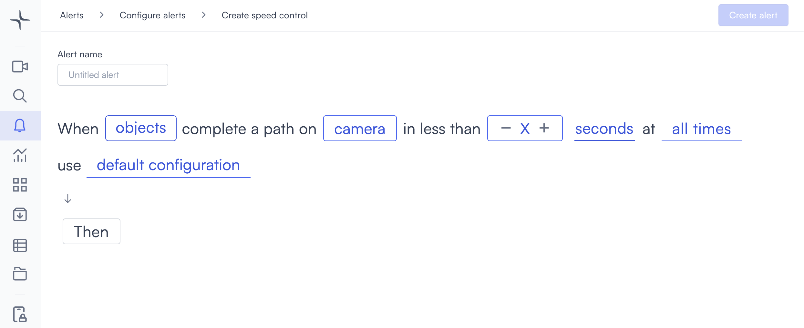

# Speed control

Speed control alerts you when an object moves through a defined path faster than the time threshold you set. It's a practical way to enforce speed limits in any environment where cameras are already deployed.

## How it works

You define a path on the camera feed and set a minimum traversal time. Lumana tracks detected objects and triggers the alert when one completes the path in less time than the threshold. A clip is saved when the alert triggers. The shorter the traversal time, the faster the object was moving.

## When to use it

Speed control detection is well suited for environments where the pace of movement directly affects safety.

* Monitoring warehouse or industrial environments where fast-moving forklifts or vehicles pose safety risks.
* Enforcing no-running policies in sensitive areas like hospitals, data centers, or labs.
* Detecting rapid movement near secured zones that might indicate a breach or emergency.

In each of these environments, the speed of movement is a direct proxy for risk.

## Configure the alert

The general alert configuration flow, including advanced configuration and alert actions, is covered in [Configure alerts](../../configure-alerts.md). This section covers the fields specific to speed control.

1. Select the **bell icon** in the navigation bar, then select **Add alert**.
2. Under **Security**, select **Use template** on the **Speed control** card. The Create speed control page opens.

3. Enter a name in the **Alert name** field, for example "Warehouse forklift speed" or "Car park vehicle speed."
4. Select the **objects** field in the alert rule sentence. A dropdown opens with the available object types.

Select one or more object types to monitor:

* **people**: Detects people.
* **vehicles**: Detects vehicles.
* **animals**: Detects animals.

Any custom objects you've already created appear below the built-in types, tagged as **Custom**. You can select multiple types. If you need to detect a specific object that isn't in the list, then select **+ New custom object**. The custom object creation process is covered in [Proximity: Create a custom object](proximity.md#create-a-custom-object).

5. Select the **camera** field to open the Choose cameras modal. Select the cameras you want to monitor, then select **Select** to confirm.

After selecting a camera, define the path on the camera feed. Select the **edit icon** next to the camera name to open the Select region of interest dialog. Select two points on the feed to mark the start and end of the path Lumana will measure. When both points are placed, the path is shown as a line across the frame.

* **Reset**: Clears all points and lets you start over.
* **Select**: Confirms the path and closes the dialog.

6. Set the speed threshold using the counter in the alert rule. Select **+** to increase the value or **-** to decrease it. Then select the unit dropdown and choose **seconds**, **minutes**, or **hours**. The alert triggers when an object completes the path in less than this amount of time.
7. Select the **time** field to set when the alert is active. The schedule options are covered in [Configure alerts](../../configure-alerts.md#create-an-alert).
8. Optionally, select **default configuration** to adjust display settings, confidence level, priority, blocking period, and alert message. These settings are covered in [Configure alerts](../../configure-alerts.md#create-an-alert).
9. Select **Then** to choose the action Lumana takes when the alert triggers. The available actions are covered in [Alert actions](../../alert-actions.md).
10. Select **Create alert** in the top right corner. The alert is saved and becomes active immediately.
