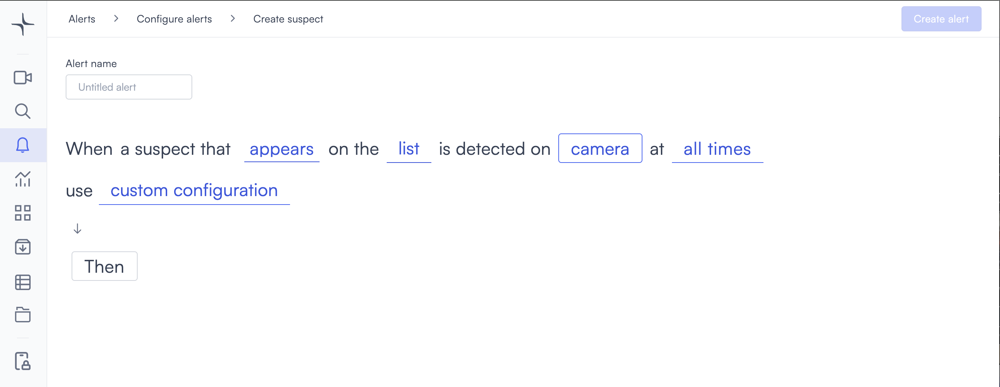
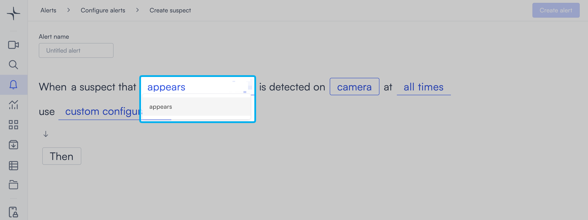
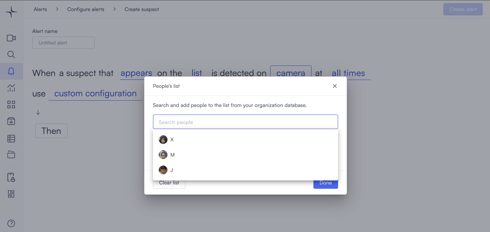
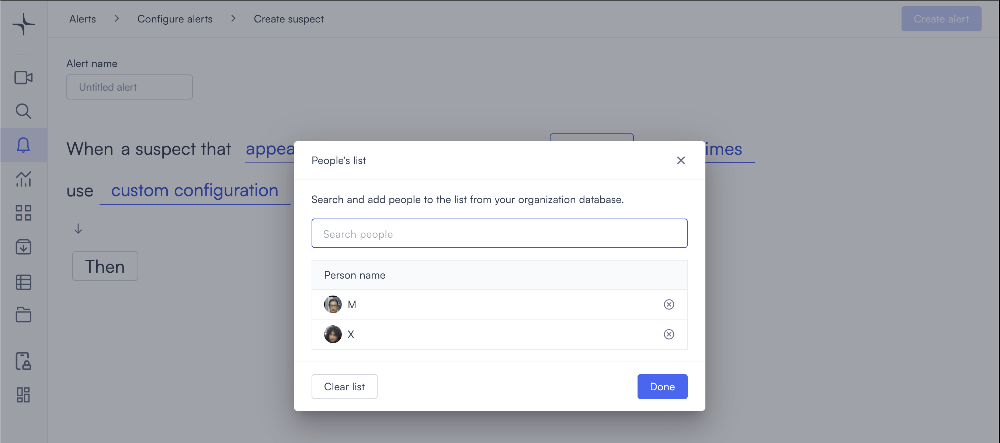

# Suspect alerts

The suspect alert triggers when Lumana detects a person from a watchlist you define. Use it to identify known persons of interest, flag unauthorized individuals in restricted areas, or build an audit trail of who appeared on camera.

## How it works

Lumana matches detected faces in the camera feed against a list of people you build from your organization's database. When Lumana finds a match, the alert triggers and saves a clip to the alert feed.

## When to use it

This alert works well in environments where you need to know immediately when a specific person appears on camera.

* Detecting known persons of interest when they appear in a monitored area.
* Flagging individuals on a security watchlist in restricted areas.
* Building an audit trail of who appeared in a specific location.

## Configure the alert

The general alert configuration flow, including advanced configuration and alert actions, is covered in [Configure alerts](../../configure-alerts.md). This section covers the fields specific to suspect alerts.

1. Select the **bell icon** in the navigation bar, then select **Add alert**.
2. Under **Security**, select **Use template** on the **Suspect** card. The Create suspect page opens.

3. Enter a name in the **Alert name** field, for example "Persons of interest" or "Restricted area watchlist."
4. Select the **appears** field in the alert rule sentence. A dropdown opens confirming the alert triggers when a person on the list is detected.

5. Select the **list** field to open the People's list modal.

Use the **Search people** field to find people from your organization database. Select a person to add them to the list. Each person you add appears under **Person name** with a remove button next to their name.

* To remove a person, select the **×** button next to their name.
* To remove everyone, select **Clear list**.

Select **Done** to confirm the list and close the modal.

6. Select the **camera** field to open the Choose cameras modal. Select the cameras you want to monitor, then select **Select** to confirm.

7. Select the **time** field to set when the alert is active. The schedule options are covered in [Configure alerts](../../configure-alerts.md#create-an-alert).
8. Optionally, select **default configuration** to adjust display settings, confidence level, priority, blocking period, and alert message. These settings are covered in [Configure alerts](../../configure-alerts.md#create-an-alert).
9. Select **Then** to choose the action Lumana takes when the alert triggers. The available actions are covered in [Alert actions](../../alert-actions.md).
10. Select **Create alert** in the top right corner. The alert is saved and becomes active immediately.
