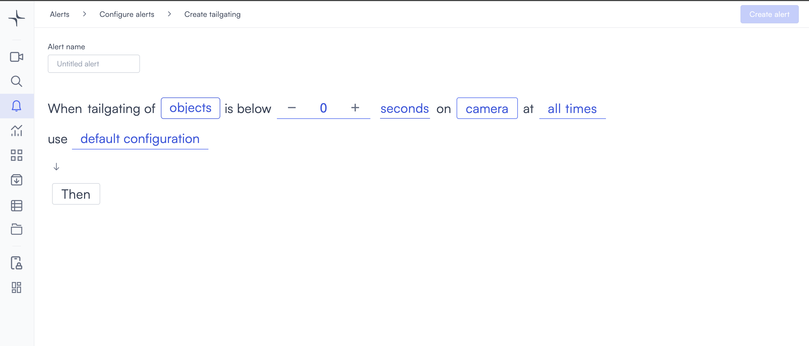

# Tailgating

The tailgating alert detects when multiple people enter through a single access control event. It triggers when one badge scan results in more than one person entering a secured area, flagging potential unauthorized access before it becomes an incident.

## How it works

When Kisi registers a single badge scan, Lumana monitors the camera feed to count how many people pass through the entry point. If more than one person enters, the alert triggers and captures a clip of the event.

## Requirements

This alert requires the Kisi access control integration to be active in your organization. Without it, the door event data that drives the alert is unavailable. See [Kisi access control](/broken/pages/CwMLCftje0ShEjwwFKyv) for setup instructions.

The Kisi integration is the only prerequisite; once it's active, the door event data Lumana needs is available.

## Configure the alert

The general alert configuration flow, including advanced configuration and alert actions, is covered in [Configure alerts](../../configure-alerts.md). This section covers the fields specific to Tailgating.

1. Select the **bell icon** in the navigation bar, then select **Add alert**.
2. Under **Security**, select **Use template** on the **Tailgating** card. The Create tailgating page opens.

3. Enter a name in the **Alert name** field, for example "Main entrance tailgating" or "Server room entry."
4. Select the **objects** field in the alert rule sentence. A dropdown opens with the available object types.

Select one or more object types to monitor:

* **people**: Detects people.
* **vehicles**: Detects vehicles.
* **animals**: Detects animals.

Any custom objects you've already created appear below the built-in types, tagged as **Custom**. You can select multiple types. If you need to detect a specific object that isn't in the list, then select **+ New custom object**. The custom object creation process is covered in [Proximity — Create a custom object](proximity.md#create-a-custom-object).

5. Select the duration counter and use the **−** and **+** controls to set the time window after entry during which Lumana checks for tailgating. The default is 0.

6. Select the time unit field and choose **seconds**, **minutes**, or **hours**.

7. Select the **camera** field to open the Choose cameras modal. Select the cameras you want to monitor, then select **Select** to confirm.

8. Select the **time** field to set when the alert is active. The schedule options are covered in [Configure alerts](../../configure-alerts.md#create-an-alert).
9. Optionally, select **default configuration** to adjust display settings, confidence level, priority, blocking period, and alert message. These settings are covered in [Configure alerts](../../configure-alerts.md#create-an-alert).
10. Select **Then** to choose the action Lumana takes when the alert triggers. The available actions are covered in [Alert actions](../../alert-actions.md).
11. Select **Create alert** in the top right corner. The alert is saved and becomes active immediately.
