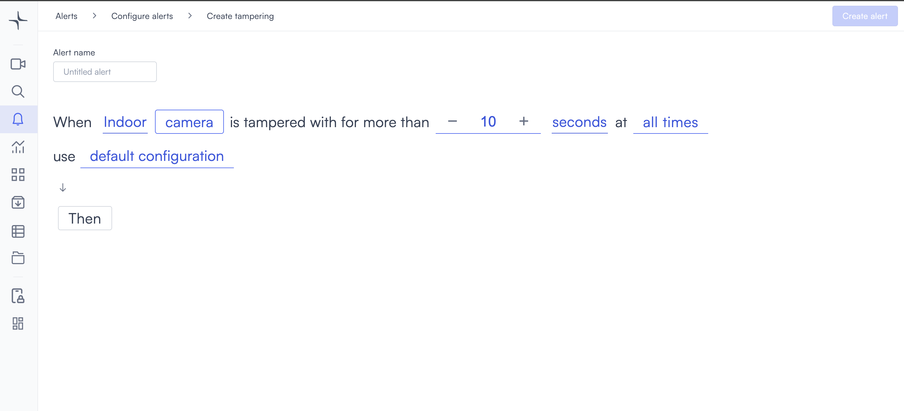
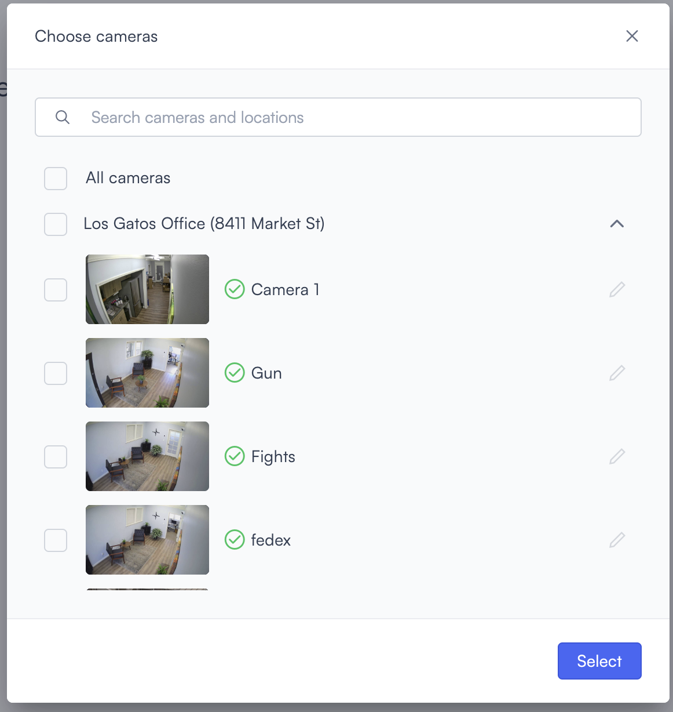
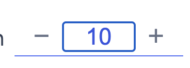

# Tampering

Tampering detection triggers when a camera is physically interfered with, such as being moved, covered, or obstructed. Use it to detect interference before surveillance coverage is lost.

## How it works

Lumana monitors the camera feed for sudden visual changes that indicate physical interference. When tampering persists beyond the duration you set, the alert triggers.

## Configure the alert

1. Select the **bell icon** in the navigation bar. The Alerts monitoring view opens.

2. Select **Add alert** in the top right corner. The Configure alerts page opens.

3. Under **Security**, select **Use template** on the **Tampering** card. The Create tampering page opens.

4. Enter a name in the **Alert name** field, for example "Camera tampering" or "Entrance camera interference."
5. Select the camera environment field in the alert rule sentence and choose **Indoor** or **Outdoor** depending on where the camera is installed.
6. Select the **camera** field to open the Choose cameras modal. Select the cameras you want to monitor, then select **Select** to confirm.

7. Select the duration counter and use the **−** and **+** controls to set how long tampering must persist before the alert triggers. The default is 10.

8. Select the time unit field and choose **seconds**, **minutes**, or **hours**.

9. Select the **time** field to set when the alert is active. [Configure alerts](../../configure-alerts.md#schedule) covers the schedule options.
10. Optionally, select **default configuration** to adjust display settings, confidence level, priority, blocking period, and alert message. [Configure alerts](../../configure-alerts.md#default-configuration) covers these settings.
11. Select **Then**  to choose the action Lumana takes when the alert triggers. The available actions are covered in [Alert actions](../../alert-actions.md).
12. Select **Create alert** in the top right corner. The alert is saved and becomes active based on the schedule you set.
