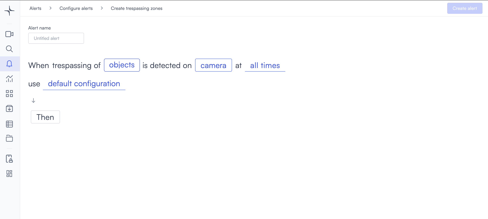

# Trespassing zones

Trespassing zones work the same way as the Trespassing alert, but detection applies to a specific drawn zone within the camera frame rather than the full view. The alert triggers the moment an object enters the zone, with no minimum time requirement.

## How it works

Lumana monitors the area you define within the camera frame. When a detected object enters that zone, the alert triggers immediately and saves a video clip to the alert feed. Use a zone when only part of the camera view is restricted and you don't want movement in the rest of the frame to trigger the alert.

## When to use it

Trespassing zones are a good fit when you need precise detection within a specific part of the camera view.

* Monitoring a doorway or entry point within a wider camera field of view.
* Protecting a specific asset or piece of equipment visible in a shared space.
* Flagging entry into a marked boundary that doesn't align with the full camera frame.

## Configure the alert

The general alert configuration flow, including advanced configuration and alert actions, is covered in [Configure alerts](../../configure-alerts.md). This section covers the fields specific to Trespassing zones.

1. Select the **bell icon** in the navigation bar, then select **Add alert**.
2. Under **Security**, select **Use template** on the **Trespassing zones** card. The Create trespassing zones page opens.

3. Enter a name in the **Alert name** field, for example "Server room entry zone" or "Loading dock boundary."
4. Select the **objects** field in the alert rule sentence. A dropdown opens with the available object types.

Select one or more object types to monitor:

* **people**: Detects people.
* **vehicles**: Detects vehicles.
* **animals**: Detects animals.

Any custom objects you've already created appear below the built-in types, tagged as **Custom**. You can select multiple types. If you need to detect a specific object that isn't in the list, then select **+ New custom object**. The custom object creation process is covered in [Proximity: Create a custom object](proximity.md#create-a-custom-object).

5. Select the **camera** field to open the Choose cameras modal. Select the cameras you want to monitor, then select **Select** to confirm.

After selecting a camera, draw a detection zone to define the area within the frame. Select the **edit icon** next to the camera name to open the Select region of interest dialog. Select points on the camera feed to define the zone boundary. Each point connects to the next with a green line. When the polygon is closed, the enclosed area fills with a green overlay indicating the active detection zone.

* **Exclude**: Toggle on to invert the zone. Objects outside the drawn area trigger the alert instead of objects inside it.
* **Reset**: Clears all points and lets you start over.
* **Select**: Confirms the zone and closes the dialog.

6. Select the **time** field to set when the alert is active. The schedule options are covered in [Configure alerts](../../configure-alerts.md#create-an-alert).
7. Optionally, select **default configuration** to adjust display settings, confidence level, priority, blocking period, and alert message. These settings are covered in [Configure alerts](../../configure-alerts.md#create-an-alert).
8. Select **Then** to choose the action Lumana takes when the alert triggers. The available actions are covered in [Alert actions](../../alert-actions.md).
9. Select **Create alert** in the top right corner. The alert is saved and becomes active immediately.
