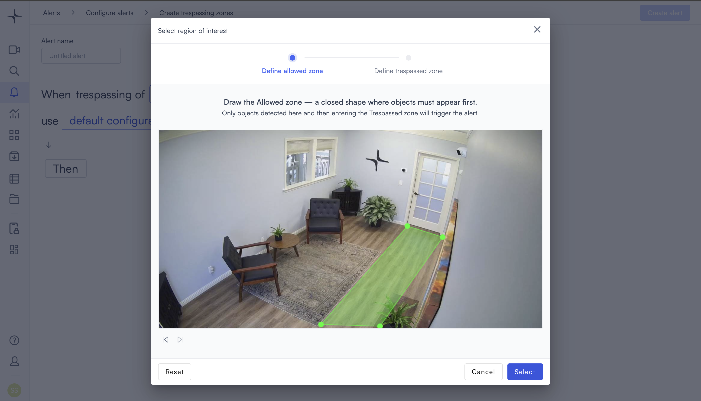
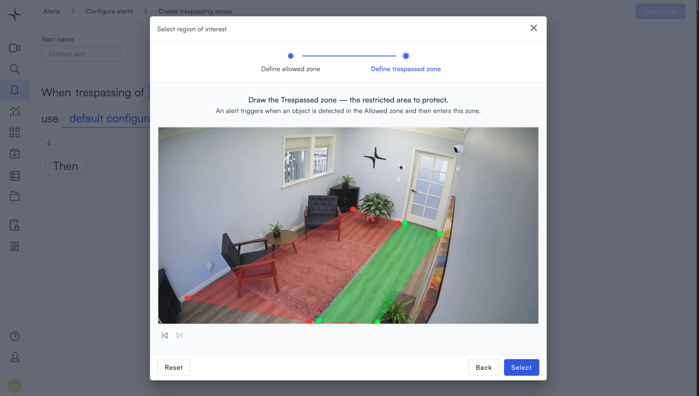

# Trespassing zones

The trespassing zones alert monitors two zones you define on the camera feed: an allowed zone and a trespassed zone. The alert triggers when Lumana detects an object in the allowed zone and then sees it enter the trespassed zone.

## How it works

You define two zones on the camera feed. The allowed zone is where objects must first appear before the alert can trigger. The trespassed zone is the restricted area you want to protect. The alert triggers only when an object moves from the allowed zone into the trespassed zone. Objects that enter the trespassed zone directly, without first appearing in the allowed zone, do not trigger the alert.

## Configure the alert

1. Select the **bell icon** in the navigation bar. The Alerts monitoring view opens.

2. Select **Add alert** in the top right corner. The Configure alerts page opens.

3. Select **Security** in the left sidebar to go to that section, then select **Use template** on the **Trespassing zones** card. The Create trespassing zones page opens.

4. Enter a name in the **Alert name** field, for example "Server room entry zone" or "Loading dock boundary."
5. Select the **objects** field in the alert rule sentence. A dropdown opens with the available object types.

Select one or more object types to monitor:

* **people**: Detects people.
* **vehicles**: Detects vehicles.
* **animals**: Detects animals.

Any custom objects you've already created appear below the built-in types, tagged as **Custom**. You can select multiple types. If you need to detect a specific object that isn't in the list, then select **+ New custom object**. Follow the steps in [Create a custom object](proximity.md#create-a-custom-object) to complete setup.

6. Select the **camera** field to open the Choose cameras panel. Select the cameras you want to monitor.

Select the **edit icon** next to a camera to open the Select region of interest dialog. You define two zones for each camera across two steps.

First, draw the allowed zone. Select points on the camera feed to draw a closed polygon. This is the area where objects must appear before the alert can trigger. The enclosed area fills with a green overlay when the zone is complete. Confirm the zone to move to the next step.

Then draw the trespassed zone. Select points to draw a second polygon for the restricted area you want to protect. This zone appears as a red overlay. The alert triggers when an object moves from the allowed zone into this area. Confirm both zones.

- **Reset**: Clears all points and lets you start the current step over.
- **Back**: Returns to the allowed zone step to redraw it.


You must define both zones for each camera before you can confirm. If you confirm before completing both zones, then Lumana shows the error: "You must select both an Allowed zone and a Trespassed zone for each camera."


In the Choose cameras panel, confirm your camera selection.

7. Select the **time** field to set when the alert is active. [Configure alerts](../../create-and-manage-alerts.md#schedule) covers the schedule options.
8. Optionally, select **default configuration** to adjust display settings, confidence level, priority, blocking period, and alert message. [Configure alerts](../../create-and-manage-alerts.md#default-configuration) covers these settings.
9. Select **Then**  to choose the action Lumana takes when the alert triggers. The available actions are covered in [Alert actions](../../alert-actions.md).
10. Select **Create alert** in the top right corner. The alert is saved and becomes active immediately.
