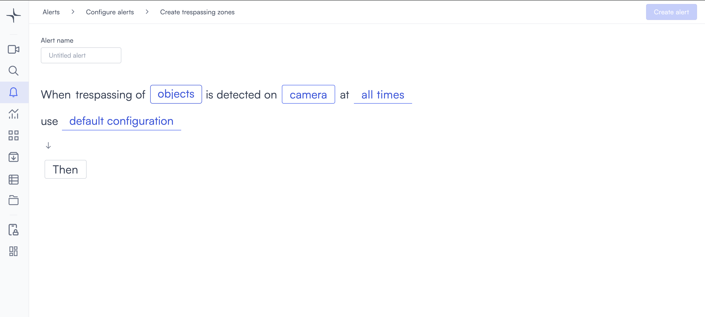
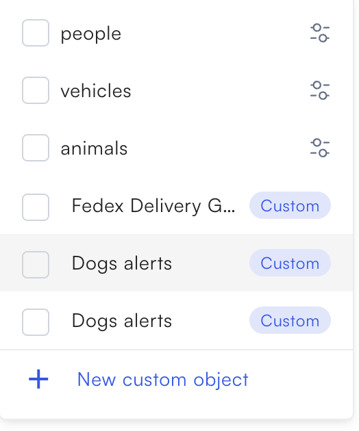
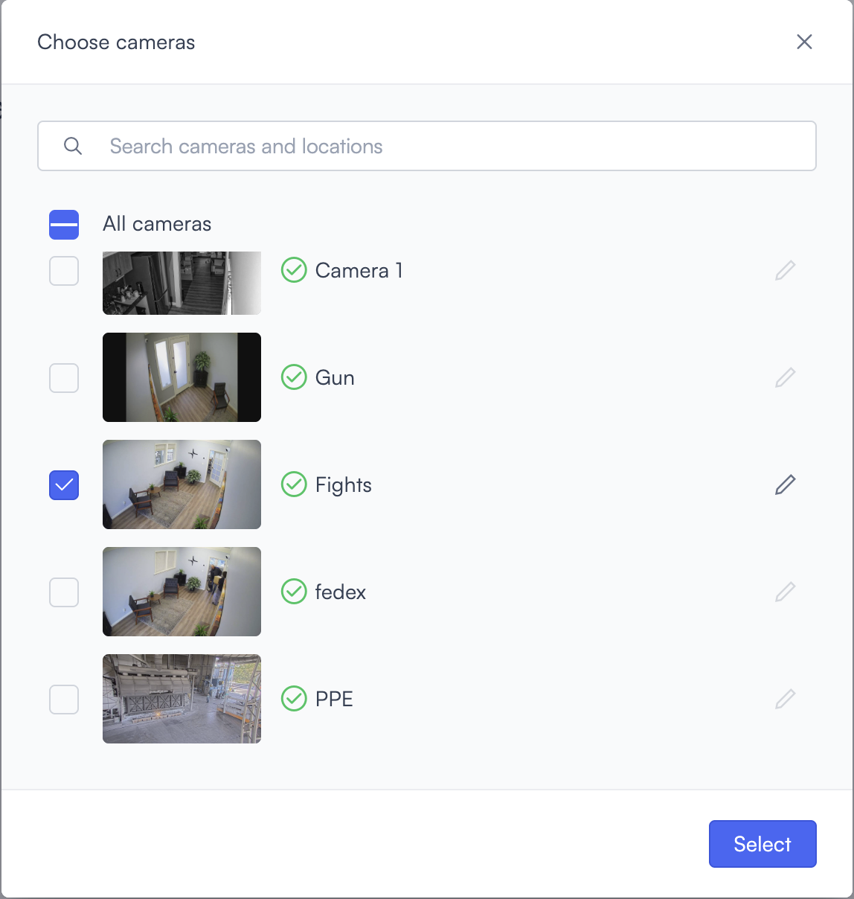
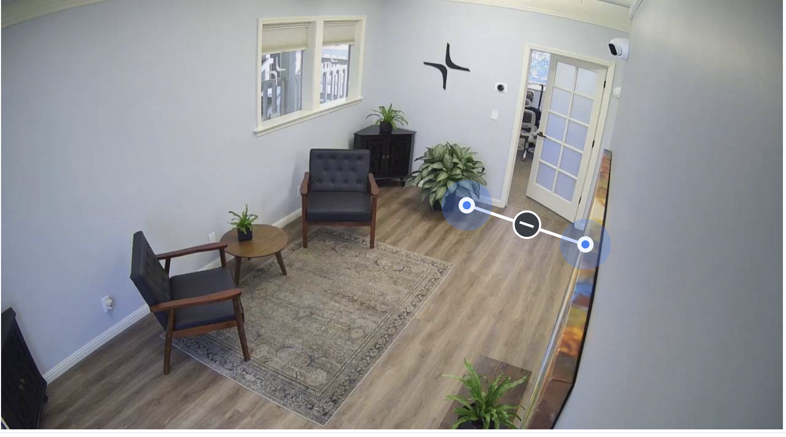
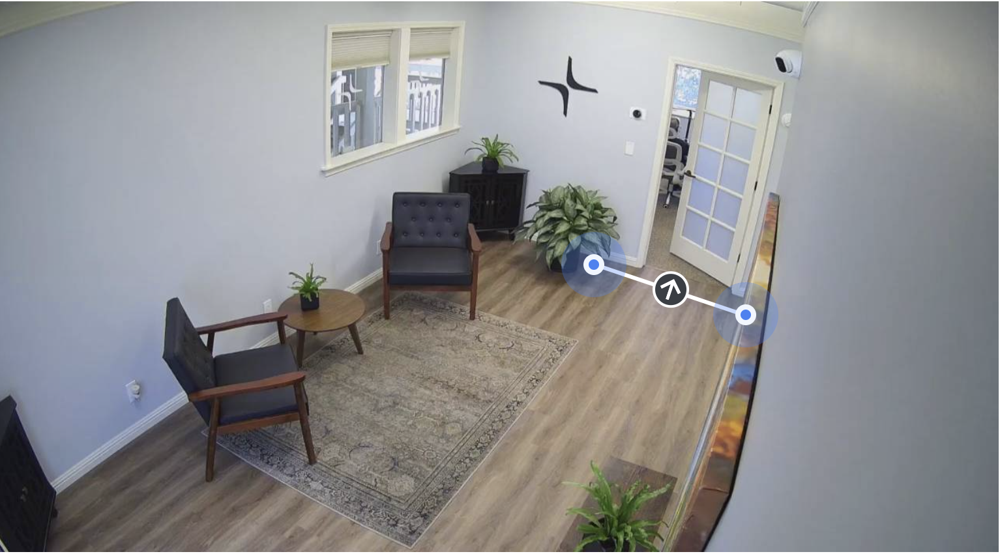
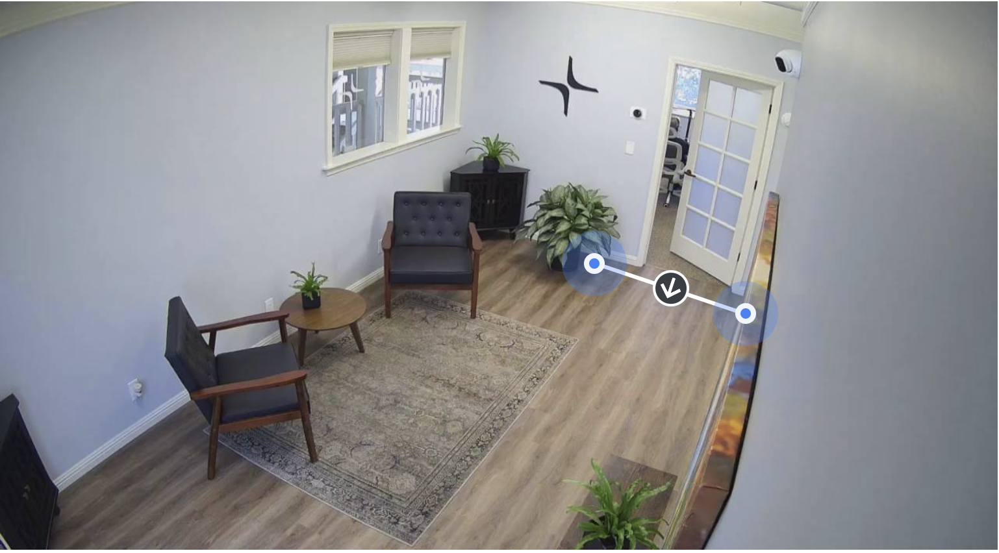

# Trespassing

The trespassing alert detects when an object crosses a line you draw on the camera feed. The alert triggers immediately when an object crosses the line.

## How it works

You draw a line on the camera feed to define the boundary. Lumana monitors that line and triggers the alert the moment a detected object crosses it. Use this alert to monitor a specific entry point or boundary within the camera's view.

## Configure the alert

1. Select the **bell icon** in the navigation bar. The Alerts monitoring view opens.

2. Select **Add alert** in the top right corner. The Configure alerts page opens.

3. Select **Security** in the left sidebar to go to that section, then select **Use template** on the **Trespassing** card. The Create trespassing page opens.

4. Enter a name in the **Alert name** field, for example "After-hours server room" or "Restricted perimeter entry."
5. Select the **objects** field in the alert rule sentence. A dropdown opens with the available object types.

Select one or more object types to monitor:

* **people**: Detects people.
* **vehicles**: Detects vehicles.
* **animals**: Detects animals.

Any custom objects you've already created appear below the built-in types, tagged as **Custom**. You can select multiple types. If you need to detect a specific object that isn't in the list, then select **+ New custom object**. Follow the steps in [Create a custom object](proximity.md#create-a-custom-object) to complete setup.

6. Select the **camera** field to open the Choose cameras panel. Select the cameras you want to monitor, then confirm your selection. The Select line crossing dialog opens.

Select two points on the camera feed to draw the boundary line. Once drawn, an arrow appears on the line. Select the arrow to set which crossing direction triggers the alert. It cycles through three states:

- **Both directions**: The minus icon. The alert triggers when an object crosses in either direction.

- **One direction**: An arrow pointing one way. The alert triggers only when an object crosses in that direction.

- **Opposite direction**: An arrow pointing the other way. The alert triggers only when an object crosses from the other side.

Then configure the line:

- Enter a name in the **Name your line** field to identify it.
- Select a color from the color picker to distinguish the line on the feed.
- Select the trash icon to delete the line and start over.

Confirm the line. Select **How to draw?** in the top right of the dialog if you need drawing guidance.

7. Select the **time** field to set when the alert is active. [Configure alerts](../../create-and-manage-alerts.md#schedule) covers the schedule options.
8. Optionally, select **default configuration** to adjust display settings, confidence level, priority, blocking period, and alert message. [Configure alerts](../../create-and-manage-alerts.md#default-configuration) covers these settings.
9. Select **Then**  to choose the action Lumana takes when the alert triggers. The available actions are covered in [Alert actions](../../alert-actions.md).
10. Select **Create alert** in the top right corner. The alert is saved and becomes active immediately.
