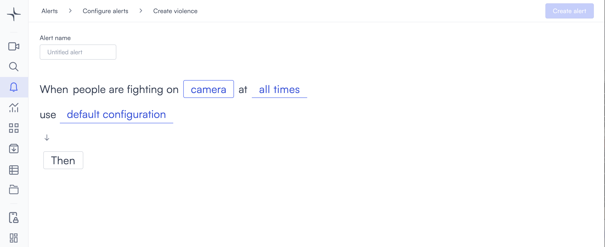

# Violence

The violence detection alert triggers when Lumana detects fighting or physical aggression in the camera view. Use it to monitor high-risk environments, enable a rapid security response, or flag incidents for review.

## How it works

Lumana uses AI to analyze movement patterns and body postures in the video feed. The model identifies physical altercations such as fighting, striking, or aggressive physical contact. When it does, the alert triggers and captures a clip of the event.

## When to use it

This alert is most effective in environments where physical confrontations are a realistic risk.

* Monitoring public spaces, transportation hubs, or nightlife venues because altercations can escalate quickly.
* Detecting confrontations in retail environments before they involve staff or customers.
* Supporting violence prevention policies in workplaces and facilities that require a documented security response.

Before deploying, review the conditions that can affect detection accuracy.

## Limitations

Violence detection requires a clear, unobstructed view of the monitored area. Crowded environments or scenes with rapid but non-violent movement, such as sports facilities or training areas, might produce false positives. Poor lighting also reduces detection accuracy.

Environments with stable lighting, low background movement, and an unobstructed camera view tend to produce the most reliable results.

## Configure the alert


Violence detection is currently in beta. Detection accuracy might vary depending on camera placement, lighting conditions, and the environment. Test the alert in your environment before relying on it for critical security decisions.


The general alert configuration flow, including advanced configuration and alert actions, is covered in [Configure alerts](../../configure-alerts.md). This section covers the fields specific to violence detection.

1. Select the **bell icon** in the navigation bar, then select **Add alert**.
2. Under **Security**, select **Use template** on the **Violence** card. The Create violence page opens.

3. Enter a name in the **Alert name** field, for example "Lobby violence detection" or "Car park altercation alert."
4. Select the **camera** field to open the Choose cameras modal. Select the cameras you want to monitor, then select **Select** to confirm.

5. Select the **time** field to set when the alert is active. The schedule options are covered in [Configure alerts](../../configure-alerts.md#create-an-alert).
6. Optionally, select **default configuration** to adjust display settings, confidence level, priority, blocking period, and alert message. These settings are covered in [Configure alerts](../../configure-alerts.md#create-an-alert).
7. Select **Then** to choose the action Lumana takes when the alert triggers. The available actions are covered in [Alert actions](../../alert-actions.md).
8. Select **Create alert** in the top right corner. The alert is saved and becomes active immediately.
