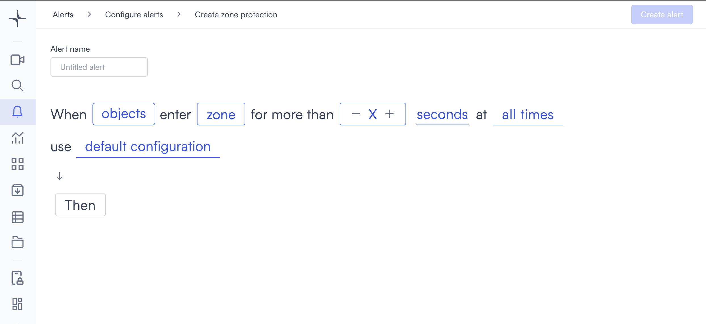
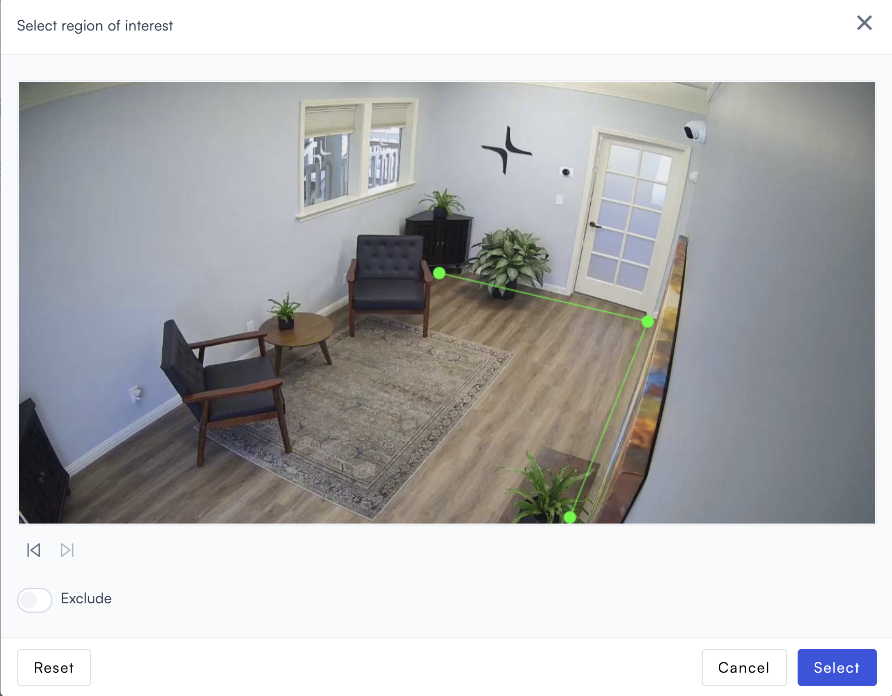
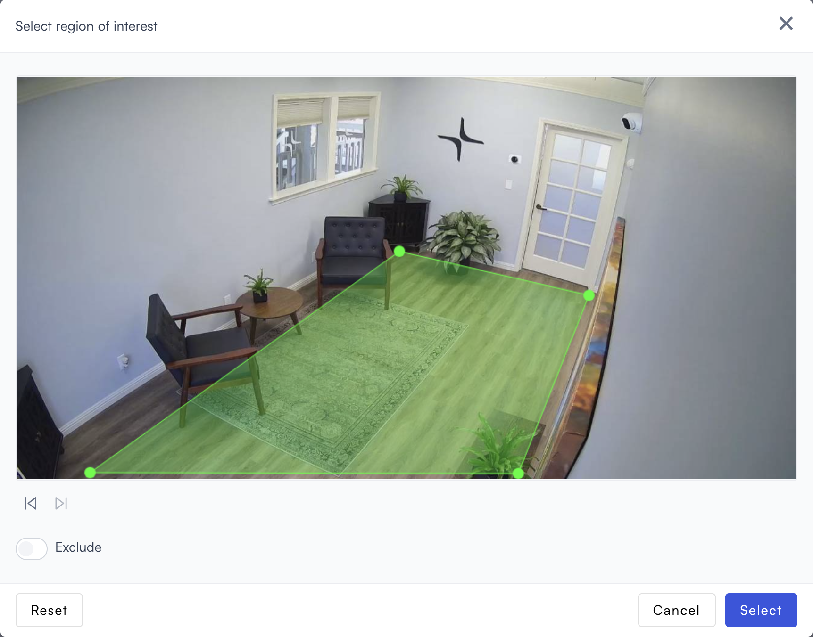
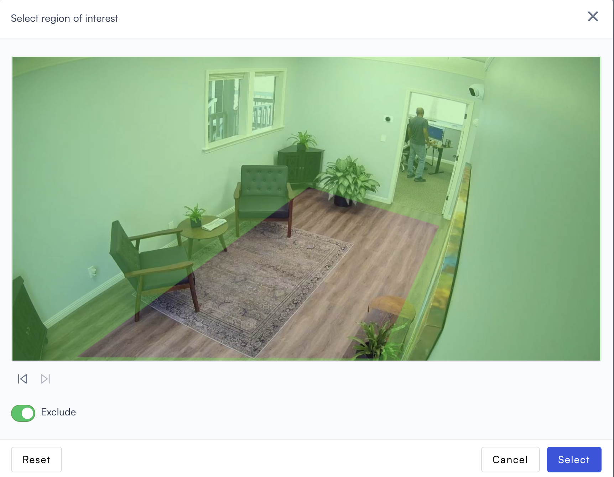

# Zone protection

Zone protection monitors a defined area for objects that linger. Unlike trespassing, which triggers on entry alone, it requires an object to stay inside the zone past a minimum dwell time before triggering.

## How it works

Define a zone within the camera frame and set a minimum dwell time. Lumana tracks detected objects and triggers the alert only when one has stayed inside the zone past the configured threshold. This filters out people or vehicles that are just passing through, so you're only alerted when presence is intentional.

## When to use it

Zone protection works well when you need to distinguish between someone briefly entering an area and someone actually spending time there.

* Monitoring parking areas where lingering near vehicles is a concern.
* Protecting restricted equipment or storage areas from extended unauthorized access.
* Setting after-hours alerts for spaces where brief access might be acceptable but extended presence is not.

The common thread is the dwell threshold: It's what separates a brief visit from a security concern.

## Configure the alert

The general alert configuration flow, including advanced configuration and alert actions, is covered in [Configure alerts](../../configure-alerts.md). This section covers the fields specific to zone protection.

1. Select the **bell icon** in the navigation bar, then select **Add alert**.
2. Under **Security**, select **Use template** on the **Zone protection** card. The Create zone protection page opens.

3. Enter a name in the **Alert name** field, for example "Restricted area dwell" or "After-hours parking zone."
4. Select the **objects** field in the alert rule sentence. A dropdown opens with the available object types.

Select one or more object types to monitor:

* **people**: Detects people.
* **vehicles**: Detects vehicles.
* **animals**: Detects animals.

Any custom objects you've already created appear below the built-in types, tagged as **Custom**. You can select multiple types. If you need to detect a specific object that isn't in the list, then select **+ New custom object**. The custom object creation process is covered in [Proximity: Create a custom object](proximity.md#create-a-custom-object).

5. Select the **zone** field to open the Choose cameras modal. Select the cameras you want to monitor, then select **Select** to confirm.

After selecting a camera, draw a detection zone to limit detection to a specific area of the frame. Select the **edit icon** next to the camera name to open the Select region of interest dialog.

Select points on the camera feed to define the zone boundary. Each point connects to the next with a green line. When the polygon is closed, the enclosed area fills with a green overlay indicating the active detection zone.

* **Exclude**: Toggle on to invert the zone. Objects outside the drawn area trigger the alert instead of objects inside it.

* **Reset**: Clears all points and lets you start over.
* **Select**: Confirms the zone and closes the dialog.

6. Set the dwell time threshold. Select **+** to increase the value or **-** to decrease it. Then select the unit dropdown next to the counter and choose **seconds**, **minutes**, or **hours**. The alert only triggers when an object has been inside the zone for at least this long.
7. Select the **time** field to set when the alert is active. The schedule options are covered in [Configure alerts](../../configure-alerts.md#create-an-alert).
8. Optionally, select **default configuration** to adjust display settings, confidence level, priority, blocking period, and alert message. These settings are covered in [Configure alerts](../../configure-alerts.md#create-an-alert).
9. Select **Then** to choose the action Lumana takes when the alert triggers. The available actions are covered in [Alert actions](../../alert-actions.md).
10. Select **Create alert** in the top right corner. The alert is saved and becomes active immediately.
