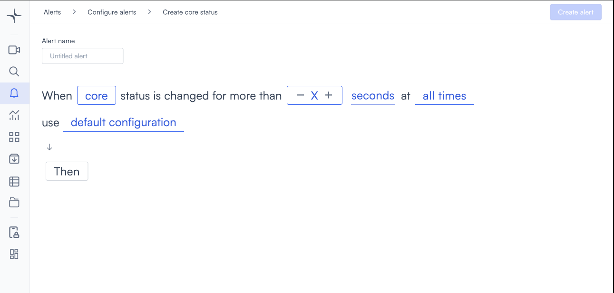
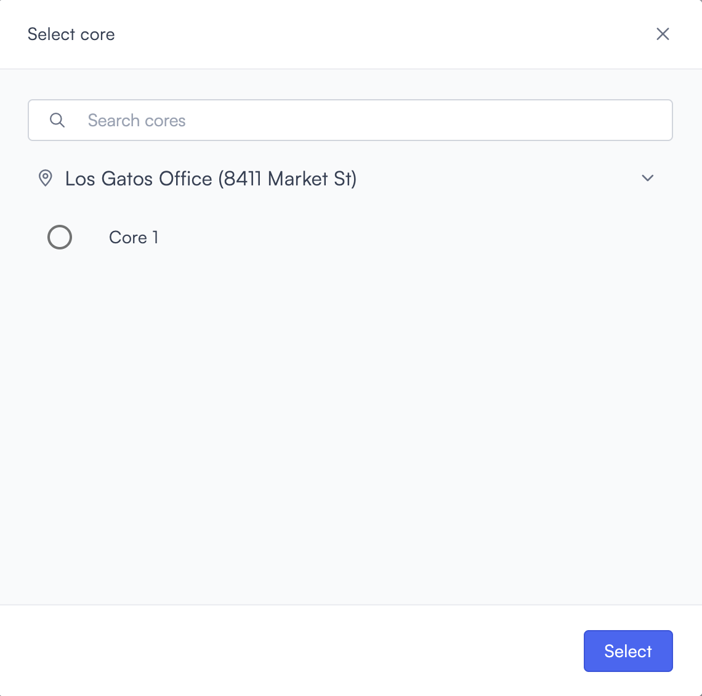

# Core status

Core status detection triggers when a Lumana Core device's status changes for longer than a duration you set. Because a single Core manages multiple cameras, a Core going offline can affect coverage across an entire site.

## How it works

Set a minimum duration. Lumana monitors Core device connection status and triggers the alert when a Core's status has changed for longer than the configured duration.

## Configure the alert

1. Select the **bell icon** in the navigation bar. The Alerts monitoring view opens.

2. Select **Add alert** in the top right corner. The Configure alerts page opens.

3. Select **Status** in the left sidebar to go to that section, then select **Use template** on the **Core status** card. The Create core status page opens.

4. Enter a name in the **Alert name** field, for example "Core offline alert" or "Site connection lost."
5. Select the **core** field to open the Select core modal. Core devices are listed by location. Use the **Search cores** field to find one by name, or select directly from the list. Select **Select** to confirm.

6. Set the duration in the **for more than** field. Select **−** or **+** to adjust the value, or enter a value directly.

7. Select the **seconds** field and choose **seconds**, **minutes**, or **hours**.

8. Select the **time** field to set when the alert is active. [Configure alerts](../../configure-alerts.md#schedule) covers the schedule options.
9. Optionally, select **default configuration** to adjust display settings, confidence level, priority, blocking period, and alert message. [Configure alerts](../../configure-alerts.md#default-configuration) covers these settings.
10. Select **Then**  to choose the action Lumana takes when the alert triggers. [Alert actions](../../alert-actions.md) covers the available actions.
11. Select **Create alert** in the top right corner. The alert is saved and becomes active immediately.
