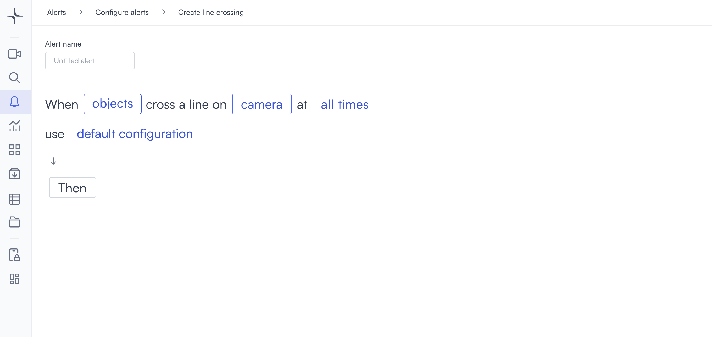

# Line crossing

Line crossing detection triggers when an object crosses a line you draw in the camera view. You can set the direction of crossing that triggers the alert.

## How it works

Draw a line across the camera frame and choose which direction of crossing to monitor: left to right, right to left, or both. When an object of the configured type crosses the line in the specified direction, the alert triggers.

## Configure the alert

1. Select the **bell icon** in the navigation bar. The Alerts monitoring view opens.

2. Select **Add alert** in the top right corner. The Configure alerts page opens.

3. Select **Tracking** in the left sidebar to go to that section, then select **Use template** on the **Line crossing** card. The Create line crossing page opens.

4. Enter a name in the **Alert name** field, for example "Perimeter entry" or "Emergency exit crossing."
5. Select the **objects** field in the alert rule sentence. A dropdown opens with the available object types.

Select one or more object types to monitor:

* **people**: Detects people.
* **vehicles**: Detects vehicles.
* **animals**: Detects animals.

Any custom objects you've already created appear below the built-in types, tagged as **Custom**. You can select multiple types. If you need to detect a specific object that isn't in the list, then select **+ New custom object**. Follow the steps in [Create a custom object](../security/proximity.md#create-a-custom-object) to complete setup.

6. Select the **camera** field to open the Choose cameras modal. Select the camera you want to monitor, then select **Select** to confirm.

After selecting a camera, draw a detection line on the camera frame. Select the **edit icon** next to the camera name to open the Select region of interest dialog.

Select two points on the camera feed to define the line. Then choose the direction of crossing that triggers the alert.

* **Reset**: Clears the line and lets you start over.
* **Select**: Confirms the line and closes the dialog.

7. Select the **time** field to set when the alert is active. [Configure alerts](../../configure-alerts.md#schedule) covers the schedule options.
8. Optionally, select **default configuration** to adjust display settings, confidence level, priority, blocking period, and alert message. [Configure alerts](../../configure-alerts.md#default-configuration) covers these settings.
9. Select **Then**  to choose the action Lumana takes when the alert triggers. [Alert actions](../../alert-actions.md) covers the available actions.
10. Select **Create alert** in the top right corner. The alert is saved and becomes active immediately.
