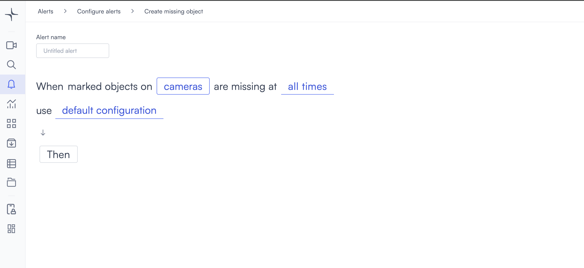

# Missing object

Missing object detection triggers when a marked object on a monitored camera is no longer detected.

## How it works

Mark a specific object in the camera view. Lumana monitors the marked object continuously and triggers the alert when it is no longer detected in the frame.

## Configure the alert

1. Select the **bell icon** in the navigation bar. The Alerts monitoring view opens.

2. Select **Add alert** in the top right corner. The Configure alerts page opens.

3. Under **Tracking**, select **Use template** on the **Missing object** card. The Create missing object page opens.

4. Enter a name in the **Alert name** field, for example "Equipment removal" or "Asset missing from storage."
5. Select the **cameras** field to open the Choose cameras modal. Select the cameras you want to monitor, then select **Select** to confirm.

After selecting a camera, mark the object you want Lumana to monitor. Select the **edit icon** next to the camera name to open the camera view, then select the object in the frame to mark it.

6. Select the **time** field to set when the alert is active. [Configure alerts](../../configure-alerts.md#schedule) covers the schedule options.
7. Optionally, select **default configuration** to adjust display settings, confidence level, priority, blocking period, and alert message. [Configure alerts](../../configure-alerts.md#default-configuration) covers these settings.
8. Select **Then**  to choose the action Lumana takes when the alert triggers. [Alert actions](../../alert-actions.md) covers the available actions.
9. Select **Create alert** in the top right corner. The alert is saved and becomes active immediately.
