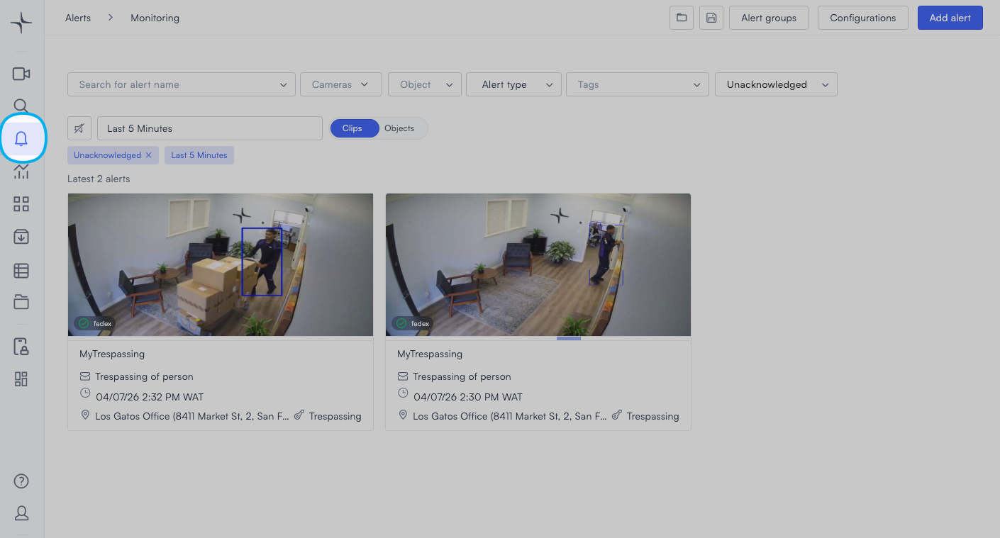
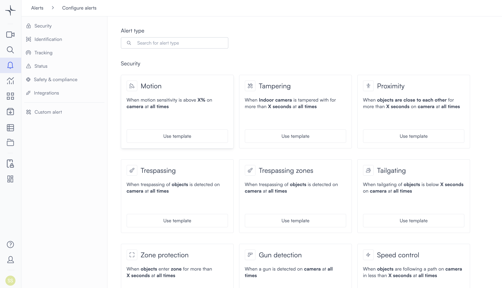
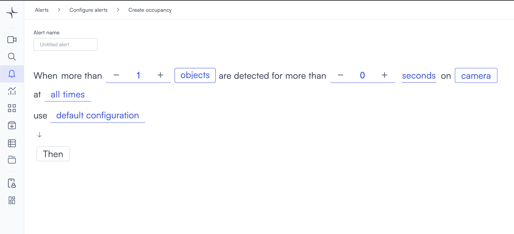
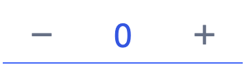
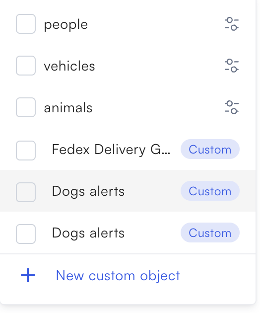
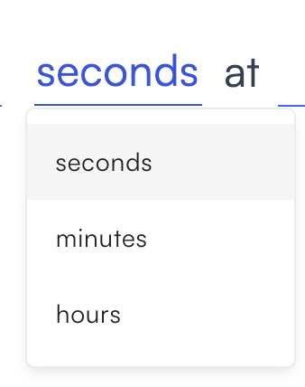
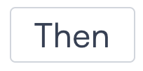

# Occupancy

Occupancy detection triggers when the count of detected objects on a camera rises above a threshold you set for a minimum duration.

## How it works

Set an object count and a minimum detection time. Lumana counts objects on the camera feed and triggers the alert when that count stays above the threshold for the specified duration.

## Configure the alert

1. Select the **bell icon** in the navigation bar. The Alerts monitoring view opens.

2. Select **Add alert** in the top right corner. The Configure alerts page opens.

3. Under **Tracking**, select **Use template** on the **Occupancy** card. The Create occupancy page opens.

4. Enter a name in the **Alert name** field, for example "Lobby overcrowding" or "Loading dock vehicle limit."
5. Set the count in the **more than** field. Select **−** or **+** to adjust the threshold, or enter a value directly.

6. Select the **objects** field in the alert rule sentence. A dropdown opens with the available object types.

Select one or more object types to monitor:

* **people**: Detects people.
* **vehicles**: Detects vehicles.
* **animals**: Detects animals.

Any custom objects you've already created appear below the built-in types, tagged as **Custom**. You can select multiple types. If you need to detect a specific object that isn't in the list, then select **+ New custom object**. Follow the steps in [Create a custom object](../security/proximity.md#create-a-custom-object) to complete setup.

7. Set the duration in the **for more than** field. Select **−** or **+** to adjust the value, or enter a value directly.

8. Select the **seconds** field and choose **seconds**, **minutes**, or **hours**.

9. Select the **camera** field to open the Choose cameras modal. Select the cameras you want to monitor, then select **Select** to confirm.

10. Select the **time** field to set when the alert is active. [Configure alerts](../../configure-alerts.md#schedule) covers the schedule options.
11. Optionally, select **default configuration** to adjust display settings, confidence level, priority, blocking period, and alert message. [Configure alerts](../../configure-alerts.md#default-configuration) covers these settings.
12. Select **Then**  to choose the action Lumana takes when the alert triggers. [Alert actions](../../alert-actions.md) covers the available actions.
13. Select **Create alert** in the top right corner. The alert is saved and becomes active immediately.
