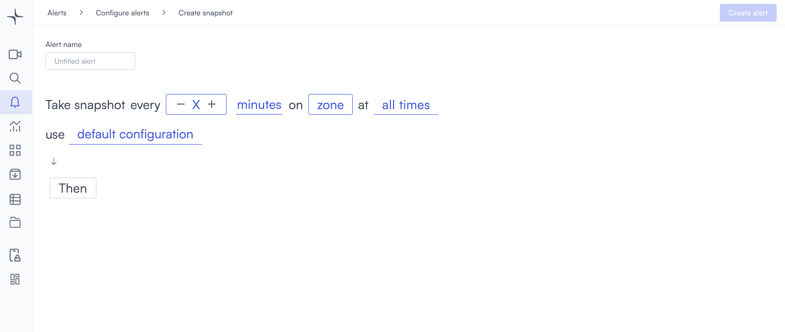
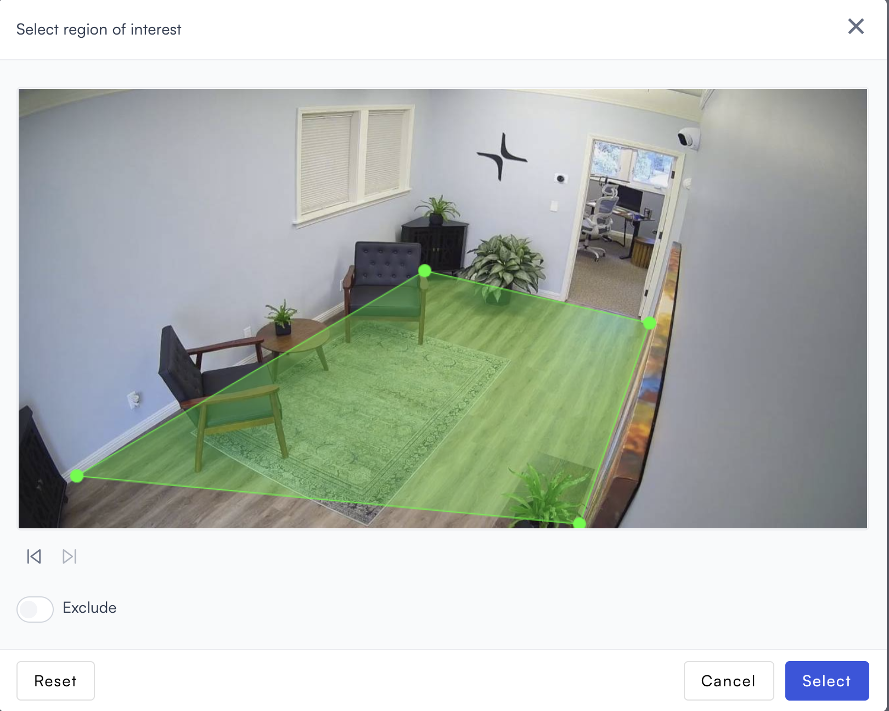
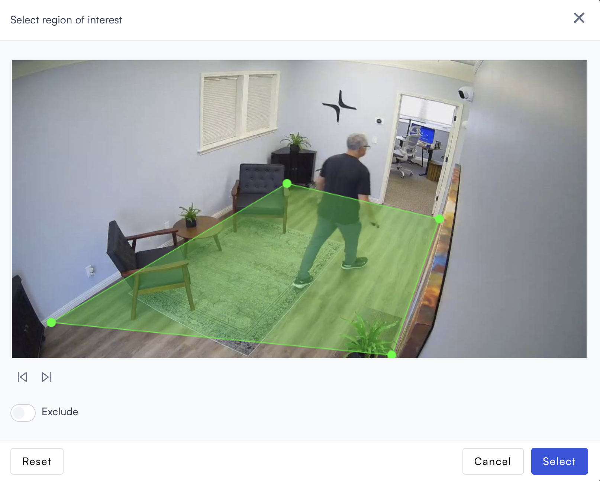
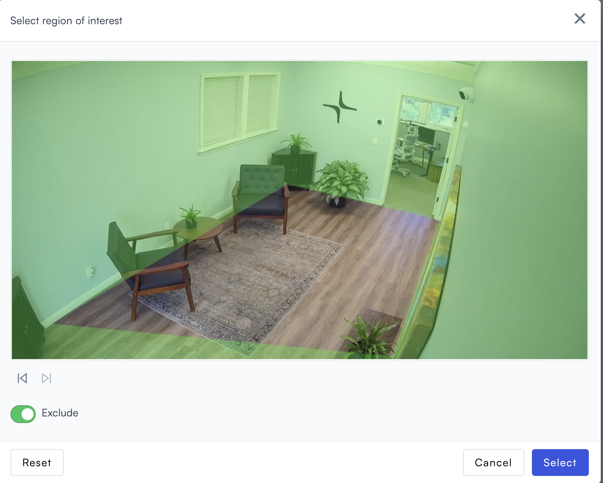

# Snapshot

Snapshot captures a still image from a zone at a regular interval you configure.

## How it works

Set an interval and draw a zone on the camera frame. Lumana captures a still image from the zone at the configured frequency.

## Configure the alert

1. Select the **bell icon** in the navigation bar. The Alerts monitoring view opens.

2. Select **Add alert** in the top right corner. The Configure alerts page opens.

3. Under **Tracking**, select **Use template** on the **Snapshot** card. The Create snapshot page opens.

4. Enter a name in the **Alert name** field, for example "Entrance hourly check" or "Storage area snapshot."
5. Set the interval in the **every** field. Select **−** or **+** to adjust the value, or enter a value directly.

6. Select the **minutes** field and choose **seconds**, **minutes**, or **hours**.

7. Select the **zone** field to open the Choose cameras modal. Select the camera you want to monitor, then select **Select** to confirm.

After selecting a camera, draw a zone on the camera frame. Select the **edit icon** next to the camera name to open the Select region of interest dialog.

Select points on the camera feed to define the zone boundary. Each point connects to the next with a green line. When the polygon is closed, the enclosed area fills with a green overlay indicating the active zone.

Use the navigation icons below the camera feed to review previous captures while drawing the zone:

*  **Previous**: Shows the most recent previous capture from this alert.

*  **Next**: Returns to the current view. This icon only appears after at least one capture exists.

* **Exclude**: Toggle on to invert the zone. Lumana captures the area outside the drawn zone instead of inside it.

* **Reset**: Clears all points and lets you start over.
* **Select**: Confirms the zone and closes the dialog.

8. Select the **time** field to set when the alert is active. [Configure alerts](../../configure-alerts.md#schedule) covers the schedule options.
9. Optionally, select **default configuration** to adjust display settings, confidence level, priority, blocking period, and alert message. [Configure alerts](../../configure-alerts.md#default-configuration) covers these settings.
10. Select **Then**  to choose the action Lumana takes when the alert triggers. [Alert actions](../../alert-actions.md) covers the available actions.
11. Select **Create alert** in the top right corner. The alert is saved and becomes active immediately.
