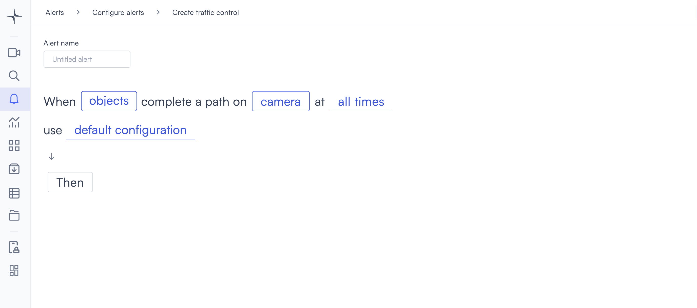
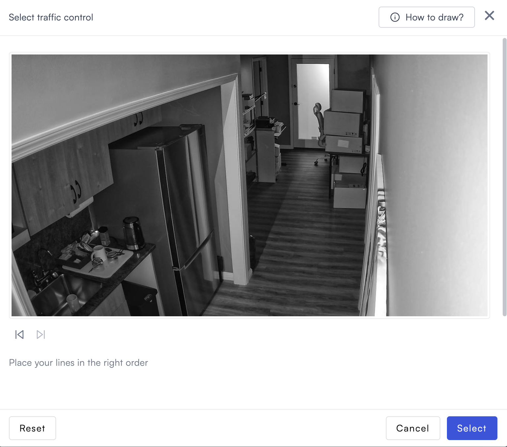
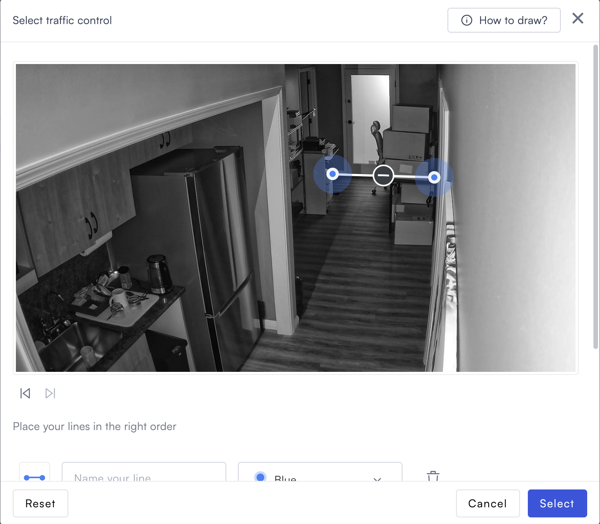
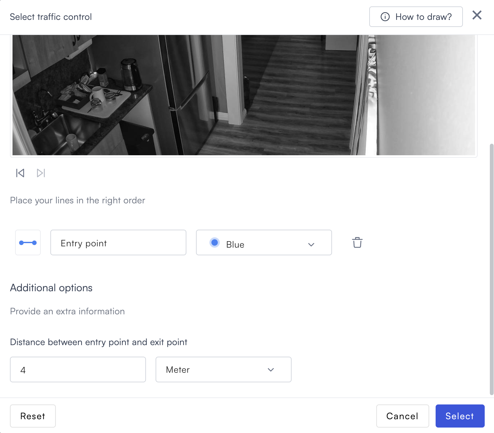

# Traffic control

Traffic control detection triggers when an object crosses a sequence of lines in the order you define in the camera view.

## How it works

Draw two or more lines across the camera frame and place them in the order objects must cross them. Each line has a directional arrow showing the required direction of travel. Lumana triggers the alert when an object crosses all lines in the correct sequence.

## Configure the alert

1. Select the **bell icon** in the navigation bar. The Alerts monitoring view opens.

2. Select **Add alert** in the top right corner. The Configure alerts page opens.

3. Under **Tracking**, select **Use template** on the **Traffic control** card. The Create traffic control page opens.

4. Enter a name in the **Alert name** field, for example "Loading dock path" or "Checkpoint route."
5. Select the **objects** field in the alert rule sentence. A dropdown opens with the available object types.

Select one or more object types to monitor:

* **people**: Detects people.
* **vehicles**: Detects vehicles.
* **animals**: Detects animals.

Any custom objects you've already created appear below the built-in types, tagged as **Custom**. You can select multiple types. If you need to detect a specific object that isn't in the list, then select **+ New custom object**. Follow the steps in [Create a custom object](../security/proximity.md#create-a-custom-object) to complete setup.

6. Select the **camera** field to open the Choose cameras modal. Select the camera you want to monitor, then select **Select** to confirm.

After selecting a camera, the Select traffic control dialog opens. Select **How to draw?** in the top right for an in-app drawing guide.

Select two points on the camera feed to draw a line. A directional arrow appears on the line showing the direction of travel objects must follow. Repeat to add more lines, placing each one in the order objects must cross it.

For each line drawn, a configuration row appears below the camera feed:

* Enter a name in the **Name your line** field, for example "Entry gate" or "Exit point."
* Select the color dropdown if you prefer changing the line color.
* Select the delete icon to remove the line.

Under **Additional options**, enter the physical distance between the first and last line in the **Distance between entry point and exit point** field, then choose **Meter** or **Feet**.

Use the navigation icons below the camera feed to browse snapshots from the camera while drawing:

*  **Previous snapshot**: Shows the previous snapshot from the camera.
*  **Next snapshot**: Shows the next snapshot from the camera. This icon only appears when a more recent snapshot is available.

* **Reset**: Clears all lines and lets you start over.
* **Select**: Confirms the lines and closes the dialog.

7. Select the **time** field to set when the alert is active. [Configure alerts](../../configure-alerts.md#schedule) covers the schedule options.
8. Optionally, select **default configuration** to adjust display settings, confidence level, priority, blocking period, and alert message. [Configure alerts](../../configure-alerts.md#default-configuration) covers these settings.
9. Select **Then**  to choose the action Lumana takes when the alert triggers. [Alert actions](../../alert-actions.md) covers the available actions.
10. Select **Create alert** in the top right corner. The alert is saved and becomes active immediately.
