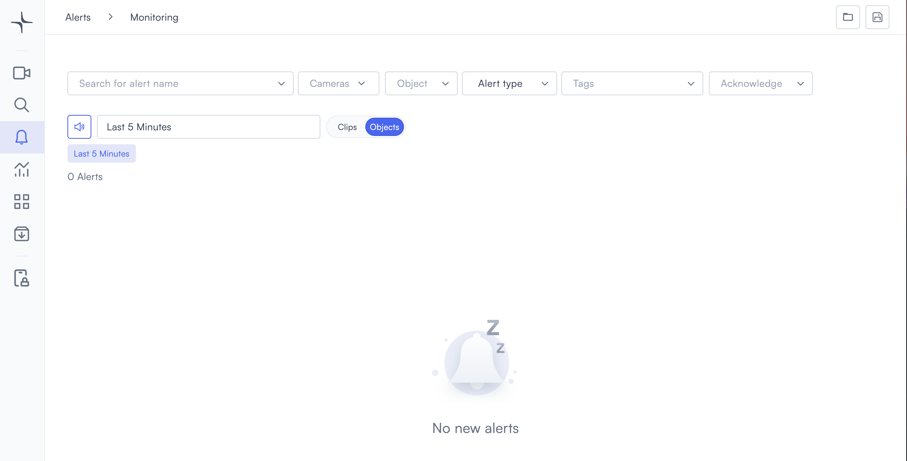
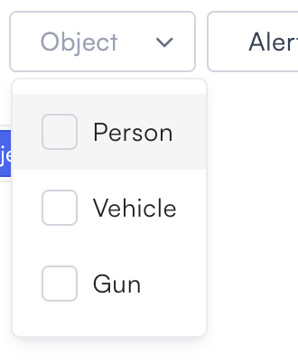
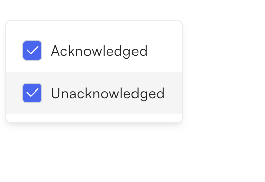
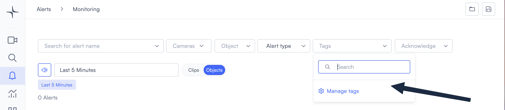
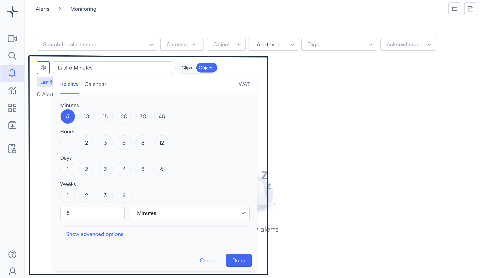
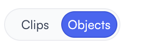

# Alert view

The alert monitoring view gives you a live feed of all alerts triggered across your organization's cameras. You can filter, review, acknowledge, and save alert views from a single screen.

## Access the alert monitoring view

Select **Alerts** in the left navigation bar, then select **Monitoring**. This opens the monitoring view at `app.lumana.ai/alert/monitoring`. The sections below explain how each part of the interface works.

## Understand the interface

The monitoring view has a filter bar across the top and a results area below.

### Filters

The filter bar has six controls you can use in any combination to narrow down the alerts you see.

- **Search for alert name**: Find alerts by a specific configured alert name.
- **Cameras**: Show only alerts triggered by specific cameras.
- **Object**: Filter by the type of object detected. The available options are **Person**, **Vehicle**, and **Gun**.
- **Alert type**: Filter by alert category.
- **Tags**: Filter by tags assigned to cameras or alerts. Select **Manage tags** from the dropdown to create or edit tags in your organization database.
- **Acknowledge**: Show **Acknowledged**, **Unacknowledged**, or both. Both options are selected by default.

   &nbsp;&nbsp;
   &nbsp;&nbsp;
  

Active filters appear as chips below the filter bar. Select the **x** on any chip to remove it.

### Time range

The time range control sits to the left of the **Clips / Objects** toggle. Select it to open the time picker. The timezone shown is based on your organization's settings.

The time picker has two tabs:

- **Relative**: Choose a preset range by Minutes (5, 10, 15, 20, 30, 45), Hours (1, 2, 3, 6, 8, 12), Days (1–6), or Weeks (1–4). You can also enter a custom value in the input field. Select **Show advanced options** for additional controls.
- **Calendar**: Choose a specific start and end date and time.

Select **Done** to apply the time range or **Cancel** to dismiss.

### Mute and unmute alerts

The speaker icon to the left of the time range field controls alert sound notifications. Select it to toggle alert sounds on or off.

### Clips and Objects

Use the **Clips / Objects** toggle to switch between two views of your results.

- **Clips**: Shows each alert as a video clip.
- **Objects**: Shows the detected objects associated with each alert.

### Save and open alert views

The two icons in the top right corner let you save and reload filter configurations.

- Select the **save icon** to save your current filter and time range settings as a named view.
- Select the **folder icon** to open a previously saved view.

Saved views are useful for recurring monitoring tasks — for example, reviewing unacknowledged motion alerts from the last hour each morning.

## Review an alert

Once your filters and time range are set, you can open individual alerts to review their details and take action.

1. Apply filters and set a time range to narrow down your results.
2. Select an alert from the list to open it.
3. Review the video clip, images, and detected objects.
4. Select the share icon to share the alert with others.
5. Select the acknowledge icon to mark the alert as reviewed.

> **Note**: Alerts must be configured before they appear in the monitoring view. If you see no alerts, check that alert rules are active under **Alerts > Configuration**.

## Next steps

- [Configure alerts](configure-alerts.md) walks you through setting up alert rules for your cameras.
