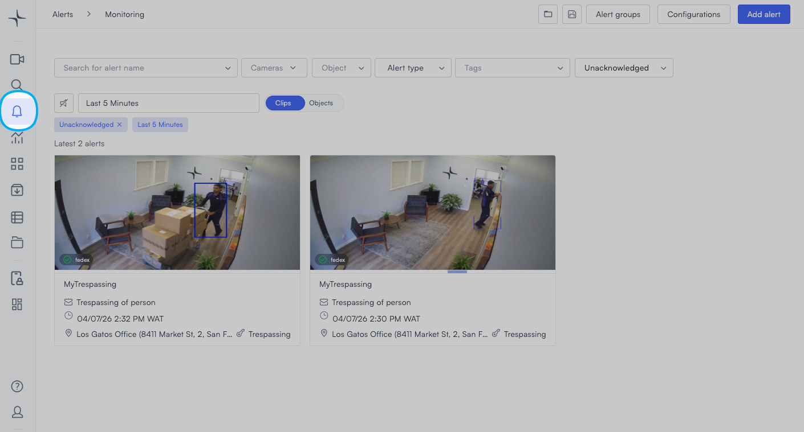
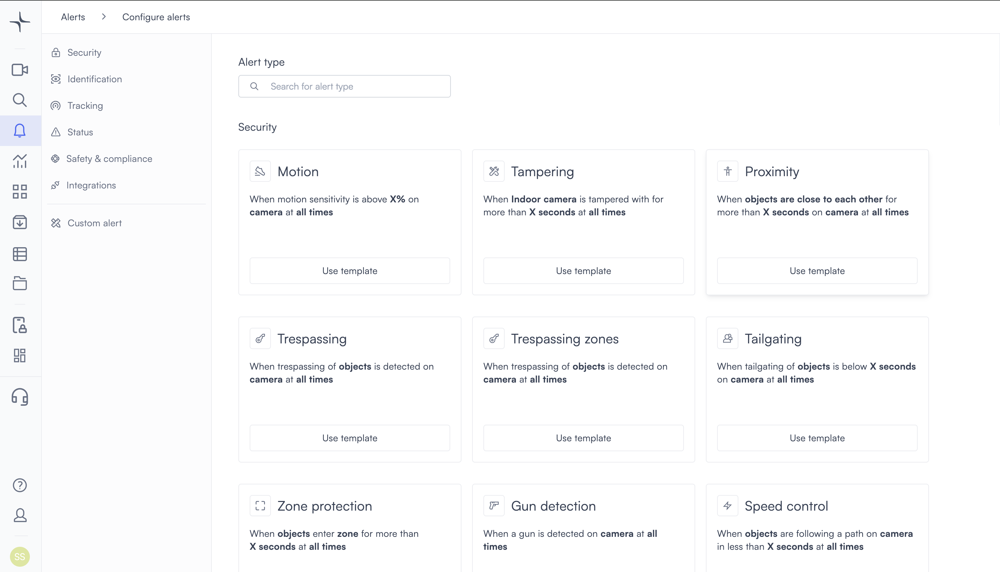
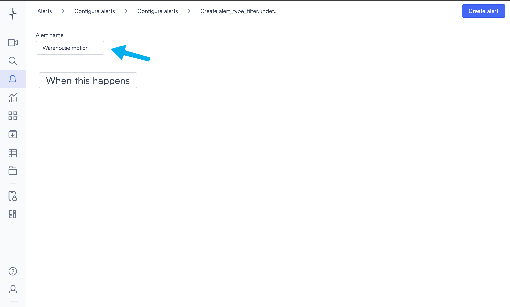
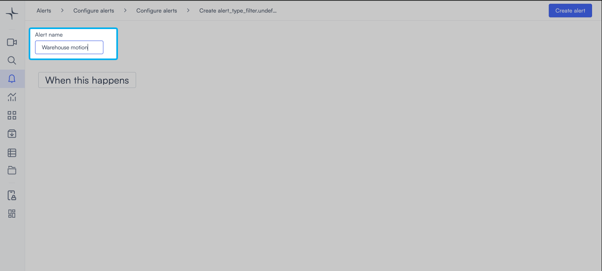
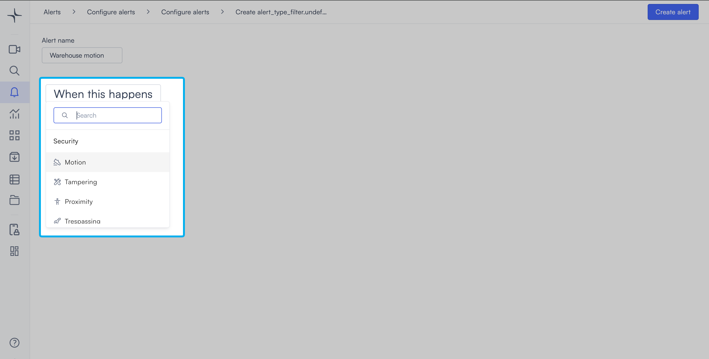
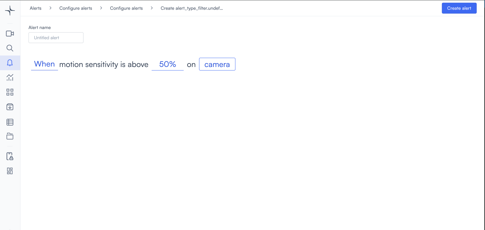
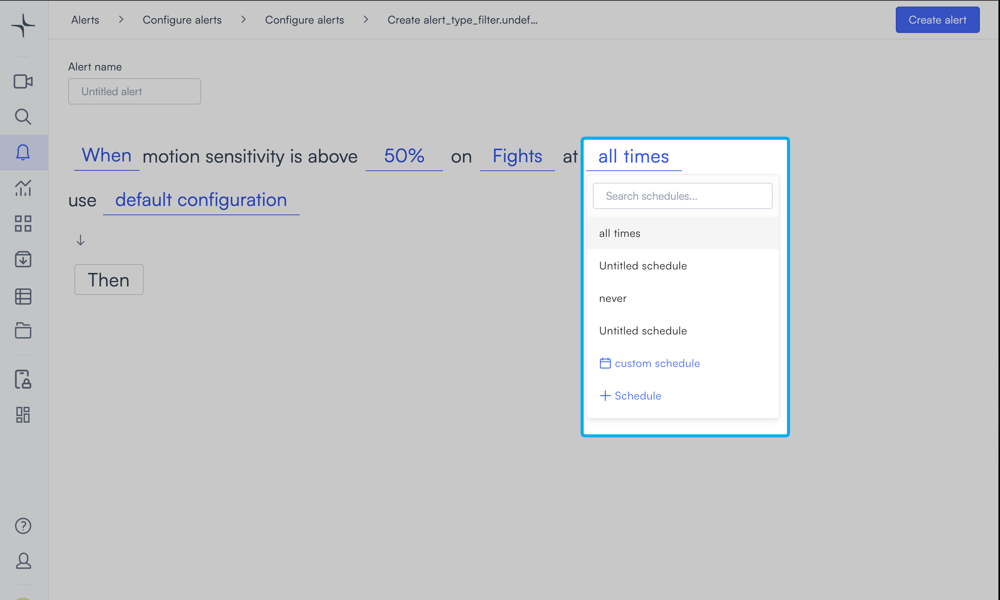
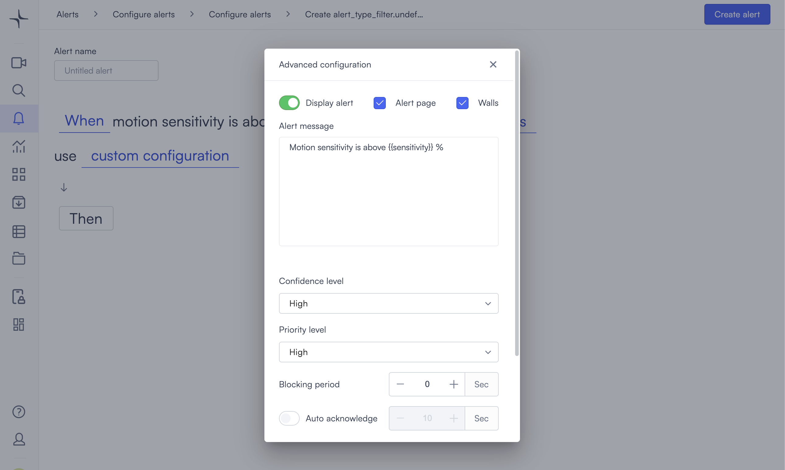
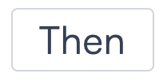

# Configure a custom alert

A custom alert lets you create an alert using any existing alert type's condition. You select the condition type from a central dropdown, configure the parameters, set a schedule, and define what happens when the alert triggers.


Admin access is required to configure alerts.


## Create a custom alert

1. In the left navigation, select **Alerts**. The Alerts page opens.

2. Select **Add alert** in the top right corner. The Configure alerts page opens, showing all available alert types grouped by category.

3. From the left sidebar, select **Custom alert**. The Custom alert creation page opens.

4. Enter a name for the alert in the **Alert name** field. Use a name that describes the condition and location, for example "Warehouse motion" or "Main entrance trespassing."

5. Select **When this happens**. A dropdown opens showing all available alert types grouped by category.

6. Search for or scroll to the alert type you want to use, then select it. The condition sentence appears with the configurable parameters highlighted.


Depending on the alert type, the sentence may show one parameter or several. For some alert types, the next parameter appears only after you set the one before it.


7. Select each highlighted parameter in the sentence and set its value. The last parameter in every sentence is **camera**. Selecting it completes the condition. After you select a camera, the scheduling, configuration, and action options appear.

The example below shows a completed sentence with all parameters set.

For the exact parameters your alert type uses, see [Custom alert parameters](custom-alert-parameters.md).

8. The **at all times** field controls when the alert is active. The default keeps the alert active around the clock. To restrict the alert to specific hours or days, select **at all times** to open the scheduling options. For all scheduling options, see [Configure alerts](create-and-manage-alerts.md#schedule).

9. Select **default configuration** to open the advanced settings panel. This lets you set confidence level, priority, blocking period, and alert message. Select **Done** to close the panel. The link updates to **custom configuration** to confirm your changes were applied. For details on each setting, see [Configure alerts](create-and-manage-alerts.md#default-configuration).

10. Select **Then** to choose what Lumana does when the alert triggers. Select an action from the list. For a description of each action and how to configure it, see [Alert actions](alert-actions.md).

11. When all settings are complete, select **Create alert** in the top right. The alert is saved.
