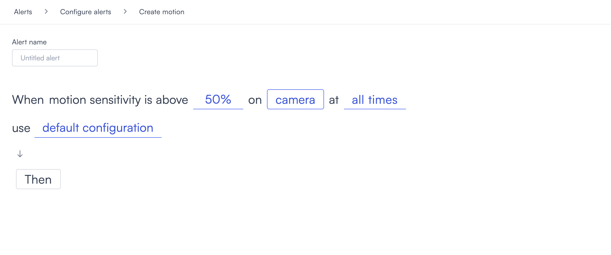
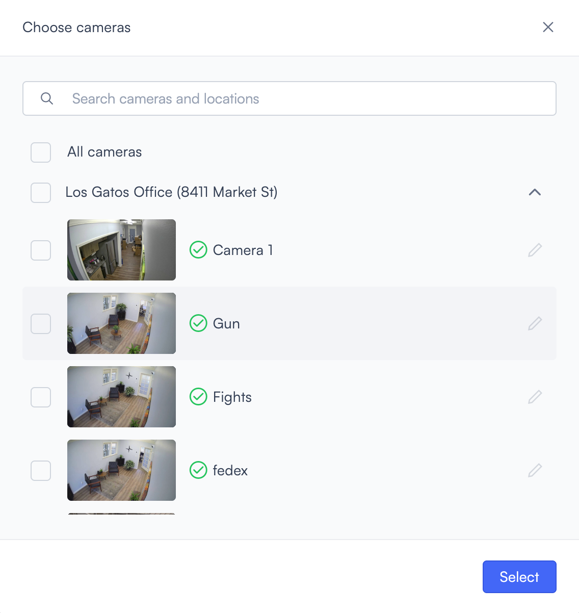
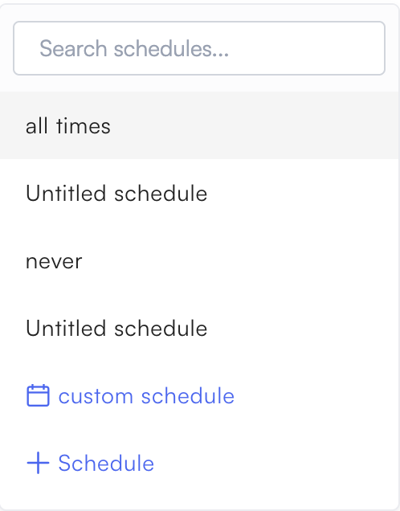
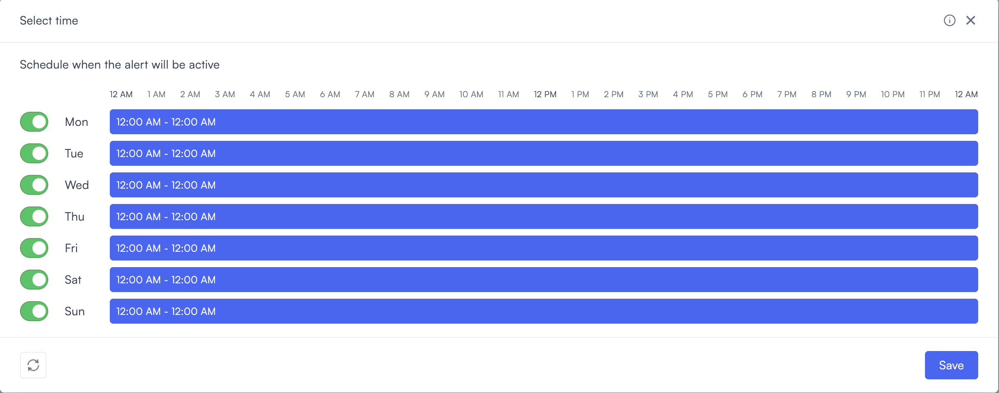
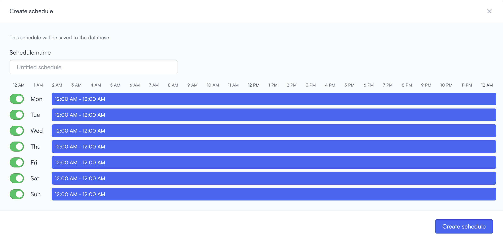
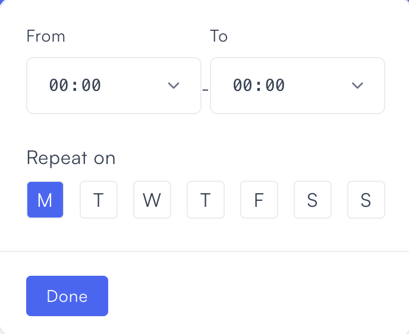
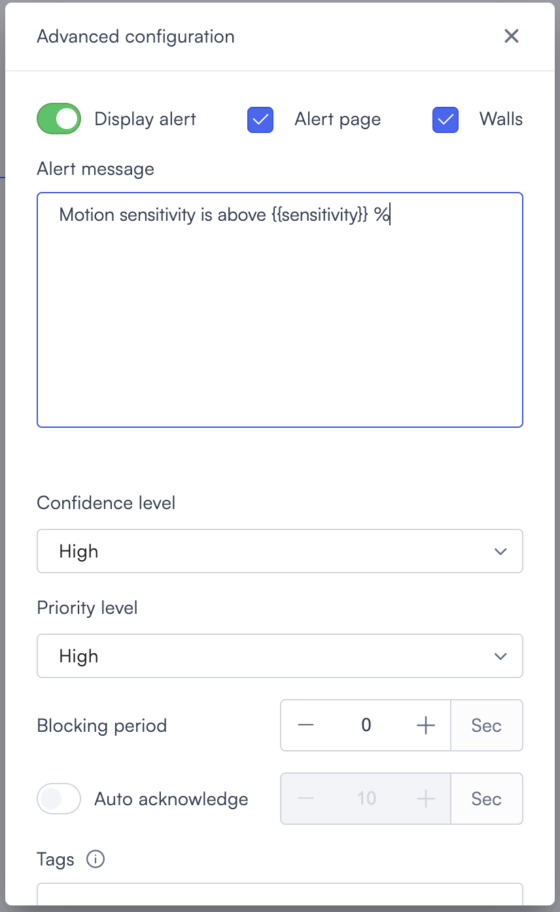
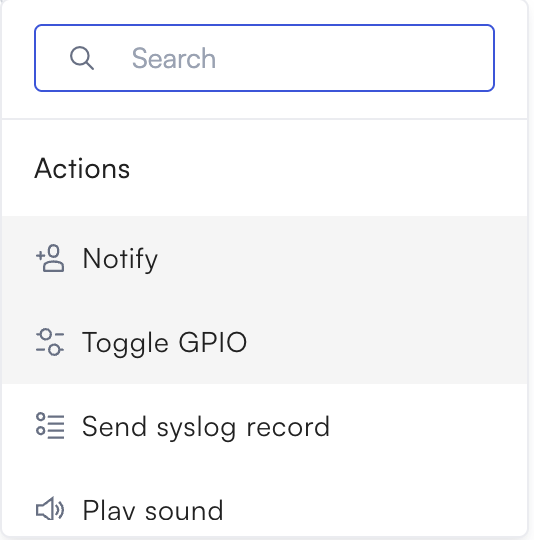
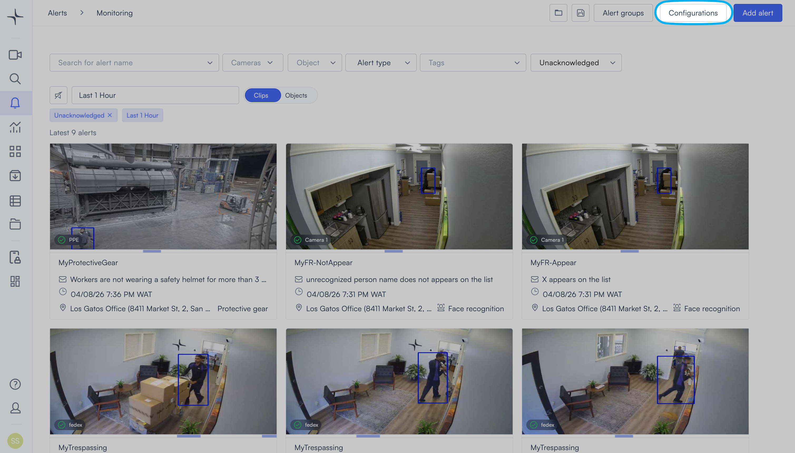

# Configure alerts

Lumana alerts monitor your cameras and notify you when specific conditions are detected. Some alerts are powered by AI, while others are rule-based. Each alert is built from a template written in plain language, so you can see exactly what it does before you configure it.

This page covers how to create, manage, and delete alerts. Each alert type and what it detects is covered in the [Alert types](alert-types/) section.

## Create an alert

1. Select the **bell icon** in the navigation bar. The Alerts monitoring view opens.

2. Select **Add alert** in the top right corner. The Configure alerts page opens.

3. Find the alert type you want. Use the left sidebar to jump to a category, or scroll through the page to browse all alert types. Each card shows a plain-language description of what the alert detects.
4. Select **Use template** on the alert type card. A new page opens with the alert rule displayed as an editable sentence.

5. Enter a name for the alert in the **Alert name** field, for example "Main entrance motion" or "PPE violation."
6.  Configure the alert rule by selecting the underlined fields in the sentence. Each field is clickable and opens a slider, modal, or dropdown depending on what it controls. The fields change depending on the alert type. For example, a Motion alert lets you set the sensitivity percentage, camera, and time window.

    Selecting the **camera** field opens the Choose cameras modal.

* Search by camera name or location using the search field.
* Select **All cameras** to apply the alert to every camera in your account.
* Select individual cameras by checking the box next to each one.
* Select **Select** to confirm your selection and close the modal.

Selecting the **time** field opens a schedule dropdown that controls when the alert is active. Use the **Search schedules...** field at the top to find a saved schedule by name.

* **all times**: The alert is active around the clock, every day.
* **Untitled schedule**: A saved schedule that hasn't been renamed. Any schedules you've previously created appear here by their name, between **all times** and **never**. Select one to apply it directly.
* **never**: The alert is saved but never triggers. Use this to pause an alert without deleting it.
* **custom schedule**: Opens the Select time dialog where you set active hours per day for this alert only. The schedule is not saved for reuse.
* **+ Schedule**: Opens the Create schedule dialog where you build a named schedule saved to your account for reuse across alerts.

To configure a one-off schedule, select **custom schedule**.

In the Select time dialog, toggle each day on or off and adjust the time bar to set the active window. Select **Save** to apply the schedule to this alert.

To create a reusable schedule, select **+ Schedule**.

In the Create schedule dialog:

a. Enter a name in the **Schedule name** field. b. Select a day row in the weekly grid to open the time picker.

c. Set the **From** and **To** times for when the alert should be active. d. Select the days to repeat this time window using the **Repeat on** day selector. e. Select **Done** to apply the time window to the selected days. f. Select **Create schedule** to save the schedule. It appears in the time dropdown for all future alerts.

7. Optionally, select **default configuration** to open the Advanced configuration panel. This panel controls how the alert is displayed, sets its confidence and priority levels, configures a blocking period to reduce alert fatigue, and lets you customise the alert message with dynamic data fields. If you skip this step, the alert uses the default settings.

**Display and visibility**

* **Display alert**: Toggle on to show this alert in the Alerts monitoring view. Toggle off to record and count the alert for analytics without showing it on dashboards or alert walls. Off-mode alerts are still logged and available in reports and dashboards.
* **Alert page**: Check to show this alert on the Alerts page. Uncheck to hide it from the real-time view while keeping it as background data.
* **Walls**: Check to show this alert on Wall displays. Uncheck to exclude it from live alert walls.

**Alert message**

The alert message is the notification text that appears when the alert triggers. You can include dynamic fields to add context-specific information. To see the available fields, type `{{` in the message field. The supported parameters are:

* `alert_name`
* `alert_priority`
* `alert_instance_id`
* `alert_category`
* `alert_category_code`
* `alert_flow`
* `alert_flow_code`
* `alert_link`
* `alert_video`
* `event_id`
* `event_tag_name`
* `event_tag_id`
* `timestamp`
* `camera_id`
* `camera_name`
* `camera_metadata`
* `camera_live_view_link`
* `camera_coords`
* `edge_id`
* `edge_name`
* `location_id`
* `location_name`
* `org_id`
* `org_name`
* `thumbnail`
* `sensitivity`

**Detection and filtering**

* **Confidence level**: The AI confidence threshold required before the alert triggers. Higher confidence reduces false positives but might miss some events. Lower confidence captures more events but may include more false positives. The options are **Low**, **Medium**, and **High**. The default is **High**.
* **Priority level**: The priority assigned to this alert. The options are **Low**, **Medium**, and **High**. The default is **High**.
* **Blocking period**: The minimum time in seconds between consecutive alerts for the same condition. Use this to reduce notification overload and focus attention on meaningful incidents. Set to 0 to allow back-to-back alerts.
* **Auto acknowledge**: When enabled, the alert automatically acknowledges itself after the number of seconds you set. Use this for informational alerts that don't require manual review.
* **Tags**: Labels you can attach to this alert for filtering in the monitoring view.

Select **Done** to close the panel and return to the alert rule. The link updates from **default configuration** to **custom configuration** to confirm your changes were applied.

8. Select **Then** to choose the action Lumana takes when the alert triggers. Select one action from the list.

The available actions are:

* **Notify**: Send a notification to selected users or groups.
* **Toggle GPIO**: Trigger a GPIO output, for example to activate a door lock or light.
* **Send syslog record**: Send a syslog entry to an external logging system.
* **Play sound**: Play an audio alert on a connected speaker.
* **Change alert group state**: Update the state of an alert group when this alert triggers.
* **Change alert status**: Change the status of this alert automatically.
* **Trigger Remote IO**: Trigger a remote input/output device.
* **Notify Team3**: Send a notification through Team3.
* **Use http request**: Send an HTTP request to an external endpoint.
* **Send Microsoft Teams message**: Post a message to a Microsoft Teams channel.
* **Change variable value**: Update the value of a configured variable.

Each action and how to configure it is covered in [Alert actions](alert-actions.md).

9. Select **Create alert** in the top right corner. The alert is saved and appears in the configured alerts list.

## View and manage configured alerts

To view all configured alerts, select **Configurations** from the Alerts monitoring view. The list shows every alert in your account with its name, a plain-language description of its trigger condition, and its current status.

Each row in the list shows:

* **Toggle**: Enable or disable the alert without deleting it.
* **Alert name and description**: The name you entered and a plain-language summary of the trigger condition.
* **Status icon**: A green checkmark indicates the alert is active.
* **Delete icon**: Removes the alert permanently.

To edit a configured alert, select its row in the list. The alert configuration page opens with the current settings. Update the fields you want to change, then select **Update Alert** to save. Select **Discard** to exit without saving.

## Delete an alert

To delete an alert, select the **delete icon** on the right side of the alert row in the configured alerts list.

> **Warning:** Deletion is permanent and cannot be undone.
