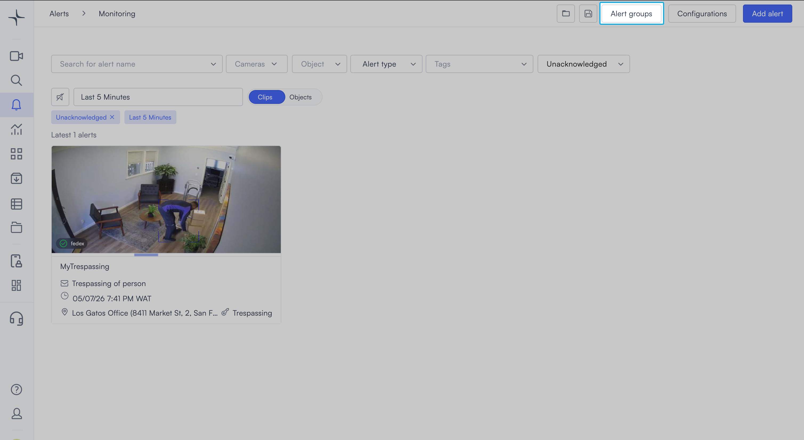
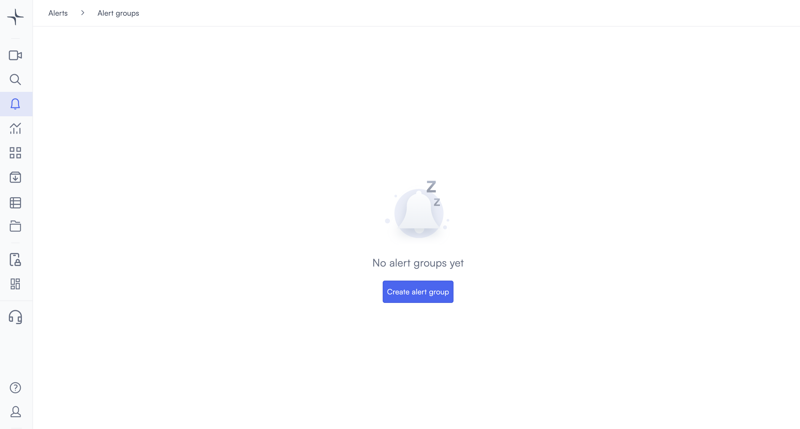
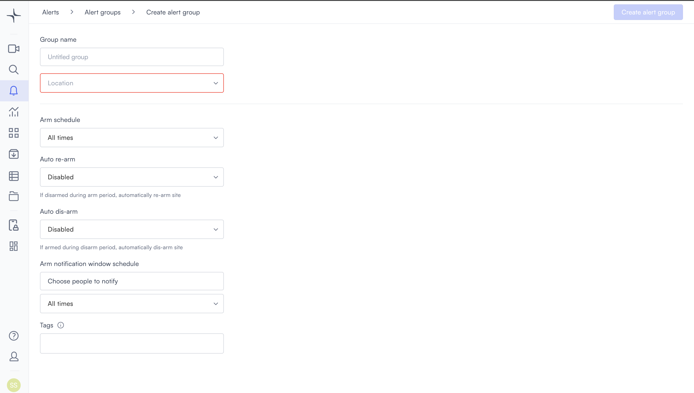
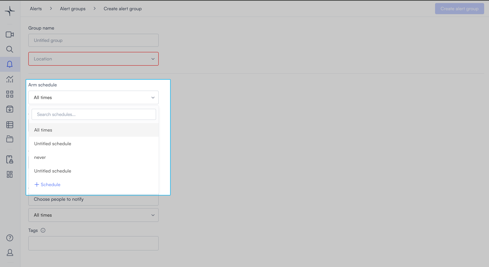
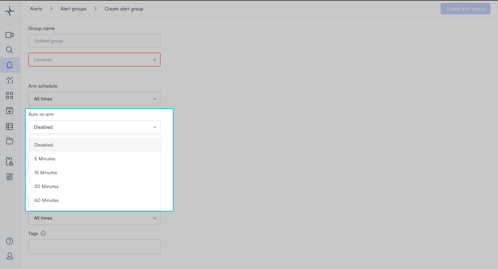
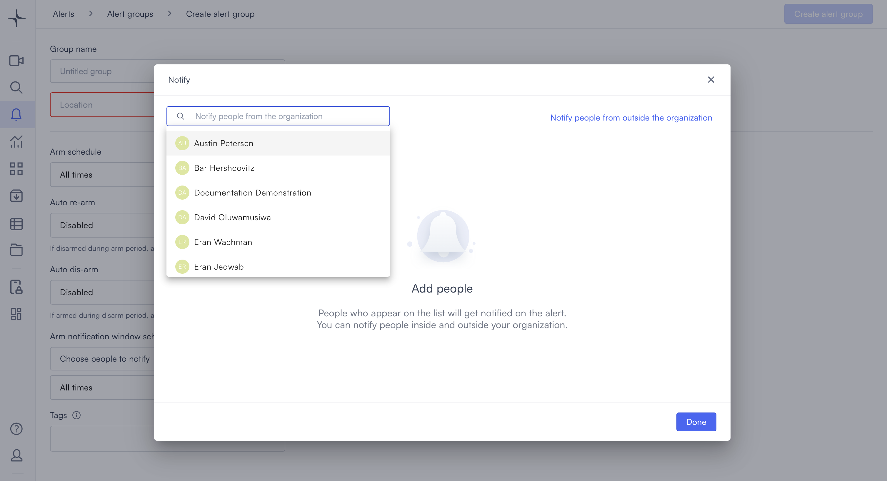
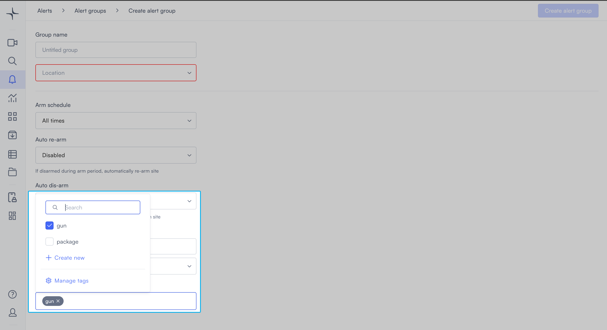

# Create an alert group

An alert group arms and disarms alerts for a location on a defined schedule. Use it to control when Lumana actively monitors a site and who receives notifications during the armed period.


Admin access is required to create and manage alert groups.


## How it works

You assign a location to the group and set an arm schedule. When the arm schedule is active, Lumana monitors alerts tied to that location. If someone manually disarms the group during the arm period, then auto re-arm brings it back online after a set delay. If the group is armed outside its schedule, then auto dis-arm shuts it down automatically. The notification list controls who receives alerts during the arm window.

## Set up the alert group

1. In the left navigation, select **Alerts**. The Alerts monitoring view opens.

2. Select **Alert groups** in the top right corner. The Alert groups page opens.

<figure data-with-frame="true"><figcaption></figcaption></figure><figure data-with-frame="true"><figcaption></figcaption></figure>

3. Select **Create alert group**. The Create alert group page opens.

4. Enter a name in the **Group name** field, for example "Main entrance" or "Warehouse perimeter."
5. Select the **Location** field. A dropdown opens. Search for a location or select one from the list.
6. Select the **Arm schedule** field to set when the group is armed. A dropdown opens showing your saved schedules. Select a schedule, or select **+ Schedule** to create a new one.

7. Select the **Auto re-arm** field to set how long Lumana waits before re-arming the group after a manual disarm. Select **Disabled** to turn this off, or select a time interval:

   - **5 Minutes**
   - **15 Minutes**
   - **30 Minutes**
   - **60 Minutes**

8. Select the **Auto dis-arm** field to set whether Lumana automatically disarms the group outside its arm schedule. Select **Disabled** to turn this off, or select a time interval.
9. Under **Arm notification window schedule**, select **Choose people to notify**. The Notify panel opens.

   - To notify people in your organization, search by name and select them from the list.
   - To notify contacts outside your organization, select **Notify people from outside the organization**.
   - Select **Done** to confirm your selections.

10. Select the schedule dropdown under **Arm notification window schedule** to set when notifications are sent.
11. Select the **Tags** field to apply tags to this group. Select an existing tag, or select **+ Create new** to add one. Select **Manage tags** to edit your tag list.

12. Select **Create alert group** in the top right corner. Lumana saves the group and it becomes active immediately.

