# Custom alert parameters

This page shows the condition sentence for each alert type as it appears in the Custom alert flow. Use it to identify your alert type's sentence when configuring step 7 of [Configure a custom alert](custom-alert.md#parameters). Select the link under each sentence to see the full parameter details on the alert type page.

The last parameter in every sentence is **camera**. Selecting it completes the condition.

## Security

Security alerts detect threats and unauthorized activity in the camera's view.

### Motion

**Condition sentence:** When motion sensitivity is above **X%** on **camera**.

Set each highlighted value in the sentence. The [Motion configuration steps](alert-types/security/motion.md#parameters) explain what each parameter controls.

### Tampering

**Condition sentence:** When **Indoor** camera is tampered with for more than **X** seconds on **camera**.

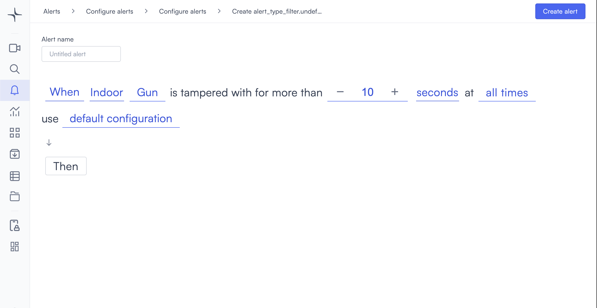

Set each highlighted value in the sentence. The [Tampering configuration steps](alert-types/security/tampering.md#parameters) explain what each parameter controls.

### Proximity

**Condition sentence:** When **objects** are close to each other for more than **0** seconds on **camera**.

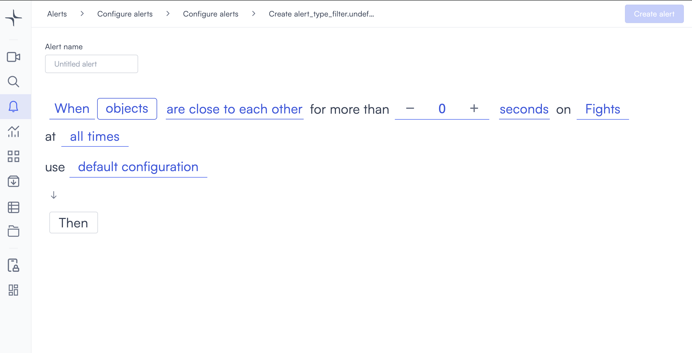

Set each highlighted value in the sentence. The [Proximity configuration steps](alert-types/security/proximity.md#parameters) explain what each parameter controls.

### Trespassing

**Condition sentence:** When trespassing of **objects** is detected on **camera**.

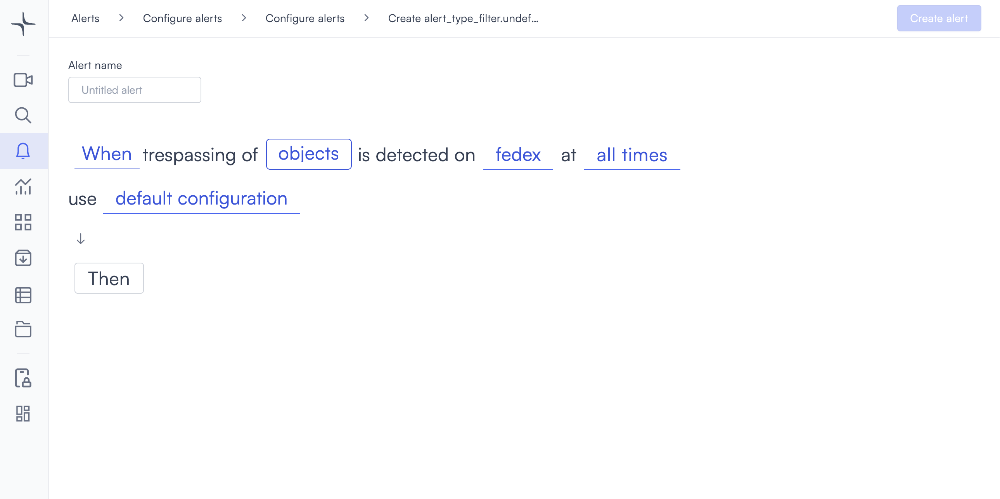

Set each highlighted value in the sentence. The [Trespassing configuration steps](alert-types/security/trespassing.md#parameters) explain what each parameter controls.

### Trespassing zones

**Condition sentence:** When **objects** enter the defined zone on **camera**.

Set each highlighted value in the sentence. The [Trespassing zones configuration steps](alert-types/security/trespassing-zones.md#parameters) explain what each parameter controls.

### Tailgating

**Condition sentence:** When multiple **objects** enter through a single access event for more than **X** seconds on **camera**.

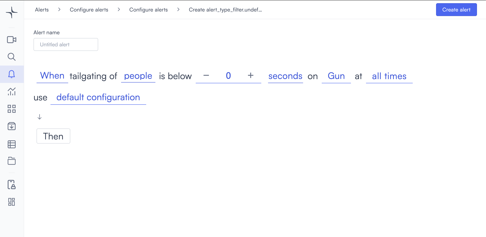

Set each highlighted value in the sentence. The [Tailgating configuration steps](alert-types/security/tailgating.md#parameters) explain what each parameter controls.

### Zone protection

**Condition sentence:** When **objects** stay in the defined zone for more than **X** seconds on **camera**.

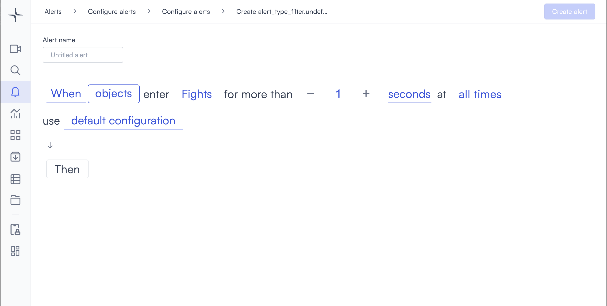

Set each highlighted value in the sentence. The [Zone protection configuration steps](alert-types/security/zone-protection.md#parameters) explain what each parameter controls.

### Gun detection

**Condition sentence:** When a firearm is visible on **camera**.

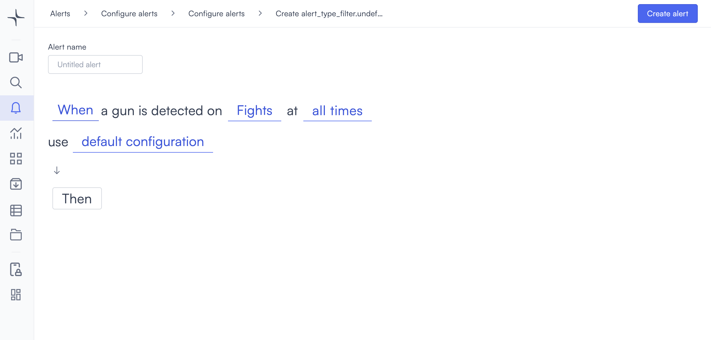

Set each highlighted value in the sentence. The [Gun detection configuration steps](alert-types/security/gun-detection.md#parameters) explain what each parameter controls.

### Speed control

**Condition sentence:** When **objects** move through the defined path in less than **X** seconds on **camera**.

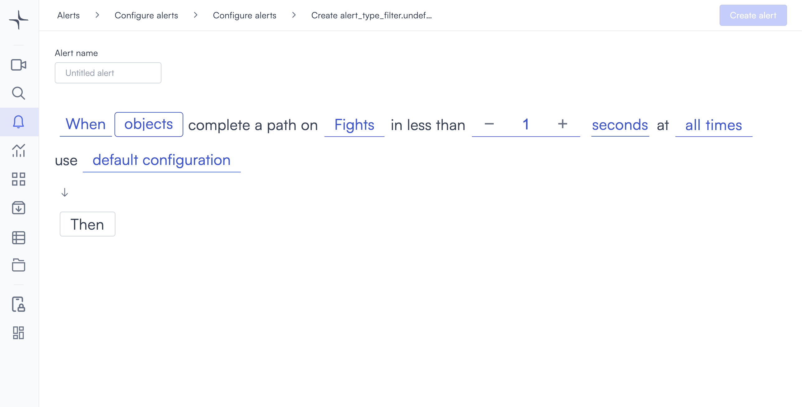

Set each highlighted value in the sentence. The [Speed control configuration steps](alert-types/security/speed-control.md#parameters) explain what each parameter controls.

### Fire

**Condition sentence:** When **fire** is detected on **camera**.

Set each highlighted value in the sentence. The [Fire configuration steps](alert-types/security/fire.md#parameters) explain what each parameter controls.

### Fall detection

**Condition sentence:** When a person falls and doesn't recover within **X** seconds on **camera**.

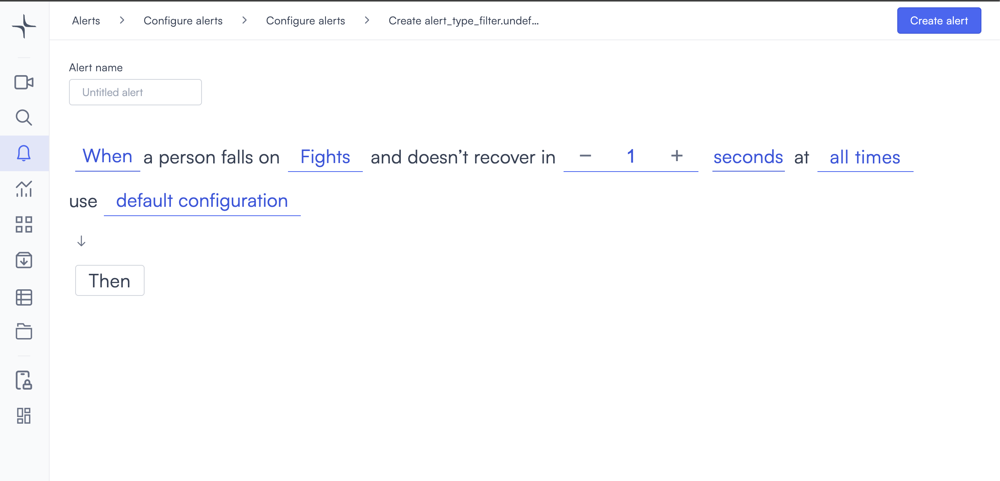

Set each highlighted value in the sentence. The [Fall detection configuration steps](alert-types/security/fall.md#parameters) explain what each parameter controls.

### Violence

**Condition sentence:** When fighting or physical aggression is detected on **camera**.

Set each highlighted value in the sentence. The [Violence configuration steps](alert-types/security/violence.md#parameters) explain what each parameter controls.

### Suspect alerts

**Condition sentence:** When a person on the list **appears** on **camera**.

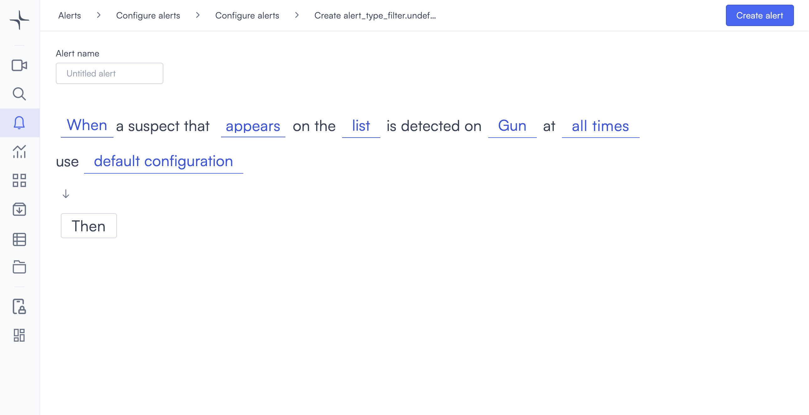

Set each highlighted value in the sentence. The [Suspect alerts configuration steps](alert-types/security/suspect-alerts.md#parameters) explain what each parameter controls.

## Identification

Identification alerts recognize specific people, vehicles, or objects using your organisation's databases.

### Face recognition

**Condition sentence:** When a face **appears** the list on **camera**.

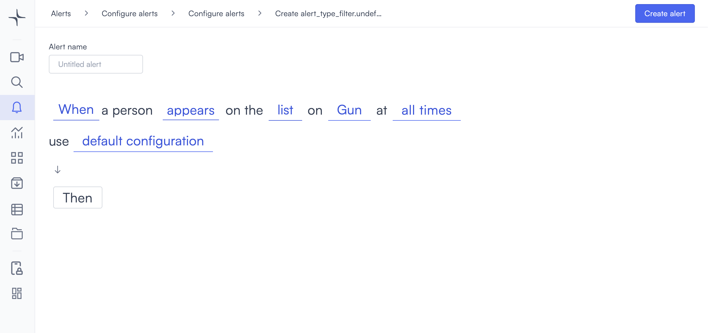

Set each highlighted value in the sentence. The [Face recognition configuration steps](alert-types/security/suspect-alerts.md#parameters) explain what each parameter controls.

### License plate recognition

**Condition sentence:** When a plate **appears** the list on **camera**.

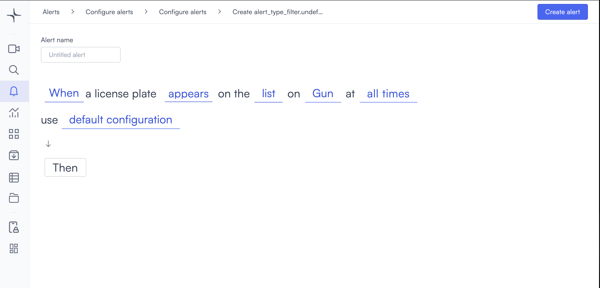

Set each highlighted value in the sentence. The [License plate recognition configuration steps](alert-types/identification/license-plate.md#parameters) explain what each parameter controls.

### Container detection

**Condition sentence:** When a container serial number **appears** the list on **camera**.

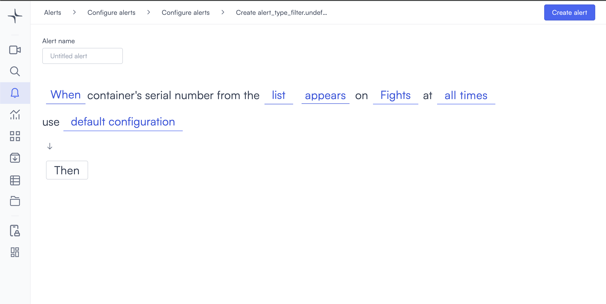

Set each highlighted value in the sentence. The [Container detection configuration steps](alert-types/identification/container.md#parameters) explain what each parameter controls.

## Tracking

Tracking alerts monitor movement patterns, occupancy levels, and behavioral conditions across the camera's view.

### Appearing

**Condition sentence:** When **objects** enter the defined zone on **camera**.

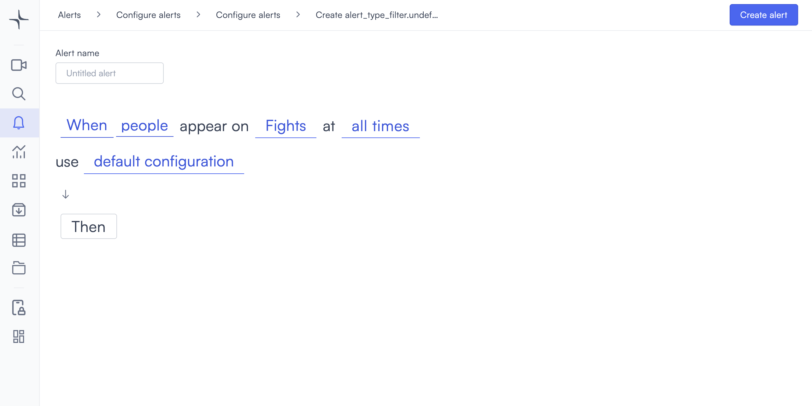

Set each highlighted value in the sentence. The [Appearing configuration steps](alert-types/tracking/appearing.md#parameters) explain what each parameter controls.

### Disappearing

**Condition sentence:** When **objects** exit the defined zone on **camera**.

Set each highlighted value in the sentence. The [Disappearing configuration steps](alert-types/tracking/disappearing.md#parameters) explain what each parameter controls.

### Traffic control

**Condition sentence:** When **objects** cross a sequence of lines in order on **camera**.

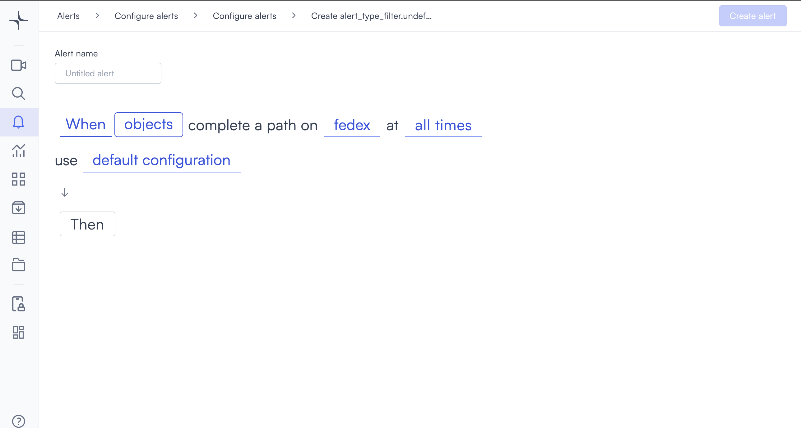

Set each highlighted value in the sentence. The [Traffic control configuration steps](alert-types/tracking/traffic-control.md#parameters) explain what each parameter controls.

### Occupancy

**Condition sentence:** When more than **X** **objects** are detected for more than **Y** seconds on **camera**.

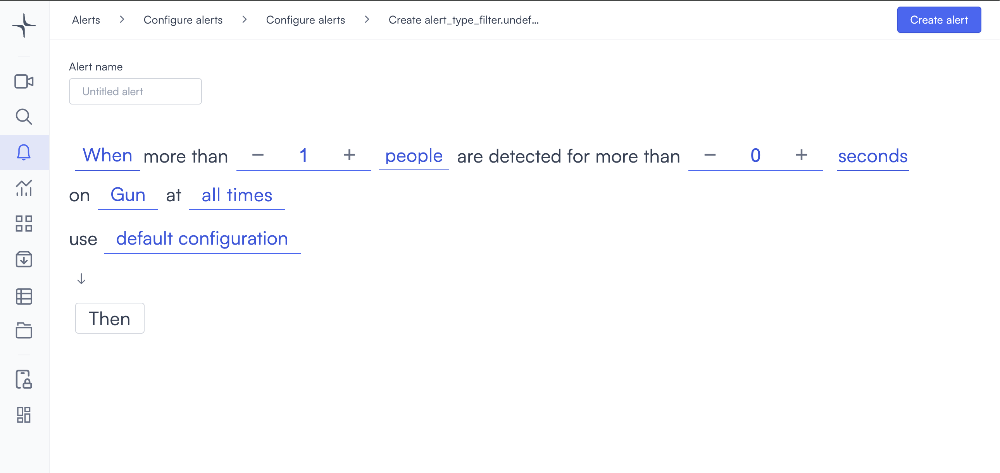

Set each highlighted value in the sentence. The [Occupancy configuration steps](alert-types/tracking/occupancy.md#parameters) explain what each parameter controls.

### Loitering

**Condition sentence:** When **objects** stay in the camera view for more than **X** seconds on **camera**.

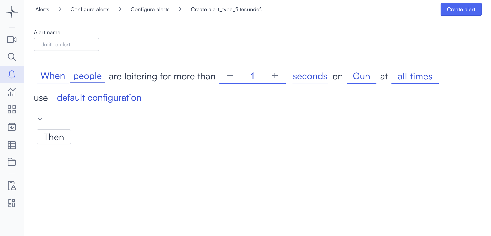

Set each highlighted value in the sentence. The [Loitering configuration steps](alert-types/tracking/loitering.md#parameters) explain what each parameter controls.

### Line crossing

**Condition sentence:** When **objects** cross the defined line on **camera**.

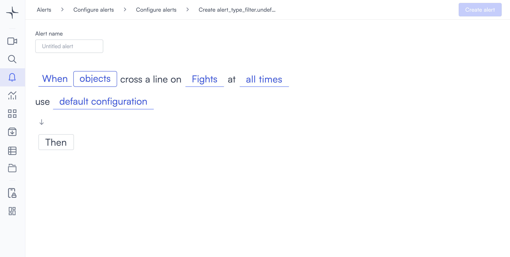

Set each highlighted value in the sentence. The [Line crossing configuration steps](alert-types/tracking/line-crossing.md#parameters) explain what each parameter controls.

### Missing object

**Condition sentence:** When a marked object on **camera** is no longer detected.

Set each highlighted value in the sentence. The [Missing object configuration steps](alert-types/tracking/missing-object.md#parameters) explain what each parameter controls.

### Absence

**Condition sentence:** When no **objects** are detected for more than **X** seconds on **camera**.

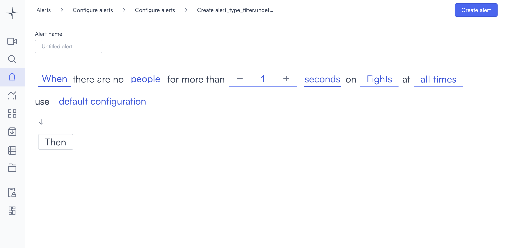

Set each highlighted value in the sentence. The [Absence configuration steps](alert-types/tracking/absence.md#parameters) explain what each parameter controls.

### Holding a phone

**Condition sentence:** When a person holds a cell phone for more than **X** seconds on **camera**.

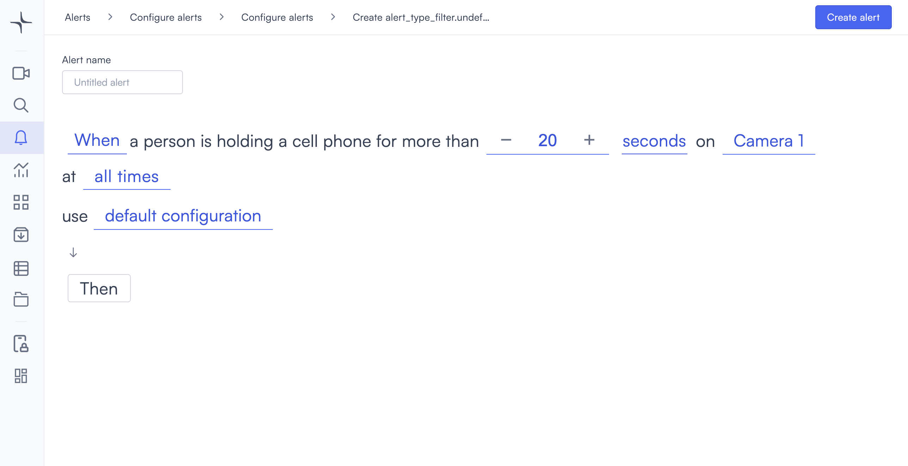

Set each highlighted value in the sentence. The [Holding a phone configuration steps](alert-types/tracking/holding-a-phone.md#parameters) explain what each parameter controls.

### Snapshot

**Condition sentence:** Capture still image from zone every **X** seconds on **camera**.

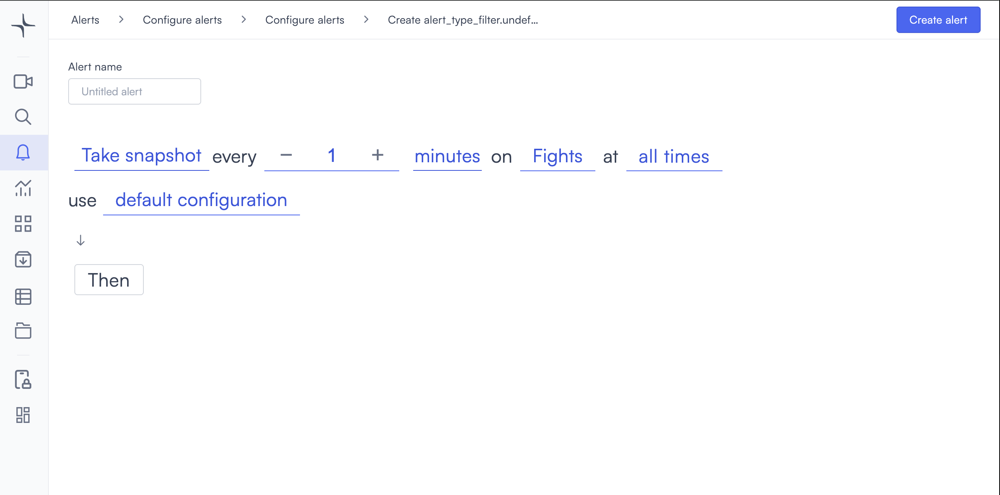

Set each highlighted value in the sentence. The [Snapshot configuration steps](alert-types/tracking/snapshot.md#parameters) explain what each parameter controls.

## Status

Status alerts notify when a camera or Core device changes its connection state.

### Camera status

**Condition sentence:** When camera status has changed for more than **X** seconds on **camera**.

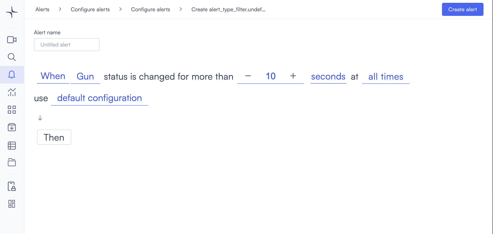

Set each highlighted value in the sentence. The [Camera status configuration steps](alert-types/status/camera-status.md#parameters) explain what each parameter controls.

### Core status

**Condition sentence:** When Core device status has changed for more than **X** seconds on **Core**.

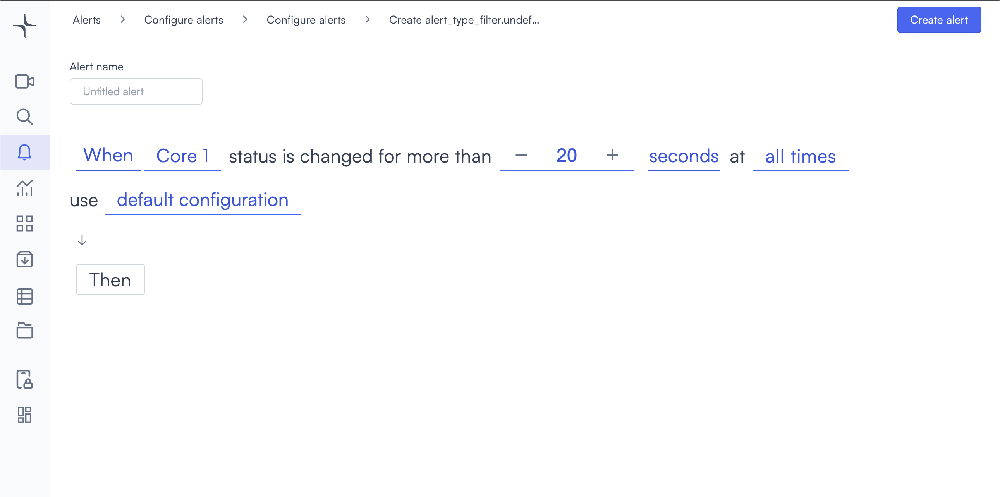

Set each highlighted value in the sentence. The [Core status configuration steps](alert-types/status/core-status.md#parameters) explain what each parameter controls.

## Safety and compliance

Safety and compliance alerts monitor for personal protective equipment and workplace safety conditions.

### Protective gear

**Condition sentence:** When workers **are not wearing** **safety helmet** for more than **X** seconds on **camera**.

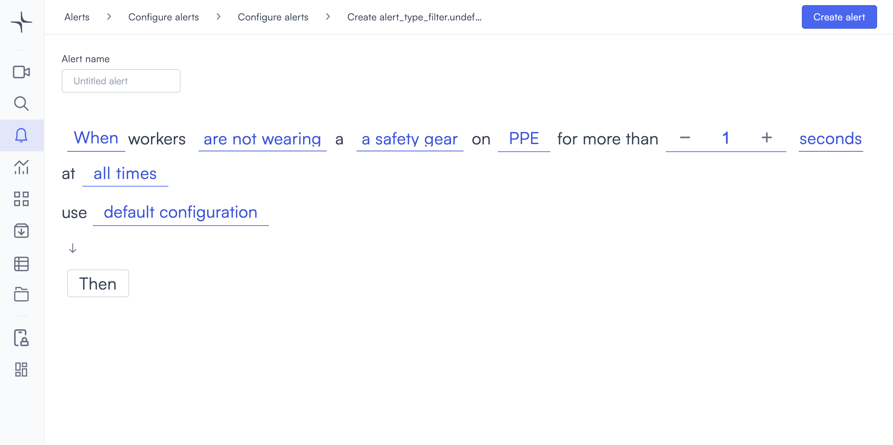

Set each highlighted value in the sentence. The [Protective gear configuration steps](alert-types/safety-and-compliance/protective-gear.md#parameters) explain what each parameter controls.

### Gloves

**Condition sentence:** When worker is **not wearing** **gloves** on **camera**.

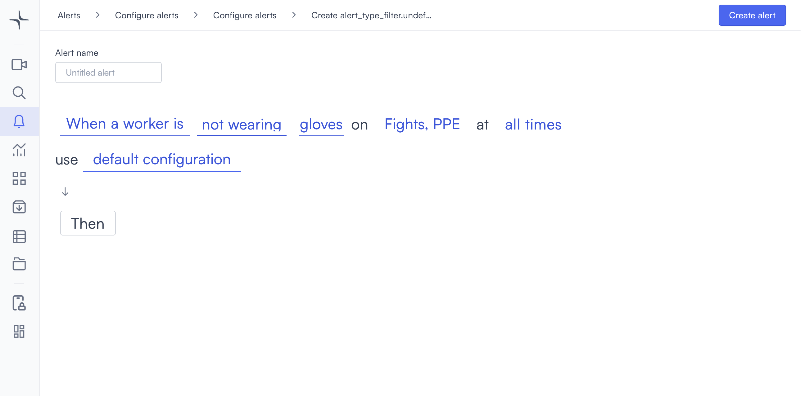

Set each highlighted value in the sentence. The [Gloves configuration steps](alert-types/safety-and-compliance/gloves.md#parameters) explain what each parameter controls.

### Personal safety

**Condition sentence:** When workers are too close to a vehicle for more than **X** seconds on **camera**.

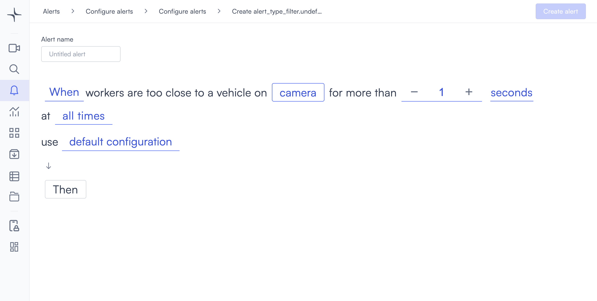

Set each highlighted value in the sentence. The [Personal safety configuration steps](alert-types/safety-and-compliance/personal-safety.md#parameters) explain what each parameter controls.

### Hands detected

**Condition sentence:** When hands are detected in the defined zone on **camera**.

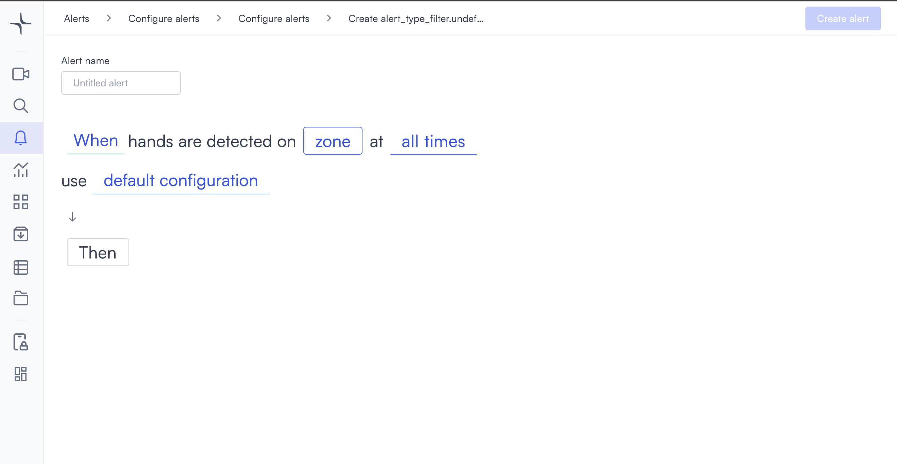

Set each highlighted value in the sentence. The [Hands detected configuration steps](alert-types/security/suspect-alerts.md#parameters) explain what each parameter controls.

## Integrations

Integration alerts respond to external events received from connected systems and APIs.

### Event tag

**Condition sentence:** When **event tag** is received, wait **X** seconds then alert on **camera**.

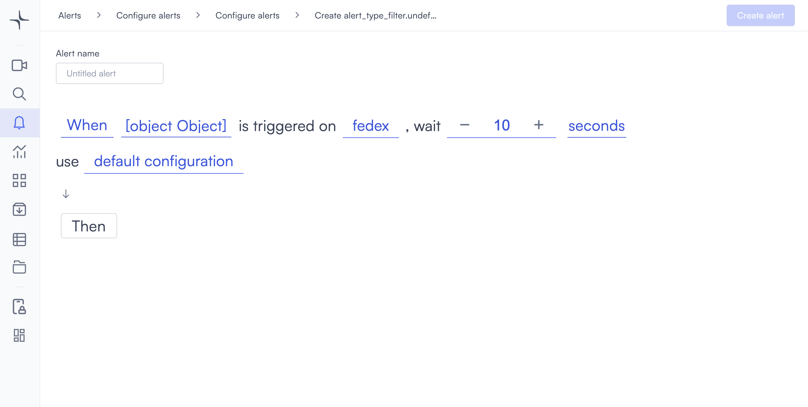

Set each highlighted value in the sentence. The [Event tag configuration steps](alert-types/integrations/event-tag.md#parameters) explain what each parameter controls.

### Event validation

**Condition sentence:** When event tag arrives and **objects** have **appearance** for **X** seconds on **camera**.

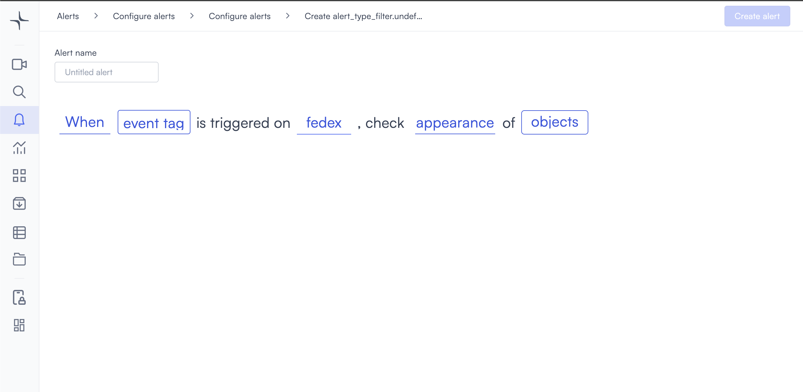

Set each highlighted value in the sentence. The [Event validation configuration steps](alert-types/integrations/event-validation.md#parameters) explain what each parameter controls.

### Door tailgating

**Condition sentence:** When multiple **objects** enter through a single access event for more than **X** seconds on **camera**.

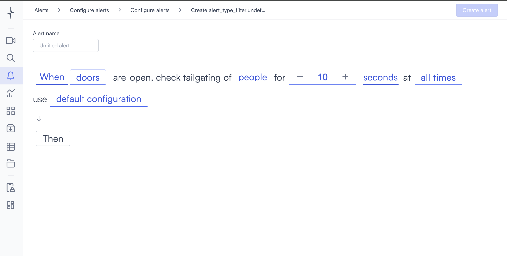

Set each highlighted value in the sentence. The [Door tailgating configuration steps](alert-types/security/tailgating.md#parameters) explain what each parameter controls.
