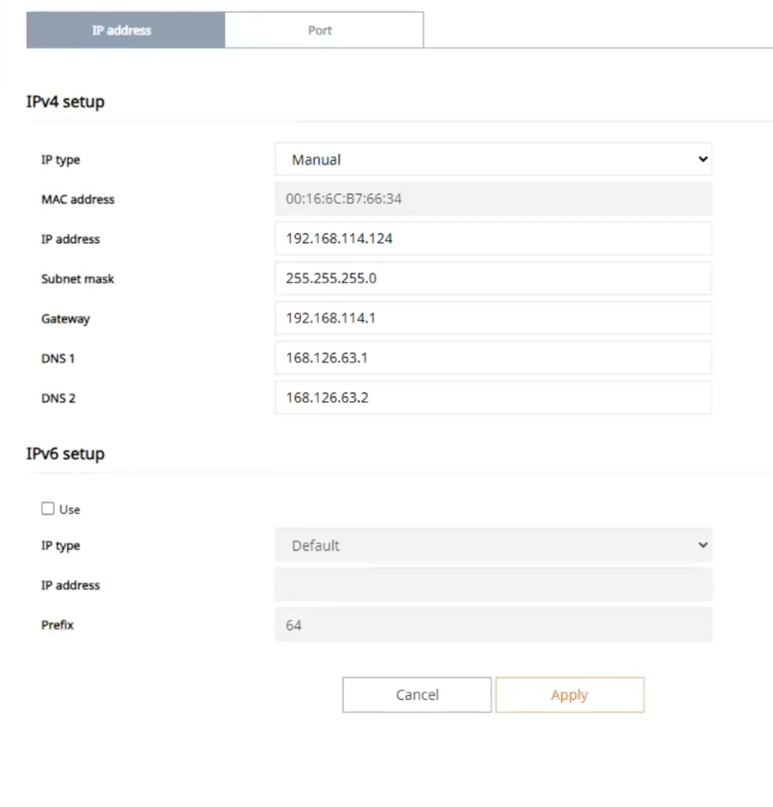
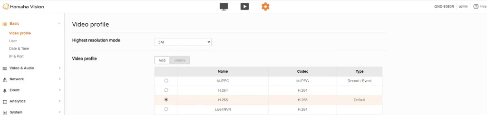
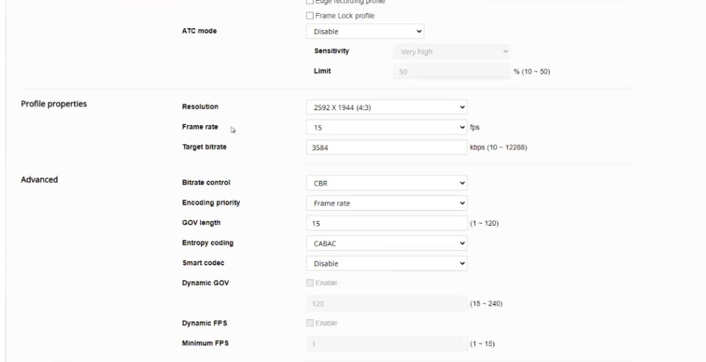
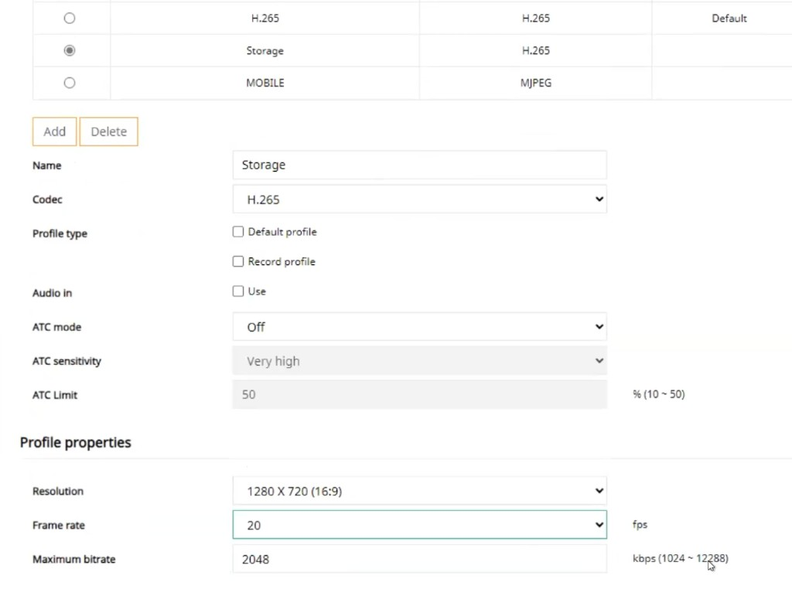

# Hanwha

Hanwha Wisenet cameras are supported in Lumana for analytics, monitoring, and typical enterprise deployments.

## Hanwha compatibility models

Compatible Hanwha Wisenet series include:

- Hanwha Wisenet P Series
- Hanwha Wisenet X Series
- Hanwha Wisenet T Series (thermal features require additional integration)
- Hanwha Wisenet A Series
- Hanwha Wisenet L Series

## Connecting Your Hanwha Camera to Lumana Core

This guide provides detailed instructions for connecting your Hanwha camera to Lumana Core, facilitating a smooth and effective integration. For optimal functionality, using the admin username and password of your Hanwha camera when connecting to Lumana Core is recommended. Additionally, this guide explores alternative methods such as using an ONVIF profile or creating a new profile to cater to varying security preferences and flexibility.

**Using Admin Credentials (recommended)**

To achieve the most seamless integration and ensure peak performance between your Hanwha camera and Lumana Core, we strongly suggest using the admin username and password. This method ensures the highest level of compatibility and access, allowing Lumana Core to fully utilize all features and settings of your Hanwha camera.

## Preparing Your Hanwha Camera

Ensure your Hanwha camera is updated, correctly configured, and ready to connect, whether using admin credentials, an ONVIF profile, or a new profile.

**Setting IP address**

Assign a Static IP (Recommended): Assign a static IP through the web interface or Wisenet device manager . Static IP is essential to ensure a consistent connection to Lumana Core.

This can be done under **Basic → IP and port**.

**Configuring the profile on your Hanwha camera**

- **Step 1**: Log into the Hanwha Web Portal

 

- **Step 2**: Under Basic->Video Profile select the video profile name you would like to use 

(In the example below the selected profile is called H.265 and it is profile 3)

Note: you can always use the add button to add another video profile 

 

- **Step 3**: Make that profile the default profile and select codec H.265

- **Step 4**: Configure the main profile 

    - Disable  ATC mode 
    - Frame rate should be 15
    - Target bit rate follow the [Lumana optimal camera configuration](https://support.lumana.ai/hc/en-us/articles/11867496430354) 
    - Bitrate control CBR
    - GOV length 15 
    - Smart Codec disabled 
    - Dynamic GOV disable 
    - Dynamic FPS disabled

- **Step 5**: Configure the substream create storage profile 

Select or add another profile, name it Storage 

In the below example it will be profile 4 

Make sure to select codec H.265 for it

 

- **Step 6**: Configure the storage profile 

- Disable  ATC mode 

- Frame rate should be 20-30

- Target bit rate follow the [Lumana optimal camera configuration](https://support.lumana.ai/hc/en-us/articles/11867496430354) 

- Bitrate control CBR

- GOV length 2x frame rate  

- Smart Codec disabled 

- Dynamic GOV disable 

- Dynamic FPS disabled

Step 7: Add camera to core 

[Follow Lumana article for adding camera](https://support.lumana.ai/hc/en-us/articles/11180060293266) 

For RTSP path you should use following the instructions above

Main stream/; /0/profile3/media.smp or /profile3/media.smp

Substream (Storage) : /0/profile4/media.smp or /profile4/media.smp

 

You’re all set!