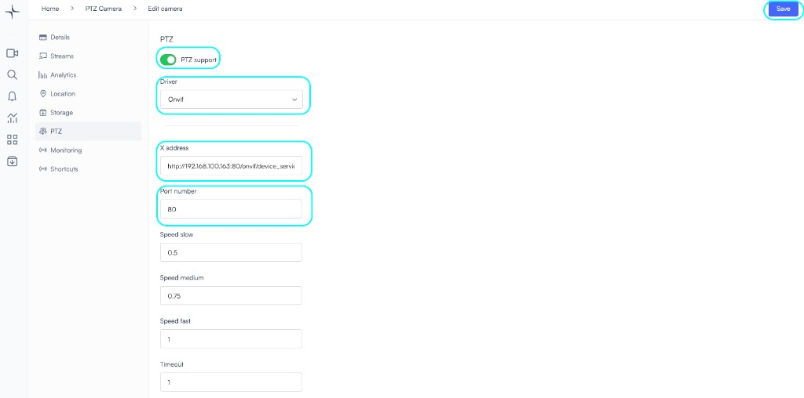
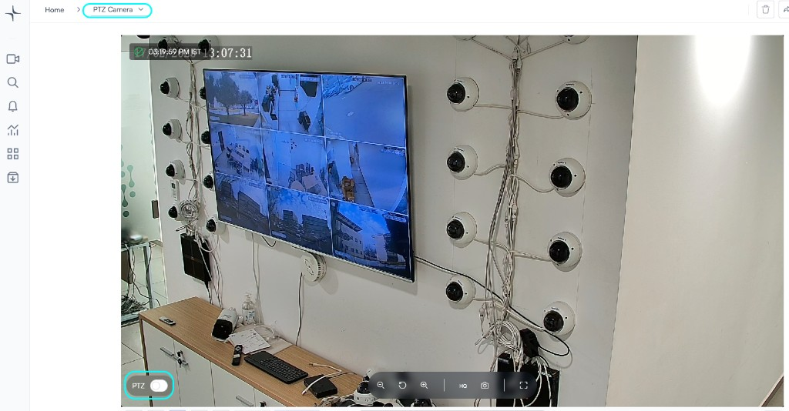

# Enable PTZ control

Lumana’s Remote PTZ (Pan-Tilt-Zoom) Control empowers users to manage camera angles, zoom levels, and coverage areas with precision—no matter where they are. This feature enables real-time monitoring and responsive security management, eliminating the need for manual adjustments.

## Key Capabilities:

✔ **360° Coverage** – Pan, tilt, and zoom to monitor every angle.

✔ **Remote Access** – Control PTZ cameras from any device, anywhere.

✔ **Predefined Homes** – Set predefined camera positioning.

 

1. Select the camera where you want to enable PTZ

2. Edit camera

3. PTZ

- Enable PTZ support
-Select the driver (by default most of the cameras support ONVIF)
- Paste the path for remote PTZ control (most cameras have the following PTZ path
{camera_IP}:80/onvif/device_service
- Specify the port (if changed from default port 80)
 

4. Save

5. After saving the configuration, you can open the camera and enable PTZ at the bottom of camera screen

6. Use the arrows to move around and use the magnification buttons to zoom in and out

