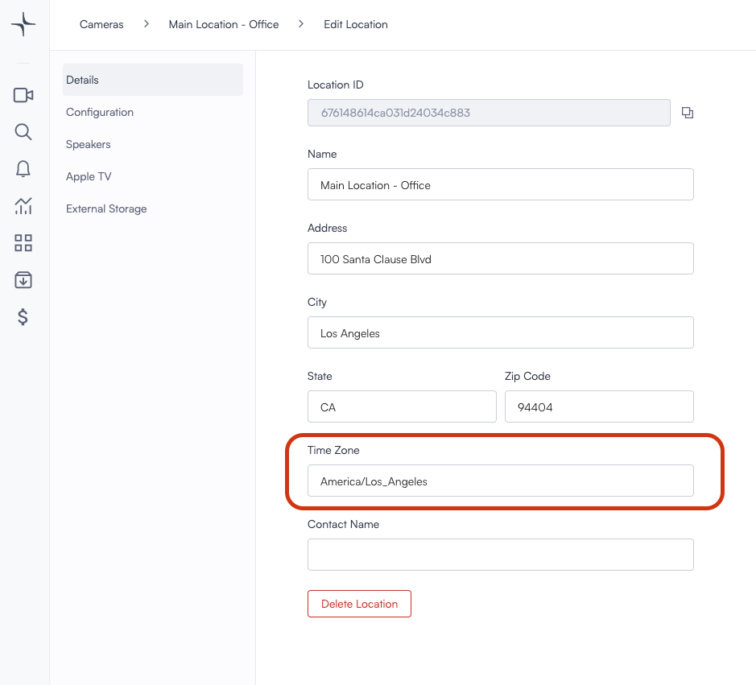

# Local time and NTP configuration

The time appears on screen when using live-view or playback is determined by the time-zone configured on the location in which the core and cameras are installed.

To change the time zone, hover the name of the relevant location, click "Edit Location" then change the time zone.

 

1. Hover the location, click "Edit location"

2. Edit the "Time Zone" field.

The Lumana Core requires a connection and synchronization with an NTP (Network Time Protocol) server to operate properly.

An NTP (Network Time Protocol) server is a server that uses the Network Time Protocol to provide accurate time synchronization to networked devices over the internet or local networks. This protocol ensures that the clocks of all machines within a network are kept in sync with UTC (Coordinated Universal Time).

Lumana's defauls NTP servers are
0.pool.ntp.org
1.pool.ntp.org
0.fr.pool.ntp.org

 

Should you want to use your local server you can enable that under the Edit Core menue

Step 1: Click on pencil icon under Core (edit Core)
Step 2: Select NTP
Step 3: Click on add server and type in the url of the new server you woul like to add
Step 4: Click Save

That's it you are all done!