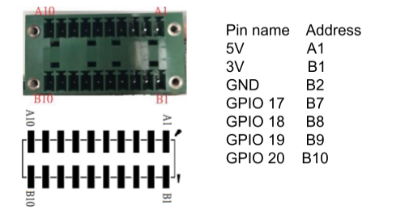

# GPIO devices

GPIO (General-Purpose Input/Output) is a versatile interface found on Lumana’s Core, allowing it to interact with external devices.In Lumana,  GPIO pins can be programmed to toggle high or low in the event of alert, enabling 3rd party devices to read hardwired signals from Lumana or control devices like LEDs, motors, or relays. These pins are essential in embedded systems, robotics, and DIY electronics projects, where direct hardware control is needed to create interactive and responsive applications.

## Pinout

## How to connect

In the below example we have connected a led to the GPIO. every time that the alert is triggered the led will blink.

Part list:

- A 5mm red LED
- A P2N2222 Transistor
- 1 330Ω resistor
- 1 10kΩ resistor

The transistor will act as a switch and amplify the current to the led 

R1 is the current limiting resistor for the LED

R2 is the Base Resistor which tells how much current to let flow in the circuit.

## How to operate

In order to enable the GPIO, please contact your technical support team as it have to be enabled on your core.

Once enabled, you now can add the action to toggle the GPIO in the alerts.

You can select the GPIO to use, the core can support up to 4 GPIOs, toggle high or low, and for how long.

