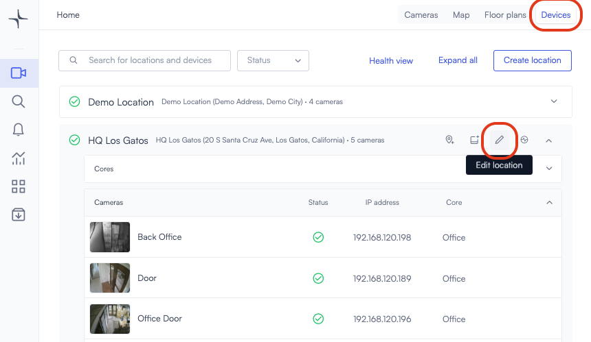
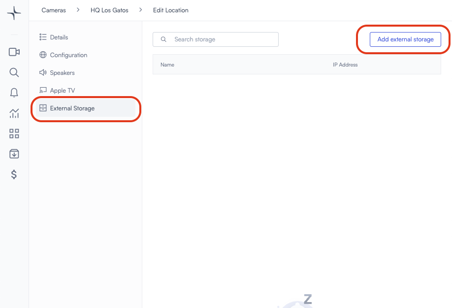
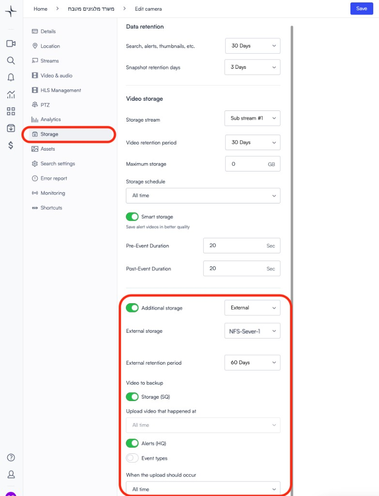

# Network Attached Storage (NAS) devices

Connect a network attached storage (NAS) device to Lumana to expand recording storage and keep a backup of recorded video.

Adding a NAS does not replace Lumana Core. The NAS works alongside the core as both an additional storage location for longer retention and a backup target for recorded data. Lumana's standard capabilities remain available.

> **Note:** If you record to NAS for more than 30 days and want to keep smart search functionality, an additional NAS license is required. No license is needed for the first 30 days.

## Prerequisites

- The storage device must support *NFS* or *S3-compatible object storage*.
- The storage device must be reachable on the network by the Lumana Core unit.

## Add an external storage server

1. Save the IP of your network storage server and the path where Lumana should save videos.

For example:

- **NAS IP:** `192.168.100.200`
- **NAS Path:** `/share/LumanaVideos`

2. In the Lumana console, on the *Devices* page, find the location where the NAS device is physically connected and click *Edit Location*.

3. In the left menu, click *External Storage*, then click *Add external storage*.

4. Choose your storage type. This can be either *NFS* or *Object Storage*. See the NFS example below.

- **Storage type:** `NFS`
- **Name:** name your external storage server
- **Path:** NAS IP and a directory path

5. Click *Test* to check connectivity to the NFS server, then click *Save external storage*.

## Configure cameras to use the external storage server

1. On the live view page of the camera, click *Edit Camera*.

2. In the edit camera menu, click *Storage*, then scroll down to *Additional Storage*.

3. Toggle *Additional storage* to *On*, then select *External*.

4. After selecting *External*, choose the server where the camera should record. In this example, select the NFS server added earlier, named `NFS-Server-1`.

5. Configure the storage options:

- Choose the retention period for videos on the external storage: `30 / 60 / 90 / 180 / 365` days
- Enable `Storage (SQ)` for saving ordinary footage
- Enable `Alerts (HQ)` for saving high-resolution clips of triggered alerts
- If you wish to restrict the times in which the core uploads videos to the NAS server, use the scheduler at the bottom, *When the upload should occur*

## Storage capacity calculation

- `RAID 5` - minimum 3 disks
- `RAID 6` - minimum 4 disks
- For `5MP` camera SQ (`700Kbps`), `0.3TB` is required for 30 days of storage
- For `8MP` camera SQ (`1000Kbps`), `0.45TB` is required for 30 days of storage

## Examples of NAS servers

- QNAP TS-1673AU-RP-16G,16 Bay NAS
- QNAP TS-464U-RP-8G 4Bay NAS 2.5Gbe

## Examples of HDDs

- MG09ACA18 Toshiba Enterprise 3.5HDD 512E 18TB
- MG09ACA16 Toshiba Enterprise 3.5HDD 512E 16TB
- MG09ACA14 Toshiba Enterprise 3.5HDD 512E 14TB