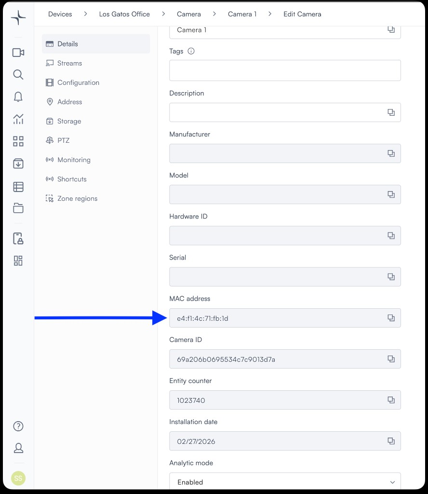
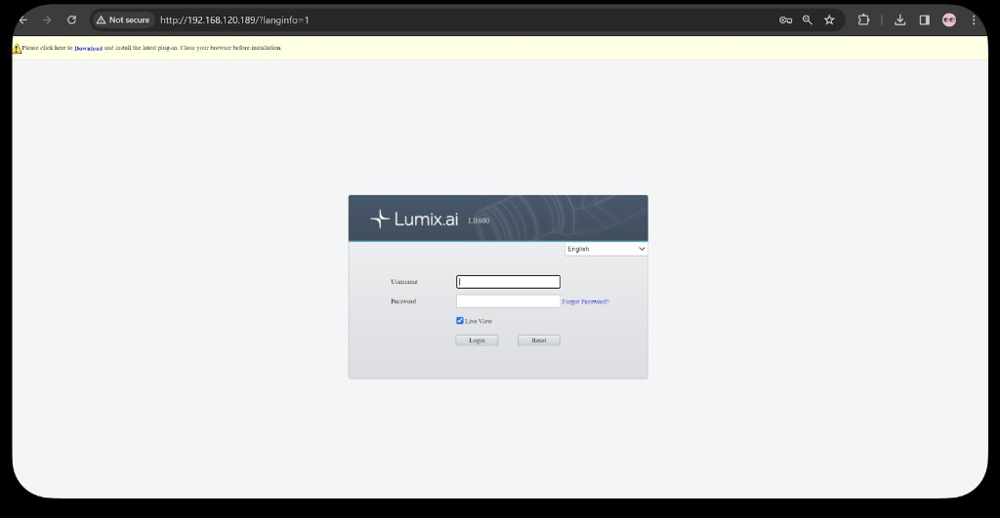
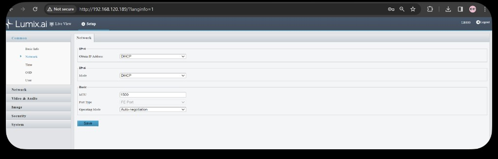
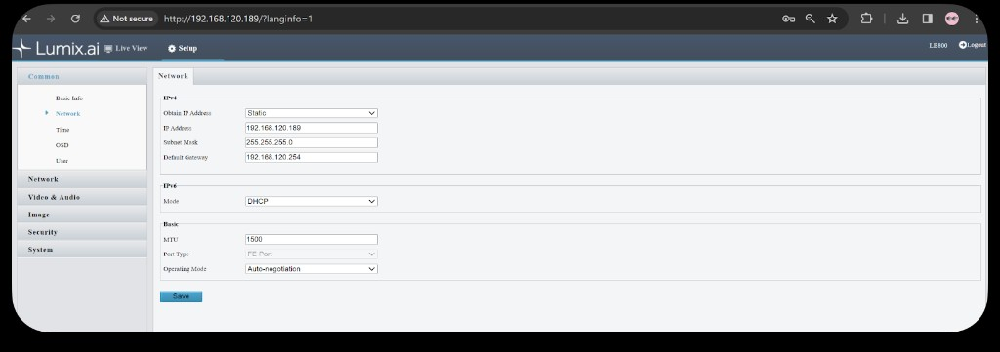

# Set up a static IP address

When integrating a DHCP-enabled camera into your network, the device automatically receives an IP address from the DHCP server, making the setup process straightforward and user-friendly. However, this convenience is accompanied by the possibility of the camera's IP address changing, especially after power failures, or the challenge of lacking a DHCP server on your network. To circumvent these issues, assigning a static IP address to your camera is recommended.

> **Note:** It is important not to allocate static IP addresses from the DHCP pool, as this can cause IP conflicts.

This guide outlines the procedure for assigning a static IP address to your camera in three scenarios.

### Scenario 1: 
Your Network Includes a DHCP Server and You Wish to Assign a Permanent IP Address

1. **Connect Your Lumana Camera**: First, plug your Lumana Camera into the network.

2. **Identify the Camera's IP Address**: To locate the camera's IP address, head over to the IP scanner tool or the Lumana app and add the camera to your organization. After adding the camera, the IP address can be found under the camera's location settings.

    

3. **Configure DHCP static mapping on your router**:  This will ensure the device uses the same IP addresses based on its MAC address in any event of power outage 

To get camera MAC address you should navigate to Camera -> Edit camera -> Details 

Here's an example of [static mapping configuration](https://www.cisco.com/c/en/us/td/docs/ios/12_2sb/12_2sba/feature/guide/sbhcpsm.html) for a cisco routers

### Scenario 2: Your Network Lacks a DHCP Server
In this case you will need to connect to the camera via the local page and set the camera IP address 

**For example:**

- Default IP address for the camera is: 192.168.1.13
- Default Subnet Mask: 255.255.255.0
- Default user: admin 
- Default password: 123456

1. **Access the Camera's Configuration Page**: On a computer connected to the same network, enter the camera's IP address into a web browser. You'll need to input your username and password to proceed.

    

2. **Adjust Network Settings**: Upon first login, you'll be prompted to change your password - remember to record the new credentials. Navigate to the "Setup" menu, then select "Network". Here, switch from DHCP to static IP and save your changes. 

    

3. **Set up the static IP address for the camera**: 

### Scenario 3: 
Your Network Includes a DHCP Server and You Wish to Assign a Permanent Static IP Address for the camera outside of the DHCP pool
 
In this case you want to assign a static IP address to the camera and do not want to assign static DHCP mapping on the server. 

To make sure this scenario is successful you would have to confirm what is the static IP address range of your network. **If you will allocate IP addresses from the DHCP pool, there might be a case where 2 devices will share the same IP address**.

Once you have identified the static IP range, you can select the IP address to allocate to the cameras and follow [Scenario 2](#scenario-2-your-network-lacks-a-dhcp-server).

