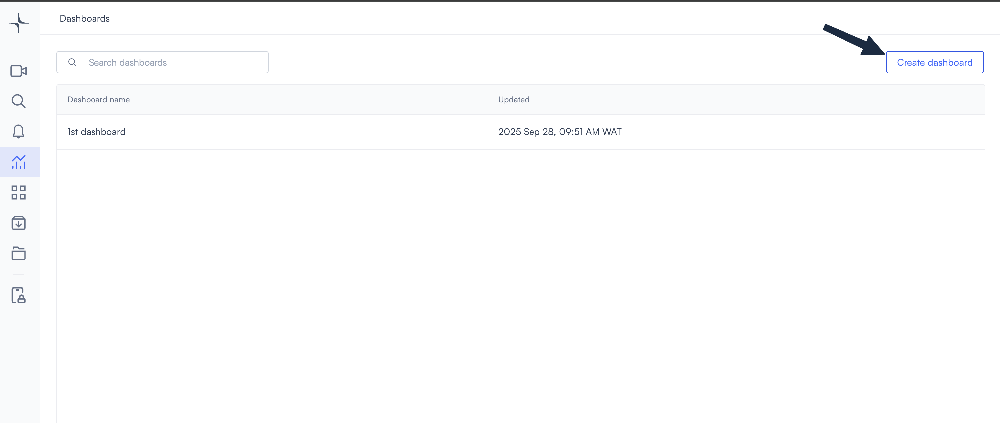
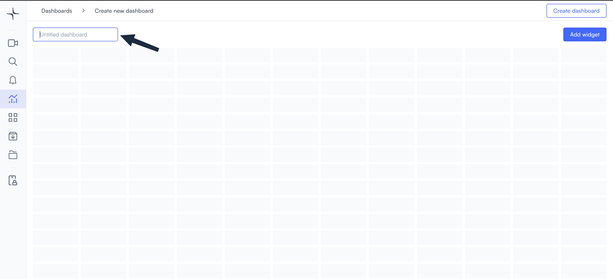
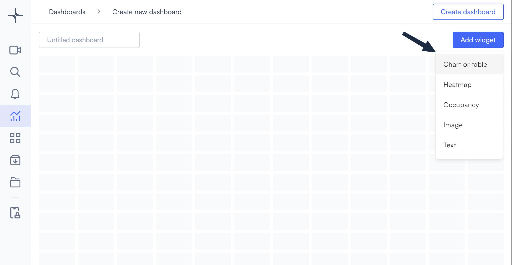
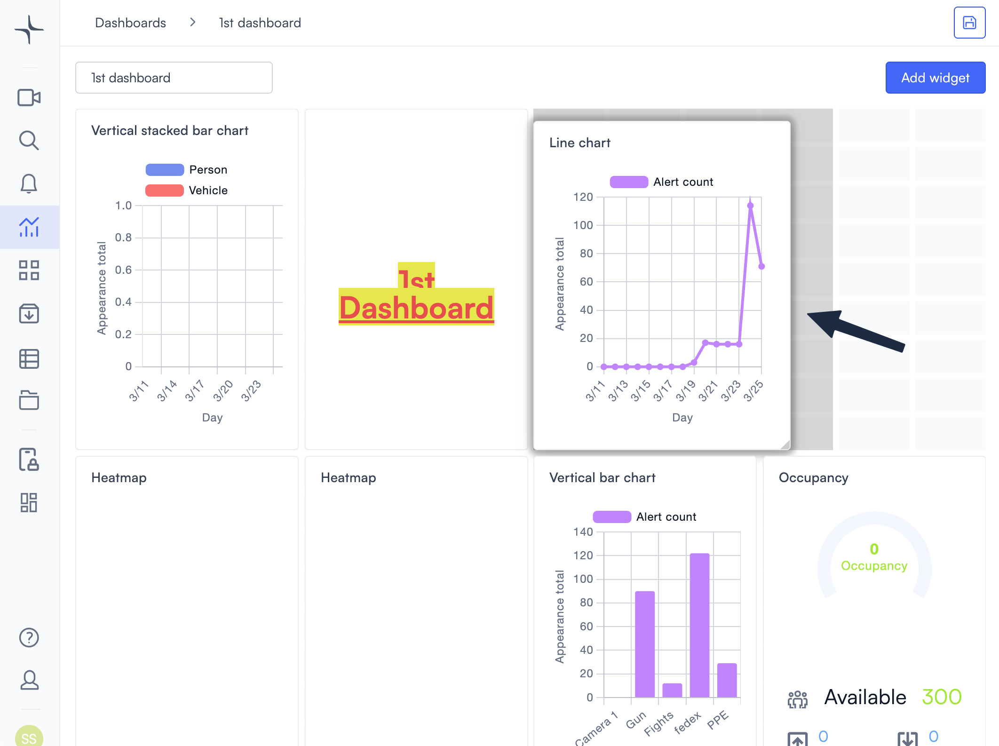
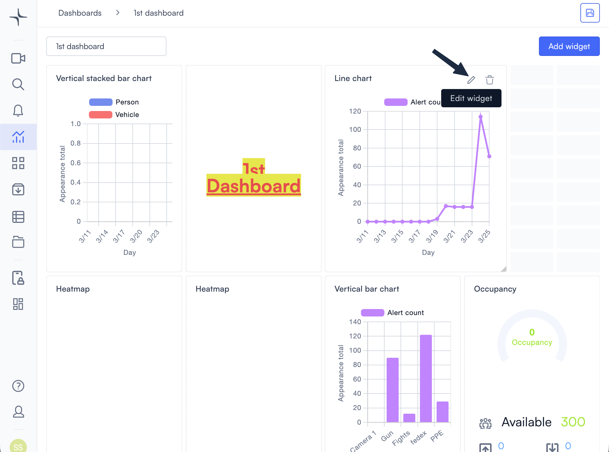
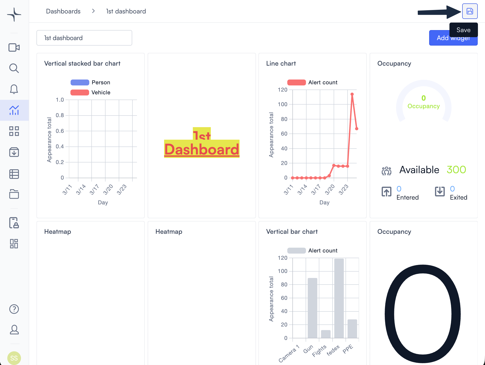

# Create and manage dashboards

Dashboards let you monitor your sites, cameras, and alerts from a single view. You can build a dashboard from scratch, add different widget types, and adjust the layout to fit your workflow. This page covers how to create, edit, and delete dashboards.

## Create a dashboard

To get started, open the Dashboards page from the left navigation bar. The Dashboards page shows all dashboards in your account, so it's where dashboard management begins.

1. Select **Dashboards** in the left navigation bar. The Dashboards view opens at `app.lumana.ai/dashboards/main`.
2. Select **Create dashboard** in the top right corner.

3. Enter a name in the **Untitled dashboard** field at the top left of the canvas.

With your dashboard created, you're ready to add widgets.

## Add a widget

Widgets are the building blocks of a dashboard. Each widget type displays a different kind of data, so you can mix and match them to build the view you need.

1. From the dashboard canvas, select **Add widget** in the top right corner. A dropdown lists the five widget types.

2. Select the widget type you want to add. A configuration dialog opens.
3. Configure the widget settings, then select **Add**. The widget appears on the canvas.

Each widget type has its own configuration options, covered in the [Widgets](widgets/README.md) section.

You can add as many widgets as you need. The canvas extends vertically as you add more.

## Enter edit mode

Most dashboard changes, including moving widgets, resizing them, and updating their settings, require the dashboard to be in edit mode first. Add at least one widget before you arrange or resize, so you have tiles on the grid. If you've just created a dashboard, you're already on the canvas: add widgets, then enter edit mode when you're ready to adjust layout or settings.

1. Select the **edit icon** (pencil) in the top right corner. The tooltip reads **Edit dashboard**.

The canvas enters edit mode. From here, you can make the following changes:

- **Add widgets**: Select **Add widget** in the top right to open the widget list and place new widgets on the grid.
- **Move widgets**: Drag any widget to a new position on the grid.
- **Resize widgets**: Drag a widget's edges or corners to change its size.
- **Change a widget**: Select the **edit icon** (pencil) on a widget to open its settings dialog.
- **Remove a widget**: Select the **delete icon** (trash) on a widget to remove it from the dashboard.
- **Rename the dashboard**: Select the dashboard title at the top left and enter a new name.
- **Save your work**: When you've finished all changes for this session, select **Save** (floppy disk) in the top right. How saving works is covered in [Save dashboard changes](#save-dashboard-changes).

> **Note**: The **delete icon** (trash) in the dashboard header removes the entire dashboard. This is separate from deleting individual widgets.

Once the dashboard is in edit mode and you have widgets on the canvas, you can rearrange them.

## Arrange and resize widgets

Moving and resizing widgets lets you organise the dashboard layout to match your monitoring priorities.

- To move a widget, select and drag it to a new position on the grid.
- To resize a widget, drag its edges or corners until it reaches the size you want.

When the layout is ready, save your changes before leaving edit mode. How saving works is covered in [Save dashboard changes](#save-dashboard-changes).

## Change widget settings

You can update a widget's configuration at any time while the dashboard is in edit mode.

1. Select the **edit icon** (pencil) on the widget you want to change.
2. Update the settings in the dialog that opens, then select **Save**.

Once you've updated the settings, you may also want to remove widgets you no longer need.

## Delete a widget

Removing a widget permanently removes it from the dashboard. The dashboard must be in [edit mode](#enter-edit-mode) before you can delete a widget.

1. Select the **delete icon** (trash) on the widget you want to remove.
2. Confirm the deletion.

> **Warning**: Deleting a widget is permanent. There's no way to recover it after removal.

With your layout finalised, you can also rename the dashboard to keep things organised.

## Rename a dashboard

You can rename a dashboard at any time while it's in [edit mode](#enter-edit-mode).

1. Select the dashboard name field at the top left of the canvas.
2. Enter the new name.

Changes to the name are saved when you select **Save** at the end of your editing session.

When you've finished all your changes, save the dashboard to lock them in.

## Save dashboard changes

Saving locks in every change you made during the current edit session, including layout adjustments, widget updates, and name changes.

1. When you've finished all changes for this session, select **Save** in the top right corner. The control is a floppy disk icon; the tooltip reads **Save**.

2. Confirm that the dashboard leaves edit mode, which means your changes are saved.

> **Note**: Widget configuration dialogs have their own **Add** or **Save** buttons. Those save the individual widget settings. The floppy disk **Save** on the dashboard saves the full layout and all session edits together.

> **Warning**: If you leave edit mode or close the page before selecting **Save**, then your dashboard changes will be lost.

If you no longer need a dashboard, you can delete it entirely.

## Delete a dashboard

Deleting a dashboard permanently removes it and all its widgets, and this action can't be undone.

1. Open the dashboard you want to delete.
2. Select the **delete icon** (trash) in the top right corner, next to the edit icon.
3. Confirm the deletion.

> **Warning**: Deleting a dashboard removes it and all its widgets permanently.
