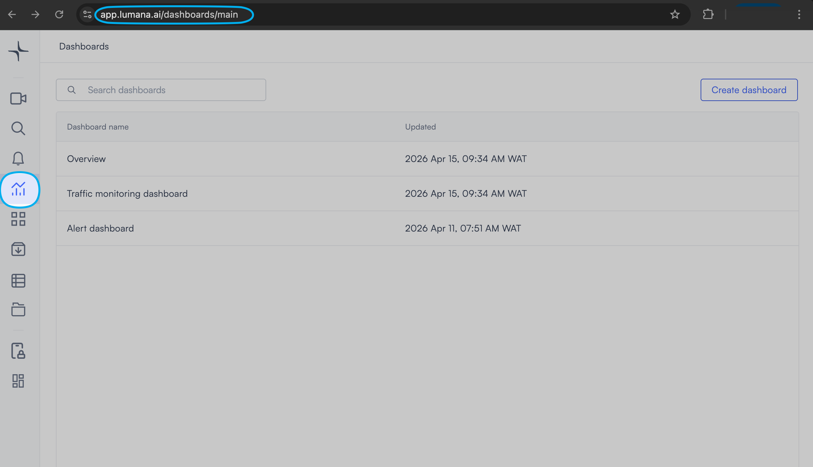
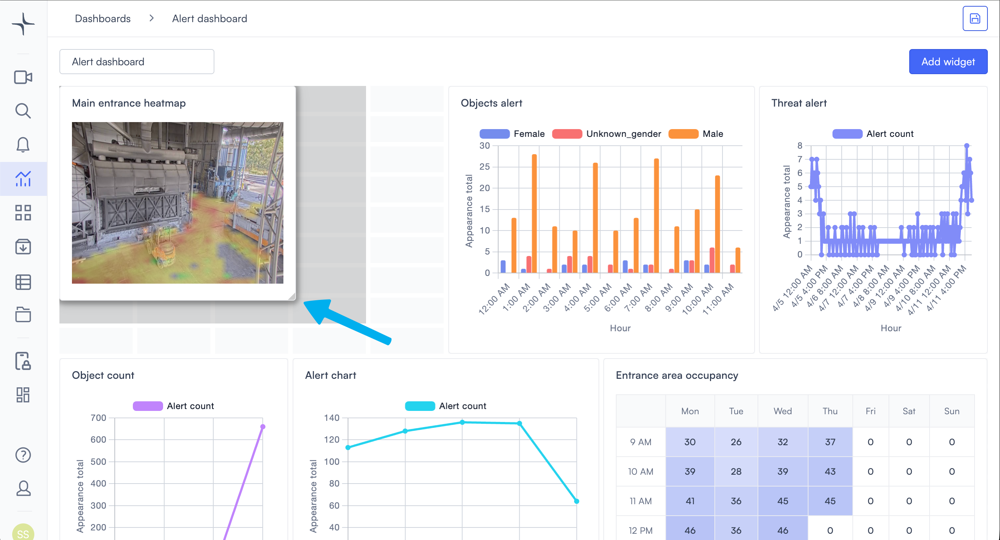
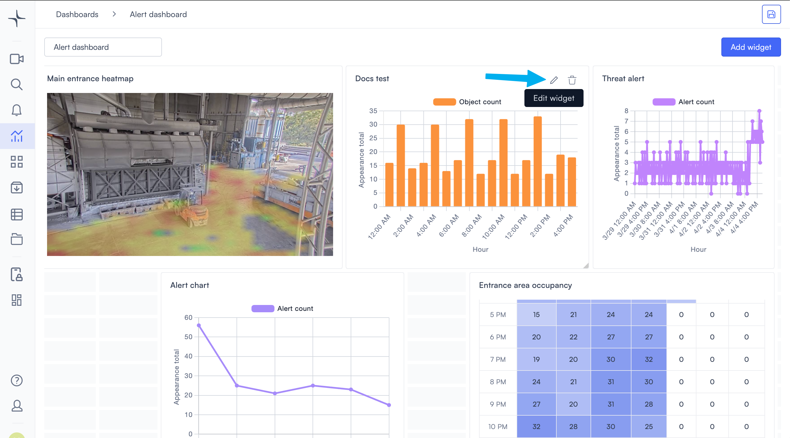
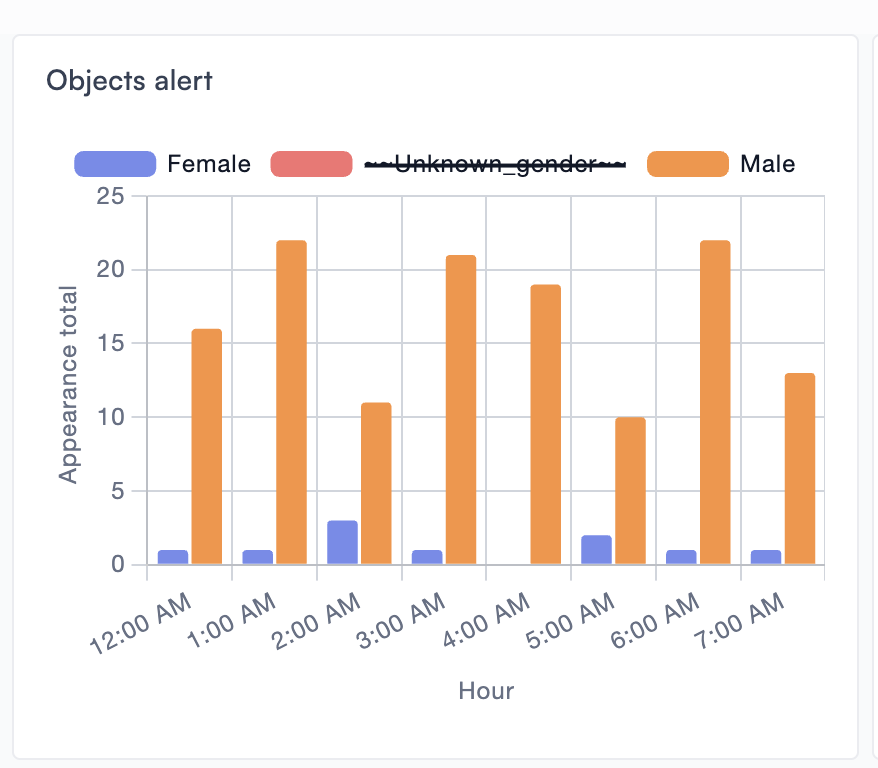
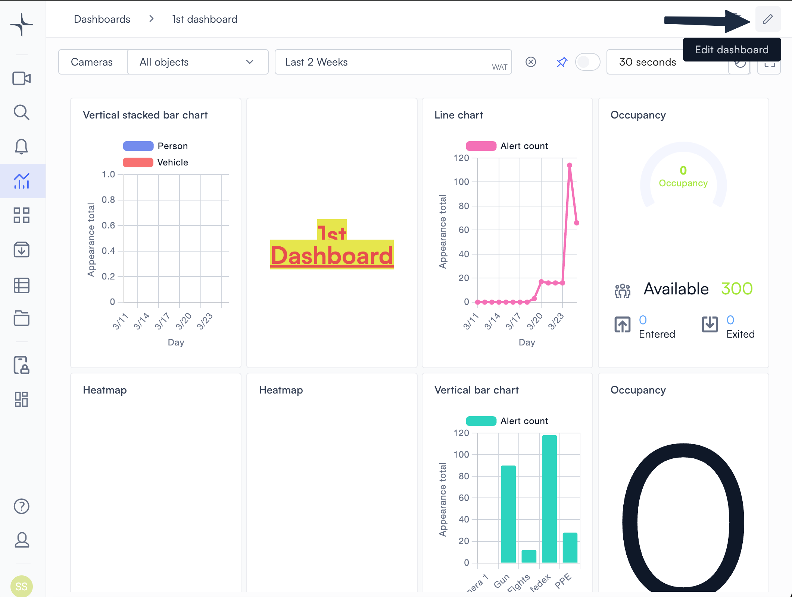
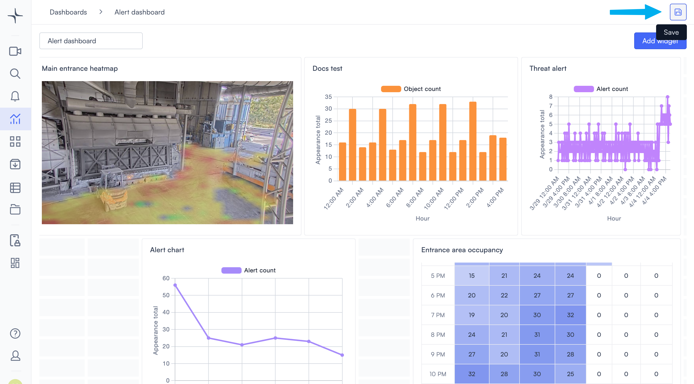
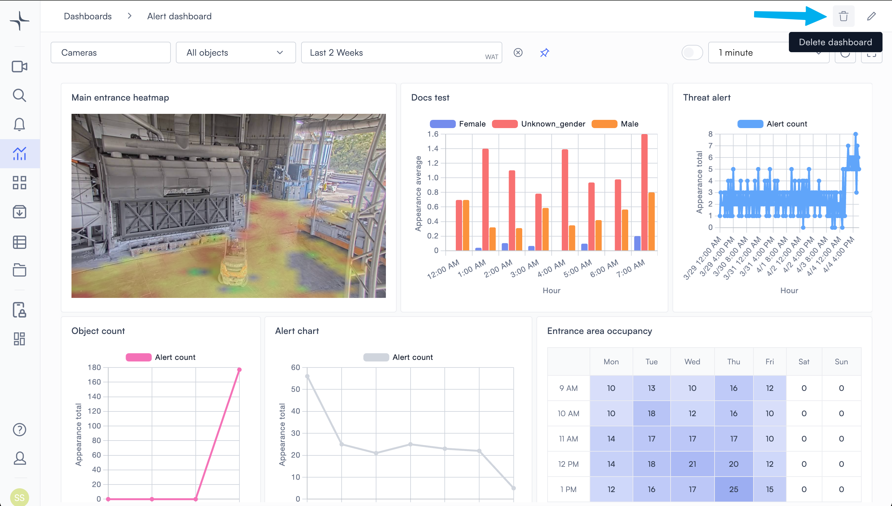

# Create and manage dashboards

Dashboards enable you to monitor your sites, cameras, and alerts from a single view. You can build a dashboard from scratch, add different widget types, and adjust the layout to fit your workflow. This page covers how to create, edit, and delete dashboards.

## Create a dashboard

The Dashboards page shows all dashboards in your account, so it's where dashboard management begins.

1. Select **Dashboards** in the left navigation bar, or go directly to `https://app.lumana.ai/dashboards/main`.

2. Select **Create dashboard** in the top right corner.

3. Give the dashboard a name by typing in the **Untitled dashboard** field at the top left of the canvas.

4. With your dashboard created, you're ready to add widgets. Follow the instructions in the next section to add each widget. When you are done, select **Create dashboard** in the top right to permanently save your dashboard.

## Add a widget

Widgets are the building blocks of a dashboard. Each widget type displays a different kind of data, so you can mix and match them to build the view you need.

1. From the dashboard canvas, select **Add widget** in the top right corner. A dropdown lists the widget types that are available.

2. Select the type of widget that you want to add. A configuration dialog opens.


Each widget type has its own configuration options. These are covered in the [Widgets](widgets/) section.


3. Configure the widget's settings, then select **Add**. The widget appears on the canvas.

You can add as many widgets as you need. The canvas extends vertically as you add more.

## Arrange or resize a widget

Moving and resizing widgets lets you organize the dashboard layout to match your monitoring priorities.

* To move a widget, select and drag it to a new position on the grid.
* To resize a widget, drag its edges or corners until it reaches the size you want.

When the layout is ready, [save your changes](create-and-manage-dashboards.md#save-dashboard-changes) before leaving edit mode.

## Edit a widget

You can change a widget's configuration at any time while the dashboard is in edit mode.

1. Select the .png>) (Edit) icon on the widget you want to change.

2. Update the settings in the dialog that opens, then select **Save**.

Each widget type has its own dialog and configuration options. These are covered in the [Widgets](widgets/) section.

## Filter chart series

If your chart has multiple data series, it will contain a legend at the top of the widget. Each legend item represents a series, such as an object type or alert category. You can use the legend to show or hide each series without reconfiguring the widget.

Select a legend item to toggle that series off. Its label is struck through and the relevant bars or lines are hidden from the chart. Select the same legend item again to restore it.

This is useful when a chart has several series and you want to focus on one or two without the others adding visual noise. The widget configuration is not permanently changed.


Multiple series appear in a chart whenever the Y-axis filter is set to **Group** or **Individual**. Charts set to **All** show a single series and have no legend to filter.


## Delete a widget

Deleting a widget permanently removes it from the dashboard.

The dashboard must be in [edit mode](create-and-manage-dashboards.md#edit-a-widget) before you can delete a widget.

1. Select the .png>) (Delete) icon on the widget you want to remove.
2. Confirm the deletion.


Deleting a widget is permanent. There's no way to recover it after removal.


## Edit a dashboard

Once a dashboard has been saved, you need to go into edit mode if you want to make any new changes to it. These changes can include moving widgets, resizing them, and updating their settings.

1. Select the .png>) (Edit) icon in the top right corner. The tooltip reads **Edit dashboard**.

The canvas enters edit mode. From here, you can make the following changes:

* [**Add widgets**](create-and-manage-dashboards.md#add-a-widget): Select **Add widget** in the top right to open the widget list and place new widgets on the grid.
* [**Arrange or resize widgets**](create-and-manage-dashboards.md#arrange-or-resize-a-widget): Drag any widget to a new position on the grid, or drag the edge or corner of a widget to change its size and shape.
* [**Edit widgets**](create-and-manage-dashboards.md#edit-a-widget): Select an individual widget's .png>) (Edit) icon to open its settings dialog.
* [**Delete widgets**](create-and-manage-dashboards.md#delete-a-widget): Select the .png>) (Delete) icon on an individual widget to remove it from the dashboard.


The .png>) (Delete) icon in the dashboard header deletes the _entire_ dashboard. Do not use this button if you want to remove an individual widget.


* [**Rename the dashboard**](create-and-manage-dashboards.md#rename-a-dashboard): Select the dashboard title at the top left and enter a new name.
* [**Delete the dashboard**](create-and-manage-dashboards.md#delete-a-dashboard): Select the .png>) (Delete) icon in the dashboard header.
* [**Save your changes**](create-and-manage-dashboards.md#save-dashboard-changes): When you've finished editing the dashboard to your satisfaction, select the .png>) (Save) icon in the top right.

## Rename a dashboard

You can rename a dashboard at any time while it's in [edit mode](create-and-manage-dashboards.md#edit-a-widget).

1. Select the dashboard name field at the top left of the canvas.
2. Enter the new name.

Just like any other changes you make to your dashboard, changes to the name are saved when you select **Save** at the end of your editing session.

## Save dashboard changes

Saving your dashboard locks in every change you made during the current edit session, including layout adjustments, widget updates, and name changes.

1. When you've finished all changes for this session, select **Save** in the top right corner. The control is a floppy disk icon; the tooltip reads **Save**.

2. Confirm that the dashboard leaves edit mode, which means your changes are saved.


Widget configuration dialogs have their own **Add** or **Save** buttons. Those save the individual widget settings. You still need to select the dashboard's **Save** button to save the full layout and all session edits together.



If you leave edit mode or close the page before selecting **Save**, then your dashboard changes will be lost.


## Delete a dashboard

Deleting a dashboard permanently removes it and all its widgets.


This action cannot be undone.


1. Open the dashboard you want to delete.
2. Select the .png>) (Delete) icon in the top right corner, next to the edit icon.

3. Confirm the deletion.

