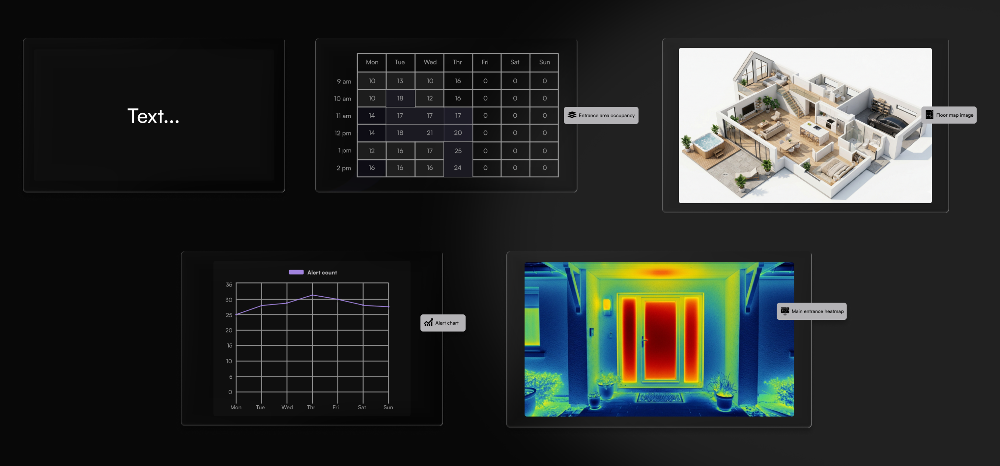

# Introduction to Dashboards

Dashboards give you a workspace for analyzing historical data from your cameras. They enable you to review patterns across days, weeks, or months, answering questions like:

* How many people passed through the main entrance last week?
* Which camera triggered the most alerts this month?
* What does foot traffic look like at different times of day?

You build a dashboard from a grid of widgets of the following types:&#x20;

* [Chart or table](widgets/chart-or-table/)
* [Heatmap](widgets/heatmap.md)
* [Occupancy](widgets/occupancy.md)
* [Image](widgets/image.md)
* [Text](widgets/text.md)

## How dashboards connect to the rest of the system

Dashboards draw from three data sources already configured in your Lumana setup:

* [**Objects**](widgets/chart-or-table/chart-or-table-objects.md): Detections recorded by your cameras, including people, vehicles, and animals.
* [**Alerts**](widgets/chart-or-table/chart-or-table-alerts.md): Events fired by the alert rules you've configured in Alerts and AI detection.
* [**Event tags**](widgets/chart-or-table/chart-or-table-event-tags/): Custom tags created through the Event tag alert type.

When you apply a filter to a dashboard, for example by selecting specific cameras, object types, or time ranges, that applies to all the widgets on the dashboard by default.

With your data sources in mind, you can start building your first dashboard.

## Building a dashboard

Add widgets to the canvas first, then use edit mode to arrange and fine-tune the layout. [Create and manage dashboards](create-and-manage-dashboards.md) walks you through the full setup flow, and [Widgets](widgets/) covers each widget type and its configuration options.
