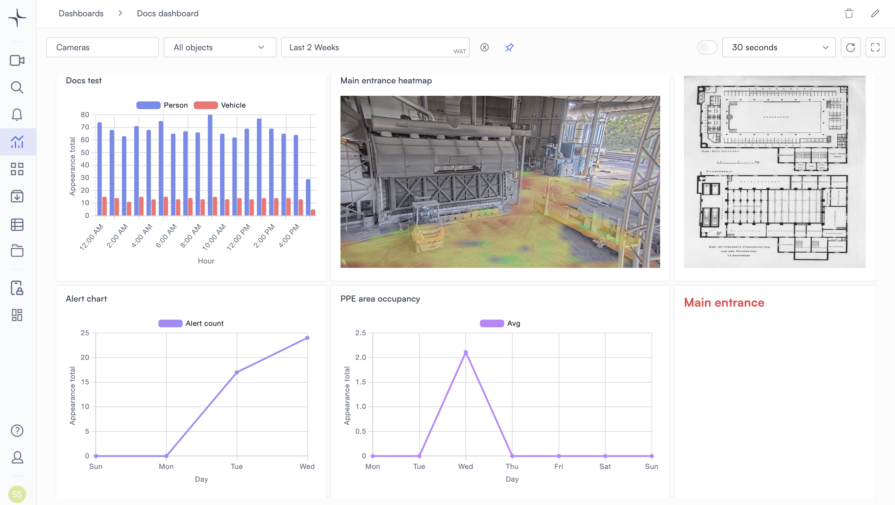

# Dashboards

Dashboards give you a workspace for analyzing data from your cameras over time. Use them to spot trends, track occupancy, and review alert activity without watching live footage.

## What dashboards are for

Unlike Live View, which shows what's happening right now, dashboards show what has already happened. Security managers use them to review patterns across days, weeks, or months.

A dashboard can answer questions like:

* How many people passed through the main entrance last week?
* Which camera triggered the most alerts this month?
* What does foot traffic look like at different times of day?

Dashboards pull this data from sources already configured in your Lumana setup, so there's nothing extra to connect.

## How dashboards connect to the rest of the system

Dashboards draw from three data sources in your Lumana setup:

* **Objects**: Detections recorded by your cameras, including people, vehicles, and animals.
* **Alerts**: Events fired by the alert rules you've configured in Alerts and AI detection.
* **Event tags**: Custom tags created through the Event tag alert type.

The cameras and object types available in dashboards are the same ones configured across the rest of the platform. Filters you apply to a dashboard (cameras, object types, and time range) apply to all widgets on that dashboard by default.

With your data sources in place, you can start building dashboards with widgets.

## What you can build

Each dashboard is a grid of widgets. Add widgets to the canvas first to add data, then use edit mode to arrange and fine-tune the layout. The full setup flow is covered in [Create and manage dashboards](create-and-manage-dashboards.md). Each widget type and its configuration options are covered in [Widgets](widgets/).

All users can create, edit, and delete dashboards.
