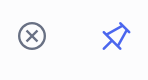

# Filter a dashboard

Dashboard filters let you control what data all widgets on a dashboard display. You can filter by camera, object type, and time range, and configure auto refresh, fullscreen mode, and default filter settings. Filters apply to every widget on the dashboard unless a widget has its own time setting configured.

## Camera filter

The **Cameras** field controls which cameras contribute data to the dashboard. Select it to open the camera picker, then choose the cameras you want to include.

* Select **All cameras** to include every camera in your organization.
* To filter by specific cameras, select individual cameras from the list or search by name or location.
* Select **Select** to apply your selection.

The camera filter is now set. Next, narrow the data further by selecting which object types to include.

## Object type filter

The object type filter narrows the data to specific detection categories. Select the **All objects** dropdown to choose a filter mode.

There are three modes:

* **All objects**: Includes every detected object type.
* **Group**: Filter by broad category: **Person**, **Vehicle**, **Animal**, **Shopping cart**, or **Container**. You can select one or more.
* **Individual**: Filter by specific detected subjects, such as Unknown person, Adult male, or Bus. The options shown depend on what your cameras have detected.

The object type filter is now configured. The time range controls which period of data the filtered results cover.

## Time range

The time range filter sets the period of data shown across all widgets. Select the time range field in the filter bar to open the time picker. The field shows the current range, for example, **Last 2 Weeks**, or **From**/**To** dates if you've applied a calendar range.

The picker has two tabs: **Relative** and **Calendar**. Select **Done** to apply the range, or **Cancel** to close without changing anything. Your timezone appears on the filter bar and in the picker.

### Relative

Use **Relative** for rolling windows that count backward from now, for example, the last two weeks of data.

* Select a preset chip (minutes, hours, days, or weeks). The number field and unit dropdown below update to match.
* To set a custom range, enter a number in the field and select a unit from the dropdown.

### Calendar

Use **Calendar** for exact start and end dates and times, for example, an incident window.

* Select a start day and an end day on the calendar. The range between them is highlighted.
* Set the **From** and **To** date and time in the fields below for precision. Selecting a time field opens a time picker where you can set hours, minutes, and AM or PM.
* When you apply a calendar range, the filter bar shows the full **From** / **To** span and timezone. It no longer shows a "Last _n_ _unit_" label.

Your filters are now set to the required period. Auto refresh controls how frequently the dashboard reloads the data.

## Auto refresh

The auto refresh toggle sits to the right of the time range. When auto refresh is on, the dashboard reloads data automatically at the interval you set.

* Select the toggle to enable or disable auto refresh.&#x20;

<figure><figcaption></figcaption></figure>

* Use the **refresh rate** dropdown to set how often the dashboard reloads. The countdown timer shows how long until the next reload.
* Select the **manual refresh** icon (circular arrow) to reload data immediately at any time.

## Save and reset filters

Saving your filters sets them as the default for this dashboard. The same camera, object type, and time range configuration loads each time you open it.

<figure><figcaption></figcaption></figure>

* Select the **pin icon** to save the current filters as the default for this dashboard.
* Select the **X icon** next to the pin to reset the filters back to the saved default.

## Fullscreen mode

Select the **fullscreen icon** at the far right of the filter bar to expand the dashboard to fill the screen. This is useful for displaying dashboards on a dedicated monitor or in a security operations center.

## Widget-level time override

Individual widgets can have their own time setting that overrides the dashboard filter. When a widget has a time setting applied, it shows data for that period regardless of the dashboard filter.

> **Note**: The widget configuration dialog shows a warning when you set a widget-level time: "Setting the time will disconnect the report from the relevant dashboard filters." To restore a widget's connection to the dashboard filter, clear its time setting.
