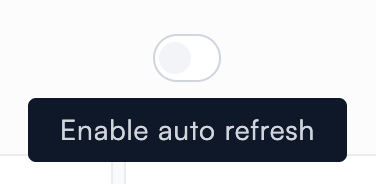
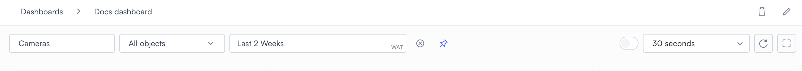
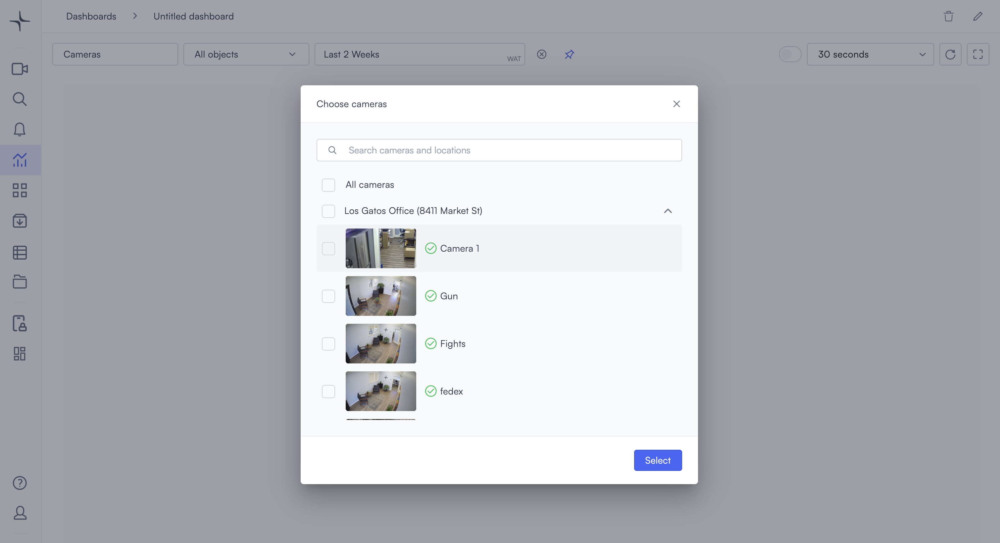
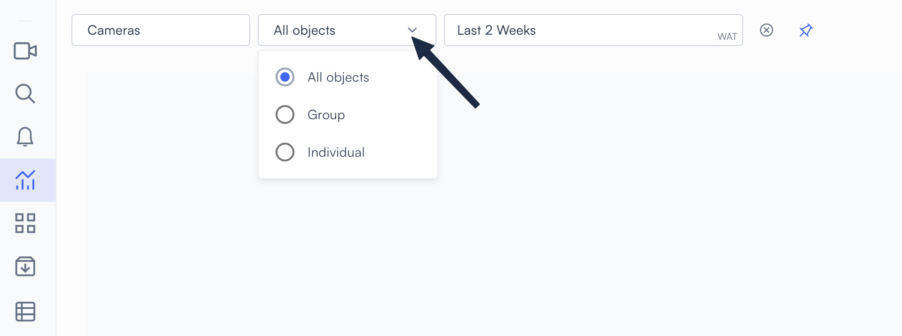
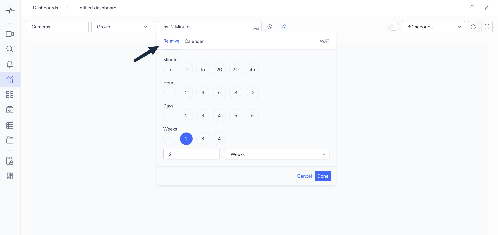
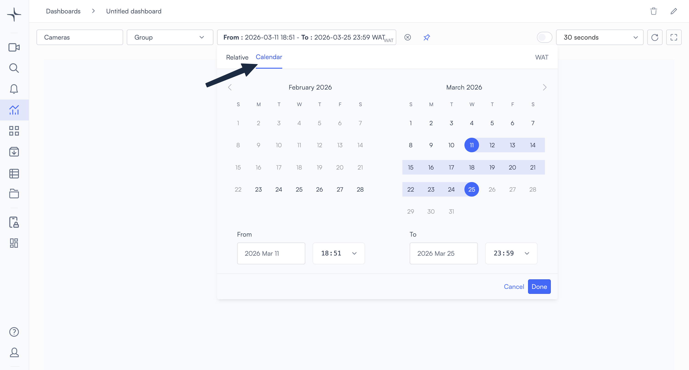

# View and filter a dashboard

## Open a dashboard

1. Select **Dashboards** in the left navigation bar, or go directly to `https://app.lumana.ai/dashboards/main`.
2. A list of dashboards is displayed. Select the dashboard you want to open.

<figure><figcaption></figcaption></figure>

## Refresh the dashboard's data

### Manual refresh

Select the .png>) (**Refresh data**) icon to update the data in your dashboard. This button can be found in the upper right.

### Auto refresh

To tell the dashboard to refresh automatically at regular intervals, use the auto refresh toggle. When auto refresh is on, the dashboard reloads data automatically at the interval you set.

1. Use the refresh rate dropdown to set how often the dashboard reloads. The countdown timer shows how long until the next reload.

<figure><figcaption></figcaption></figure>

2. Select the toggle to enable auto refresh.&#x20;

<figure><figcaption></figcaption></figure>

To disable auto refresh, select the toggle again.

## Fullscreen mode

Select the .png>) (**Fullscreen**) icon in the upper right to expand the dashboard to fill the screen. This is useful when displaying dashboards on a dedicated monitor or in a security operations center.

Select the icon again to return the dashboard to the browser window.

## Dashboard filters

Dashboard filters let you control what data is displayed by all the widgets on a dashboard. You can filter by camera, object type, and time range. The filters you choose apply to every widget on the dashboard unless a widget has its own time setting configured.

### Camera filter

The **Cameras** field controls which cameras contribute data to the dashboard. Select it to open the camera picker, then choose the cameras you want to include.

* Select **All cameras** to include every camera in your organization.
* To filter by specific cameras, select individual cameras from the list. You can use the search field at the top to search for cameras by name or location.
* Select **Select** to apply your selection and return to the dashboard. The data being displayed updates immediately to reflect the change.

### Object type filter

The object type filter narrows the data to specific detection categories.

There are three modes:

* **All objects**: All detectable objects are included.
* **Group**: Only objects in the selected category or categories are included. Some examples of categories: **Person**, **Vehicle**, **Animal**, **Shopping cart**, and **Container**.
* **Individual**: Filter by specific detected subjects. The options available depend on what your cameras have detected.

### Time range

The time range filter sets the time period that is covered by the widgets in the dashboard.&#x20;

The time range field in the filter bar shows the current range, which may be a relative range such as "Last 2 Weeks" or an absolute range such as "From: 2026-03-16 11:32 - To: 2026-03-26 23:59 EST".

#### Set a relative range

Use **Relative** for rolling windows that count backward from now. For example, you may want your dashboard to cover the last two weeks of data:

* To use a preset range, select the appropriate chip under minutes, hours, days, or weeks.
* To set a custom range, enter a number in the field and select a unit of time from the dropdown list.

Select **Done** to apply your changes to the dashboard.

#### Set an absolute range

Use **Calendar** to set specific start and end dates and times. This is useful for analyzing specific incidents.

* Select a start day and an end day on the calendar. The range between them is highlighted.
* Use the time picker below the calendar for greater precision, to set an exact start and end time.

Select **Done** to apply your changes to the dashboard.

### Set a default filter

You can store a set of filters as the default for this dashboard. The same camera, object type, and time range configuration loads each time you open it.

Select the .png>) (**Save as default filters**) icon to save the current filters as the default for this dashboard.

Once you have a default set of filters, you can bring up that set at any time by selecting the .png>) (**Reset to default filters**) icon.

### Widget-level time override

Individual widgets might have their own time settings that override ones that are defined in the dashboard filter. When a widget has a time setting applied, it shows data for that period regardless of the dashboard filter.


To restore a widget's connection to the dashboard filter, clear its time setting.

