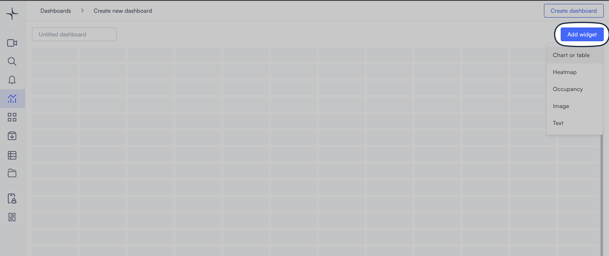

# Widgets

Widgets are the tiles on a [dashboard](../dashboards.md) grid. Each one displays a different type of data or content from your cameras.

To add, move, resize, or update widgets, follow the steps in [Create and manage dashboards](../create-and-manage-dashboards.md).

## Widget types

<table data-view="cards"><thead><tr><th>Type</th><th>What it does</th><th data-hidden data-card-cover data-type="image">Cover image</th><th data-hidden data-card-target data-type="content-ref"></th></tr></thead><tbody><tr><td>Chart or table</td><td>Visualizes object detections, alert counts, or event tags as a chart or table.</td><td><a href="../../.gitbook/assets/Chart_or_Table.png">Chart_or_Table.png</a></td><td><a href="chart-or-table/">chart-or-table</a></td></tr><tr><td>Heatmap</td><td>Shows where activity is concentrated in a camera's field of view.</td><td><a href="../../.gitbook/assets/Main_entrance_heatmap.png">Main_entrance_heatmap.png</a></td><td><a href="heatmap.md">heatmap.md</a></td></tr><tr><td>Occupancy</td><td>Tracks how many people are in a space at any point in time.</td><td><a href="../../.gitbook/assets/Entrance_area_occupancy.png">Entrance_area_occupancy.png</a></td><td><a href="occupancy.md">occupancy.md</a></td></tr><tr><td>Image</td><td>Displays a static image, such as a floor plan or reference photo.</td><td><a href="../../.gitbook/assets/Floor_map_image.png">Floor_map_image.png</a></td><td><a href="image.md">image.md</a></td></tr><tr><td>Text</td><td>Adds a formatted text block for labels, descriptions, or context.</td><td><a href="../../.gitbook/assets/Text.png">Text.png</a></td><td><a href="text.md">text.md</a></td></tr></tbody></table>

## Working with widgets

Widget management tasks are covered in [Create and manage dashboards](../create-and-manage-dashboards.md): adding, arranging, resizing, changing settings, saving, and deleting.
